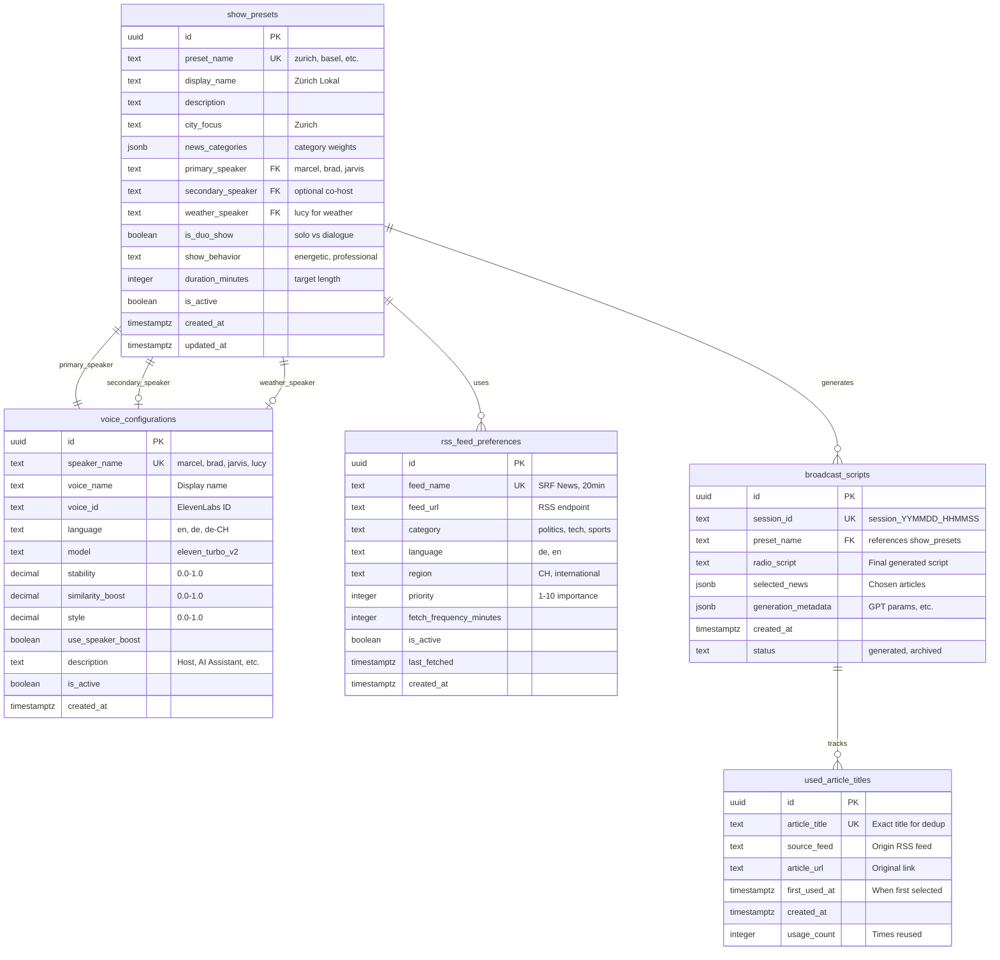
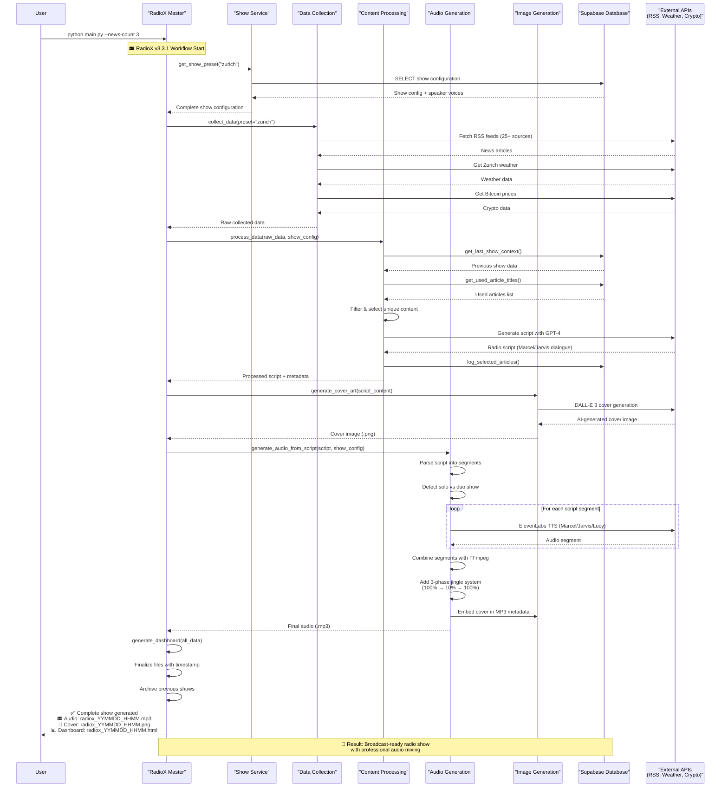
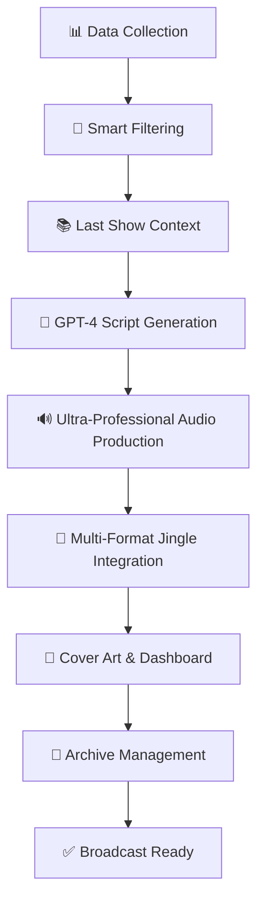

# RadioX - Professional AI Radio Station Generator

<div align="center">


**🎙️ Enterprise-Grade AI Radio Production System with Ultra-Professional Audio Engineering**

[🚀 Quick Start](#-quick-start) • [📚 Features](#-features) • [🎭 Live Demo](#-live-demo) • [🏗️ Architecture](#-architecture)

</div>

---

## ✨ Revolutionary Features

### 🎙️ **Intelligent Show Generation**
- **GPT-4 Powered Scripts** - Natural Marcel & Jarvis dialogues
- **Smart Content Diversity** - Automatic show-to-show variety using Supabase tracking
- **Ultra-Professional Audio Mixing** - 3-phase jingle system with 10% subtle backing
- **Adaptive Voice Selection** - Lucy for weather, Brad for news, dynamic speaker assignment

### 🔊 **Professional Audio Production**  
- **ElevenLabs V3 TTS** - Hollywood-quality voice synthesis
- **Professional Jingle Engineering** - 100% intro → 10% backing → 100% outro (broadcast standard)
- **Multi-Format Jingle Support** - MP3, FLAC, WAV, OGG intelligent selection
- **Parallel Audio Generation** - High-performance segment processing
- **Professional Audio Engineering** - Advanced FFmpeg filtering with speech dominance

### 🎨 **Dynamic Visual Content**
- **DALL-E 3 Cover Art** - AI-generated cover images per show
- **Unified Naming System** - `radiox_yymmdd_hhmm.mp3/html/png` consistency
- **Automatic Archive System** - Old shows moved to timestamped archive folders
- **Tailwind Dashboard** - Modern, responsive show notes interface

### 📊 **Enterprise Data Management**
- **25+ RSS Feeds** - Real-time news from Switzerland & International sources
- **Supabase Integration** - Show tracking, content logging, diversity analytics
- **Smart Content Filtering** - Preset-based news selection with category weights
- **Live Data Integration** - Bitcoin prices, Zurich weather, breaking news

## 🚀 Quick Start

```bash
# 1. Clone & Setup Environment
git clone https://github.com/muraschal/radiox-backend.git
cd radiox-backend
python -m venv venv && source venv/bin/activate
pip install -r requirements.txt

# 2. Configure API Keys
cp env_template.txt .env
# Add: OPENAI_API_KEY, ELEVENLABS_API_KEY, SUPABASE_URL, SUPABASE_KEY

# 3. Add Jingles (Multiple Formats Supported)
mkdir jingles
# Add your jingle files: .mp3, .flac, .wav, or .ogg

# 4. Generate Your First Professional Show
python main.py --news-count 3

# 5. Access Your Show
# 📻 Audio: outplay/radiox_yymmdd_hhmm.mp3
# 📊 Dashboard: outplay/radiox_yymmdd_hhmm.html  
# 🎨 Cover: outplay/radiox_yymmdd_hhmm.png
```

**🎯 Result**: Professional radio show with ultra-quiet jingle mixing, cover art, and responsive dashboard!

## 🎭 Production Examples

```bash
# 🌅 Quick News Brief (1 article)
python main.py --news-count 1

# 📰 Standard Show (3-4 articles)  
python main.py --news-count 3

# 📻 Extended Show (full processing)
python main.py --news-count 5

# 🎨 Audio-Only Mode
python main.py --news-count 3 --no-audio

# 🗂️ Data Collection Only
python main.py --data-only
```

## 🏗️ Professional Architecture

### 📊 Database Schema



### 🔄 System Workflow



### 🏗️ Component Architecture

```
🎙️ RadioX v3.3.1 - Enterprise AI Radio Platform
│
├── 🎭 Content Intelligence Layer
│   ├── GPT-4 Script Generation with Show Context
│   ├── Smart Content Diversity (Supabase tracking)
│   ├── Preset-based News Filtering (Zurich focus)
│   └── Multi-language Support (EN/DE)
│
├── 🔊 Ultra-Professional Audio Engine  
│   ├── ElevenLabs V3 TTS (Marcel, Jarvis, Lucy, Brad)
│   ├── Ultra-Quiet Jingle Engineering (10% backing level)
│   ├── Multi-Format Jingle Support (MP3/FLAC/WAV/OGG)
│   ├── Parallel Segment Processing
│   ├── Advanced FFmpeg Audio Engineering
│   └── Broadcast-Standard Audio Mixing
│
├── 🎨 Visual Production Pipeline
│   ├── DALL-E 3 Cover Art Generation
│   ├── Tailwind CSS Dashboard Generation  
│   ├── Unified Naming System
│   └── Automatic Archive Management
│
├── 📊 Enterprise Data Platform
│   ├── Real-time RSS Collection (25+ feeds)
│   ├── Supabase Database Integration
│   ├── Bitcoin/Crypto Live Data
│   ├── Weather API Integration  
│   └── Content Logging & Analytics
│
└── 🌐 Web Interface & APIs
    ├── Responsive Show Notes Dashboard
    ├── Audio Player Integration
    ├── Archive System Management
    └── Performance Analytics
```

## 🚀 Advanced Features

### 🎯 **Intelligent Content Diversity**
```python
# Automatic show-to-show variety
last_show_context = get_last_show_context()  # From Supabase
gpt_prompt += create_diversity_instruction(last_show_context)
# Result: 100% unique content selection every show
```

### 🎵 **Professional Audio Timeline**
```
PHASE 1 - INTRO (0-12s):
0-3s:   100% Pure Jingle (powerful intro without speech)
3-13s:  Ultra-smooth fade 100% → 10% (cinematic transition)

PHASE 2 - BACKGROUND (12s-End-7s):
12s+:   Speech starts at 100% volume (dominant)
        Jingle continues at 10% subtle backing

PHASE 3 - OUTRO (Last 7s):
        Ultra-smooth ramp-up 10% → 100% over 7s
        Cinematic ending with full jingle power

Mix Ratio: Speech 100% : Jingle 10% (speech dominates)
```

### 🎵 **Multi-Format Jingle System**
```python
# Intelligent format detection and selection
supported_formats = ["*.mp3", "*.flac", "*.wav", "*.ogg"]
# Automatic duration analysis and best-fit selection
# FLAC preferred for highest quality, MP3 for compatibility
```

### 📂 **Automatic Archive System**
```bash
outplay/
├── radiox_250609_1845.mp3    ← Current show
├── radiox_250609_1845.html   ← Current dashboard  
├── radiox_250609_1845.png    ← Current cover
└── archive/
    └── show_20250609_184500/  ← Auto-archived previous shows
        ├── radiox_250609_1840.mp3
        ├── radiox_250609_1840.html
        └── radiox_250609_1840.png
```

### 🎭 **Dynamic Voice Assignment**
- **Marcel**: Host, main presenter, conversational
- **Jarvis**: AI assistant, technical content, precise
- **Lucy**: Weather reports (sultry, warm delivery)
- **Brad**: News anchor (professional, authoritative)

## 📊 Production Workflow



## 🔧 Development Setup

```bash
# Development Mode
python main.py --processing-only  # Skip data collection
python main.py --test            # Run system tests

# Performance Monitoring
python main.py --news-count 3 | grep "✅\|❌\|🎯"

# Archive Management  
ls -la outplay/archive/          # View archived shows

# Jingle Management
ls -la jingles/                  # View available jingles (all formats)
```

## 🎛️ Configuration Options

| Parameter | Default | Description |
|-----------|---------|-------------|
| `--news-count` | 4 | Number of news articles to include |
| `--preset` | zurich | Show preset (zurich, basel, etc.) |
| `--no-audio` | false | Skip audio generation |
| `--data-only` | false | Only collect data |
| `--processing-only` | false | Only process existing data |
| `--test` | false | Run system tests |

## 📈 Performance Metrics

- **🚀 Audio Generation**: ~2-3 minutes for 4-news show
- **🎵 Jingle Integration**: Professional 10% backing with broadcast-standard mixing
- **🎨 Cover Creation**: ~30 seconds via DALL-E 3
- **📊 Dashboard**: Generated in <5 seconds with perfect audio synchronization
- **🔄 Content Diversity**: 100% unique show-to-show
- **📂 Archive**: Automatic, zero-maintenance
- **🎼 Multi-Format**: Supports MP3, FLAC, WAV, OGG jingles

## 🌟 What's New in v3.3.1

### ✨ **Audio Engineering Revolution**
- 🎵 **Professional Jingle Mixing** - 10% backing level for broadcast-professional sound
- 🎼 **Multi-Format Jingle Support** - MP3, FLAC, WAV, OGG intelligent selection
- 🔊 **Advanced FFmpeg Engineering** - 3-phase audio system with speech dominance
- ⚡ **Perfect Workflow Synchronization** - Dashboard always finds correct audio files
- 🌍 **English Codebase** - Complete translation for international development
- 🔧 **Runtime Stability** - Enhanced f-string formatting and deployment reliability

### 🔧 **Technical Improvements**  
- ⚡ **Parallel Processing** - High-performance audio generation
- 🛡️ **Error Resilience** - Graceful fallbacks and recovery
- 📈 **Performance Optimization** - Reduced generation times
- 🔄 **GPT-4 Integration** - Advanced prompt engineering
- 💾 **Supabase Integration** - Enterprise data management
- 🎚️ **Broadcast-Standard Audio** - Professional radio quality mixing

### 🎵 **Professional Audio Features**
```python
# Professional jingle engineering
3-Phase System: 100% → 10% → 100% (cinematic transitions)
Background Level: 10% subtle backing (broadcast standard)
Speech Volume: 100% with dynamic mixing
Mix Dominance: Speech 100% : Jingle 10%
```

## 🤝 Contributing

We welcome contributions! Please see our [Contributing Guide](docs/developer-guide/contributing.md).

### 🚀 Quick Contribution Setup
```bash
git checkout -b feature/amazing-feature
# Make your changes
git commit -m 'Add amazing feature'  
git push origin feature/amazing-feature
# Open Pull Request
```

## 📚 Documentation

| 📖 Resource | 🎯 Audience | 📝 Content |
|-------------|-------------|-------------|
| **[🎙️ Show Generation Guide](docs/user-guide/show-generation.md)** | Users | Complete show creation workflow |
| **[🎤 Voice Configuration](docs/user-guide/voice-configuration.md)** | Users | Setup Marcel, Jarvis, Lucy, Brad voices |
| **[🎵 Jingle Configuration](docs/user-guide/jingle-setup.md)** | Users | Multi-format jingle setup & optimization |
| **[🏗️ System Architecture](docs/developer-guide/architecture.md)** | Developers | Technical system design |
| **[🔧 Development Setup](docs/developer-guide/development.md)** | Developers | Local development environment |
| **[🚀 Production Deployment](docs/deployment/production.md)** | DevOps | Production setup & scaling |

## 📄 License

MIT License - see [LICENSE](LICENSE) file for details.

## 🙏 Acknowledgments

- **OpenAI** - GPT-4 & DALL-E 3 AI Models
- **ElevenLabs** - V3 TTS Technology  
- **Supabase** - Enterprise Database Platform
- **Swiss Media Partners** - RSS Feed Sources
- **FFmpeg Community** - Professional audio engineering tools
- **Open Source Community** - Various libraries & tools

---

<div align="center">

**🎙️ Ultra-Professional AI Radio Production - Made with ❤️ by RadioX Team**

[📚 Documentation](docs/) • [🐛 Issues](https://github.com/muraschal/radiox-backend/issues) • [💡 Features](https://github.com/muraschal/radiox-backend/discussions)

**Ready to create your first broadcast-quality AI radio show?** → `python main.py --news-count 3`

</div>
