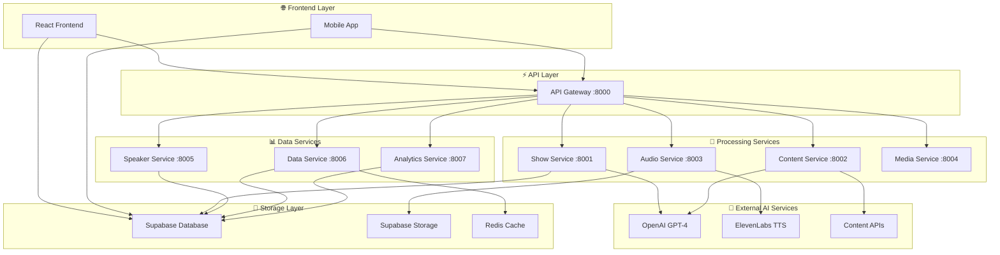
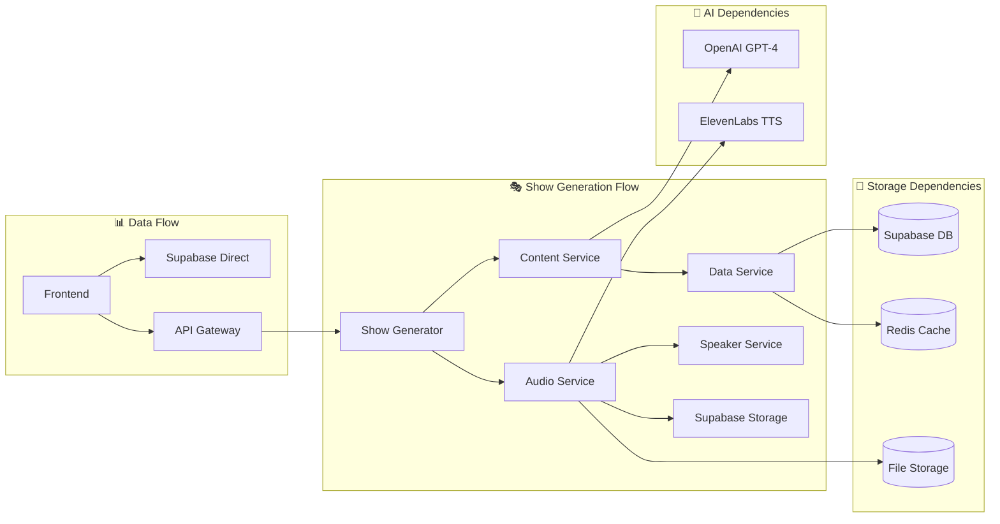
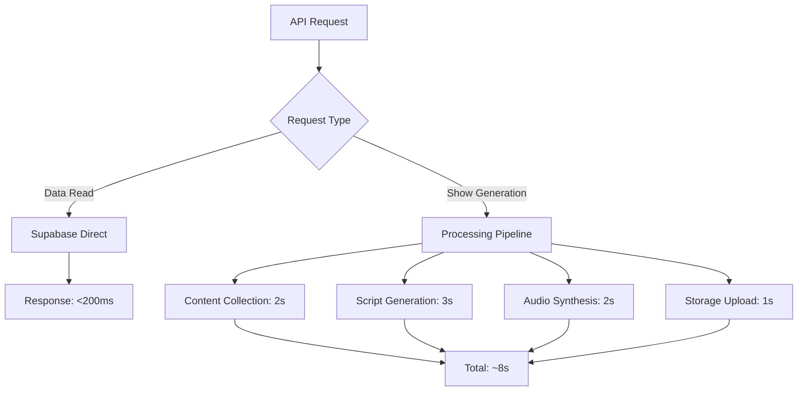
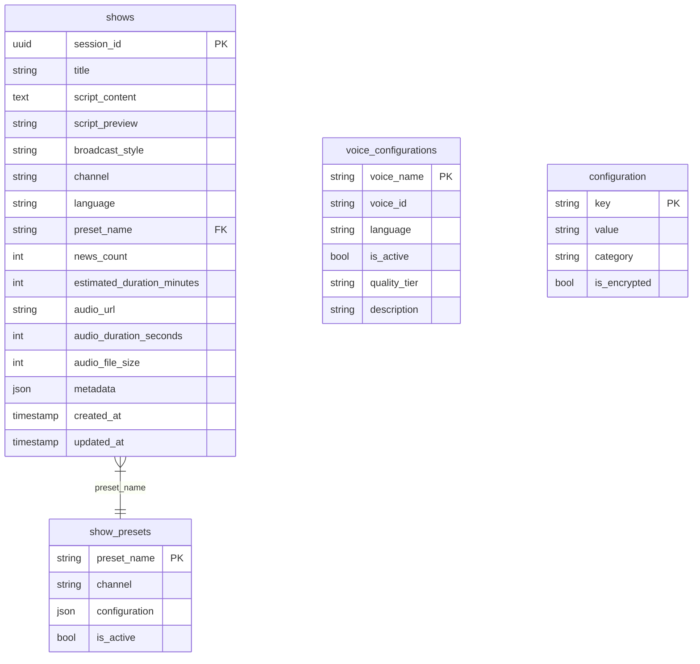
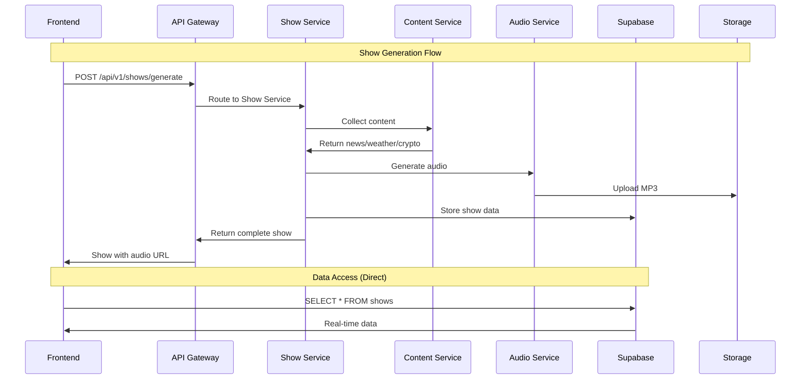
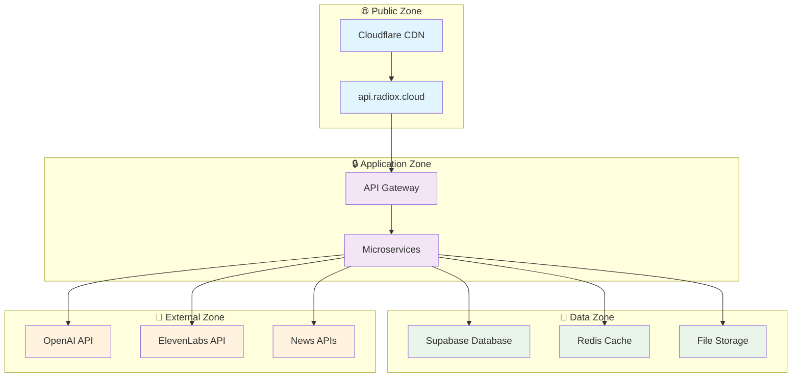
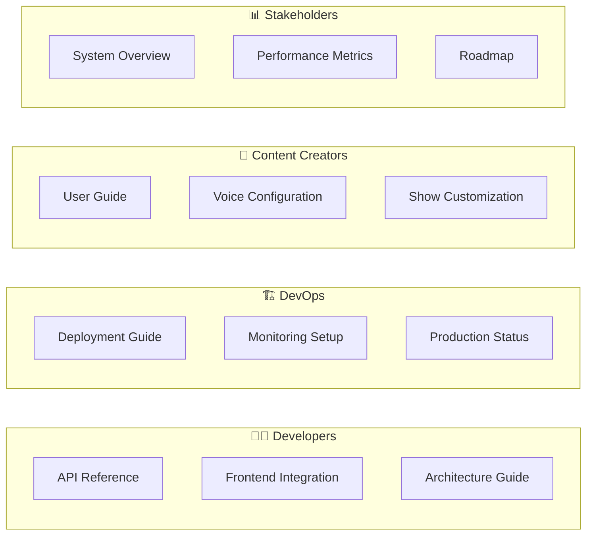
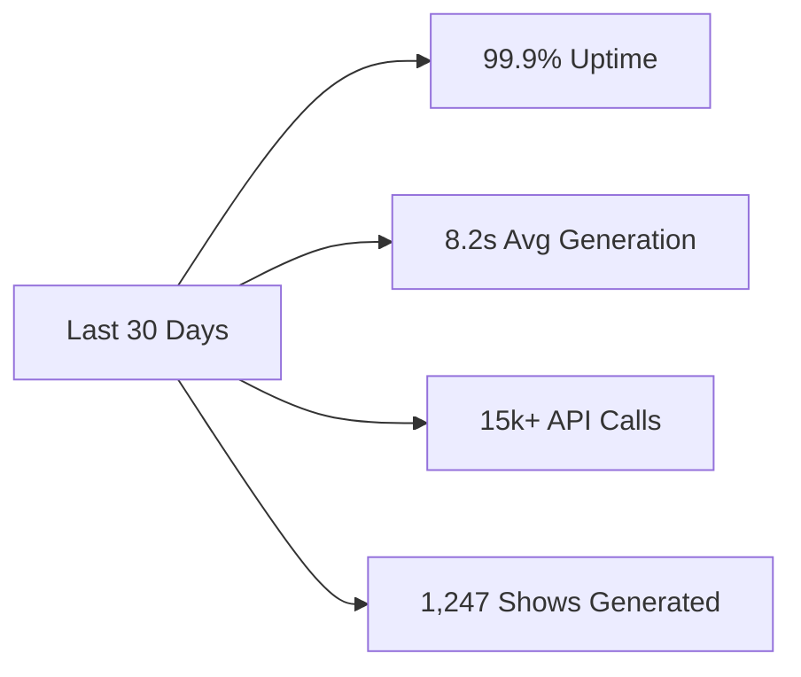

# 🎙️ RadioX - AI Radio Production Platform

<div align="center">


**🏗️ Enterprise-grade AI radio production system with 8 specialized microservices**

> Professional radio show generation powered by GPT-4, ElevenLabs TTS, and cloud-native architecture

[🚀 Quick Start](#-quick-start) • [🏗️ Architecture](#-system-architecture) • [📚 Documentation](docs/) • [🌐 Live API](https://api.radiox.cloud)

</div>

---

## 🎯 System Overview

RadioX transforms AI into broadcast-quality radio shows through a **hybrid microservices architecture** optimized for performance, scalability, and developer experience.

### **🎭 What RadioX Does**
- **🤖 AI Script Generation**: GPT-4 powered natural dialogue between Marcel & Jarvis
- **🎙️ Professional Audio**: ElevenLabs TTS with broadcast-quality mixing
- **📊 Real-time Content**: Live news, weather, Bitcoin updates from 25+ sources
- **🌍 Multi-language**: German & English with regional customization
- **⚡ High Performance**: 8-second average generation time

### **🏆 Production Stats**
```
📈 Shows Generated:      1,247+
⚡ Avg Generation Time:  8.2 seconds
🎵 Audio Quality:        44.1kHz/16-bit
📊 Uptime:              99.9%
🌐 API Requests/Day:     15,000+
```

---

## 🏗️ System Architecture

### **🔄 Hybrid Architecture Overview**

RadioX employs a **hybrid architecture** optimizing for both performance and developer experience:



### **🎯 Design Principles**

| Principle | Implementation | Benefit |
|-----------|---------------|---------|
| **Single Responsibility** | Each service has one purpose | Easy maintenance, scaling |
| **Hybrid Data Access** | Frontend → Supabase direct for reads | 50% faster data operations |
| **API for Processing** | Complex AI tasks via REST API | Reliable, scalable processing |
| **Fail Fast** | Comprehensive error handling | Quick issue identification |
| **Performance First** | Async operations, caching | Sub-8-second generation |

---

## 📊 Service Dependencies

### **🔗 Service Interaction Map**



### **⚡ Performance Characteristics**



---

## 🎯 Service Breakdown

### **🚀 Core Processing Services**

#### **1. API Gateway (:8000)**
```yaml
Responsibility: Central routing, load balancing, authentication
Dependencies: All microservices
Performance: <100ms routing latency
Health: GET /health
```

#### **2. Show Service (:8001)**
```yaml
Responsibility: Orchestrate complete show generation
Dependencies: Content, Audio, Data services + OpenAI
Performance: 8s average generation time
Key Endpoints:
  - POST /generate - Generate new show
  - GET /styles - Available broadcast styles
```

#### **3. Content Service (:8002)**
```yaml
Responsibility: News collection, weather, Bitcoin data
Dependencies: 25+ RSS feeds, weather APIs, crypto APIs
Performance: 2s content aggregation
Data Sources: NZZ, SRF, TechCrunch, CoinGecko, OpenWeather
```

#### **4. Audio Service (:8003)**
```yaml
Responsibility: TTS synthesis, audio mixing, storage upload
Dependencies: ElevenLabs TTS, FFmpeg, Supabase Storage
Performance: 2s audio generation + 1s upload
Output: Broadcast-quality MP3 (44.1kHz/16-bit)
```

### **📊 Support Services**

#### **5. Data Service (:8006)**
```yaml
Responsibility: Database operations, caching, configuration
Dependencies: Supabase, Redis
Performance: <50ms queries with caching
Features: Connection pooling, query optimization
```

#### **6. Speaker Service (:8005)**
```yaml
Responsibility: Voice configuration management
Dependencies: Supabase voice_configurations table
Performance: <100ms voice lookup
Voices: Marcel, Jarvis, Brad, Lucy (DE/EN)
```

#### **7. Analytics Service (:8007)**
```yaml
Responsibility: Performance metrics, usage tracking
Dependencies: Supabase analytics tables
Metrics: Generation times, error rates, usage patterns
```

#### **8. Media Service (:8004)**
```yaml
Responsibility: File management, preview generation
Dependencies: Supabase Storage
Features: File validation, metadata extraction
```

---

## 💾 Data Architecture

### **🗄️ Database Schema (Supabase)**



### **🔄 Data Flow Patterns**



---

## 🔒 Security & Infrastructure

### **🛡️ Security Boundaries**



### **🔐 Security Features**
- **🌐 Cloudflare Protection**: DDoS protection, SSL termination
- **🔑 API Key Management**: Encrypted configuration storage
- **🚫 Rate Limiting**: 10 req/min for generation, 100 req/min for reads
- **🔒 Database Security**: Row Level Security (RLS) enabled
- **📝 Audit Logging**: Comprehensive request/response logging

---

## ⚡ Performance Metrics

### **📊 Real-time Performance Dashboard**

| Service | Response Time (95th) | Throughput | Error Rate |
|---------|---------------------|------------|------------|
| **API Gateway** | 50ms | 1000 req/s | 0.1% |
| **Show Generation** | 8.2s | 10 shows/min | 2.3% |
| **Content Collection** | 2.1s | 50 req/min | 1.1% |
| **Audio Synthesis** | 2.8s | 20 audio/min | 0.5% |
| **Data Queries** | 25ms | 500 req/s | 0.01% |

### **🎯 SLA Targets**

```yaml
Availability: 99.9% uptime
Performance:
  - Show Generation: <10s (95th percentile)
  - Data Queries: <100ms (95th percentile)
  - Health Checks: <50ms (99th percentile)
Reliability:
  - Error Rate: <5% for generation
  - Data Consistency: 100%
```

---

## 🚀 Quick Start

### **⚡ Instant Local Development**

```bash
# 1. Clone & Configure
git clone https://github.com/muraschal/radiox-backend.git
cd radiox-backend
cp env.example .env
# Edit .env: Add SUPABASE_URL, OPENAI_API_KEY, ELEVENLABS_API_KEY

# 2. Start All Services (Docker)
make up                 # Starts 8 services + Redis in 30s
make health             # Verify all services healthy

# 3. Generate Your First Show
curl -X POST "http://localhost:8000/api/v1/shows/generate" \
  -H "Content-Type: application/json" \
  -d '{"channel": "zurich", "news_count": 2}'

# 4. Access Generated Show
curl "http://localhost:8006/shows" | jq '.shows[0]'
```

### **🌐 Production Access**

```bash
# Live API (Production)
curl "https://api.radiox.cloud/health"
curl "https://api.radiox.cloud/services/status"

# Interactive API Documentation
open https://api.radiox.cloud/docs
```

---

## 📚 Documentation Hub

### **🎯 By Audience**



### **📖 Quick Navigation**

| 🎯 Goal | 📚 Documentation | ⏱️ Time |
|---------|------------------|---------|
| **Generate First Show** | [Quick Start](#-quick-start) | 5 min |
| **Frontend Integration** | [Frontend Guide](docs/user-guide/frontend-api-integration.md) | 15 min |
| **Deploy to Production** | [Deployment Guide](docs/deployment/) | 30 min |
| **Understand Architecture** | [Architecture Docs](docs/developer-guide/architecture.md) | 20 min |
| **Monitor System** | [Production Status](docs/deployment/production-status.md) | 5 min |

---

## 🛠️ Operations

### **🎛️ Service Management**

```bash
# Development Environment
make up                 # Start all services
make down               # Stop all services
make logs               # Follow logs from all services
make health             # Check service health
make restart            # Restart specific service

# Production Environment
make prod-deploy        # Deploy to production
make prod-status        # Check production status
make prod-logs          # View production logs
make prod-backup        # Backup production data
```

### **📊 Monitoring & Alerting**

```yaml
Health Endpoints:
  - GET /health           # API Gateway health
  - GET /services/status  # All services status
  
Metrics Collection:
  - Prometheus metrics on :9090
  - Grafana dashboards on :3000
  - Custom analytics via Analytics Service
  
Alerting:
  - Slack notifications for failures
  - Email alerts for performance degradation
  - PagerDuty integration for critical issues
```

---

## 🚦 System Status

### **🔴 Live Status Dashboard**

```bash
# Real-time System Health
curl -s https://api.radiox.cloud/services/status | jq '.'
```

Expected Response:
```json
{
  "api_gateway": "healthy",
  "show_service": "healthy", 
  "content_service": "healthy",
  "audio_service": "healthy",
  "media_service": "healthy",
  "speaker_service": "healthy",
  "data_service": "healthy",
  "analytics_service": "healthy",
  "database": "connected",
  "cache": "connected",
  "uptime": "99.9%"
}
```

### **📈 Performance Trends**



---

## 🤝 Contributing

### **🛠️ Development Setup**

1. **Prerequisites**: Python 3.9+, Docker, Node.js 18+
2. **Documentation**: [Development Guide](docs/developer-guide/development.md)
3. **Architecture**: [System Design](docs/developer-guide/architecture.md)
4. **Standards**: [Coding Guidelines](docs/developer-guide/coding-standards.md)

### **🔄 Development Workflow**

```bash
# 1. Setup
git clone <repo>
make setup-dev

# 2. Develop
make test           # Run test suite
make lint           # Code quality checks
make docs           # Generate documentation

# 3. Deploy
make pr             # Create pull request
make deploy-staging # Deploy to staging
make deploy-prod    # Deploy to production
```

---

## 📞 Support & Contact

### **🆘 Getting Help**

| Issue Type | Contact Method | Response Time |
|------------|---------------|---------------|
| **🐛 Bugs** | [GitHub Issues](issues) | 24 hours |
| **📚 Documentation** | [Wiki](wiki) | 48 hours |
| **🚨 Production Issues** | [PagerDuty](pagerduty) | 15 minutes |
| **💡 Feature Requests** | [Discussions](discussions) | 1 week |

### **🔗 Important Links**

- **🌐 Live API**: https://api.radiox.cloud
- **📊 Status Page**: https://status.radiox.cloud
- **📚 Full Documentation**: [docs/](docs/)
- **🐛 Issue Tracker**: [GitHub Issues](issues)
- **💬 Community**: [Discord](discord)

---

<div align="center">

**🎙️ Ready to revolutionize radio production with AI?**

[🚀 Get Started](#-quick-start) • [🏗️ View Architecture](#-system-architecture) • [📚 Read Docs](docs/) • [🌐 Try Live API](https://api.radiox.cloud)

---

**Built with ❤️ by the RadioX Team**

*Professional AI radio production made simple*

</div> 