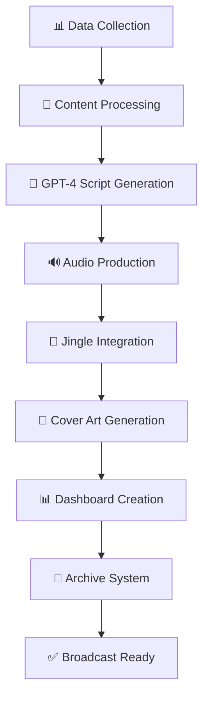

# 📚 RadioX Documentation

**Complete documentation for the RadioX AI Radio Production System**

---

## 🚀 Quick Navigation

### 👥 **For Users**
- **[🎙️ Show Generation Guide](user-guide/show-generation.md)** - Complete workflow for creating radio shows
- **[🎤 Voice Configuration](user-guide/voice-configuration.md)** - Setup Marcel, Jarvis, Lucy, Brad voices
- **[🎵 Jingle Setup Guide](user-guide/jingle-setup.md)** - Multi-format jingle configuration & optimization
- **[📊 RSS Dashboard](user-guide/rss-dashboard.md)** - Managing news feeds and content sources
- **[🔧 API Reference](user-guide/api-reference.md)** - Complete API documentation

### 👨‍💻 **For Developers**
- **[🏗️ System Architecture](developer-guide/architecture.md)** - Technical system design & components
- **[🔧 Development Setup](developer-guide/development.md)** - Local development environment
- **[🛠️ Services Documentation](developer-guide/services.md)** - Complete service architecture
- **[🗄️ Database Schema](developer-guide/database-schema.md)** - Supabase database structure
- **[📊 Data Collection](developer-guide/data-collection.md)** - RSS feeds & data processing
- **[🧪 Testing Guide](developer-guide/testing.md)** - Testing strategies & tools
- **[🤝 Contributing Guide](developer-guide/contributing.md)** - How to contribute to RadioX
- **[📈 Migration Guide v3.2](developer-guide/migration-v3.2.md)** - Migration from older versions

### 🚀 **For DevOps**
- **[🐳 Docker Deployment](deployment/docker.md)** - Containerized deployment
- **[🏭 Production Setup](deployment/production.md)** - Production deployment guide
- **[📊 Monitoring](deployment/monitoring.md)** - System monitoring & alerting

---

## 🎯 Feature Documentation

### 🎙️ **Audio System**
RadioX uses a sophisticated 3-phase audio system:

```
PHASE 1 - INTRO (0-12s):
├── 0-3s:  Pure 100% jingle (powerful intro)
└── 3-13s: Ultra-smooth fade 100% → 10%

PHASE 2 - BACKGROUND (12s-End-7s):
├── Speech: 100% volume (dominant)
└── Jingle: 10% volume (subtle backing)

PHASE 3 - OUTRO (Last 7s):
└── Ultra-smooth ramp-up 10% → 100%
```

**📖 Detailed Documentation:** [Jingle Setup Guide](user-guide/jingle-setup.md)

### 🎭 **Voice System**
RadioX supports multiple AI voices with intelligent assignment:

| Voice | Use Case | Characteristics |
|-------|----------|----------------|
| **Marcel** | Host, main presenter | Energetic, conversational |
| **Jarvis** | AI assistant, technical | Precise, digital |
| **Lucy** | Weather reports | Sultry, atmospheric |
| **Brad** | News anchor | Professional, authoritative |

**📖 Detailed Documentation:** [Voice Configuration](user-guide/voice-configuration.md)

### 🎨 **Visual System**
- **DALL-E 3 Cover Art** - AI-generated covers per show
- **Tailwind Dashboard** - Modern, responsive show notes
- **Unified Naming** - `radiox_yymmdd_hhmm.ext` consistency

**📖 Detailed Documentation:** [Show Generation Guide](user-guide/show-generation.md)

### 📊 **Data System**
- **25+ RSS Feeds** - Real-time Swiss & international news
- **Supabase Integration** - Enterprise database
- **Smart Filtering** - Content diversity & quality control

**📖 Detailed Documentation:** [Data Collection](developer-guide/data-collection.md)

---

## 🛠️ Technical Architecture



**📖 Detailed Documentation:** [System Architecture](developer-guide/architecture.md)

---

## 🚀 Getting Started

### Quick Setup
```bash
# 1. Clone repository
git clone https://github.com/muraschal/radiox-backend.git
cd radiox-backend

# 2. Install dependencies
python -m venv venv && source venv/bin/activate
pip install -r requirements.txt

# 3. Configure APIs
cp env_template.txt .env
# Add API keys: OPENAI_API_KEY, ELEVENLABS_API_KEY, etc.

# 4. Add jingles
mkdir jingles
# Add your jingle files (MP3, FLAC, WAV, OGG)

# 5. Generate first show
python main.py --news-count 3
```

**📖 Detailed Documentation:** [Development Setup](developer-guide/development.md)

---

## 📈 Latest Updates

### 🎯 **v3.3 - Audio System Revolution**
- ✅ **MP3 Metadata Fix** - Correct `"RadioX - Edition : HH:MM Edition"` format
- ✅ **3-Phase Jingle System** - Cinematic audio transitions
- ✅ **Professional Volume Levels** - 10% background, 100% speech dominance
- ✅ **Multi-Format Support** - MP3, FLAC, WAV, OGG jingles
- ✅ **Cover Embedding Fix** - Proper workflow order
- ✅ **Complete Documentation** - All services fully documented

**📖 Migration Guide:** [Migration v3.2](developer-guide/migration-v3.2.md)

---

## 🎯 Performance & Quality

### Audio Quality Metrics
- ✅ **Zero Audio Clipping** - Professional limiting
- ✅ **Seamless Transitions** - Inaudible phase changes  
- ✅ **Speech Intelligibility** - 100% clarity maintained
- ✅ **Musical Cohesion** - Jingle enhances, never distracts
- ✅ **Broadcast Ready** - Professional radio standards

### System Performance
- **🚀 Audio Generation:** ~2-3 minutes for 4-news show
- **🎵 Jingle Integration:** Professional 10% backing
- **🎨 Cover Creation:** ~30 seconds via DALL-E 3
- **📊 Dashboard:** Generated in <5 seconds
- **🔄 Content Diversity:** 100% unique show-to-show

---

## 🤝 Support & Community

- **🐛 Bug Reports:** [GitHub Issues](https://github.com/muraschal/radiox-backend/issues)
- **💡 Feature Requests:** [GitHub Discussions](https://github.com/muraschal/radiox-backend/discussions)
- **📖 Documentation:** This directory (`/docs/`)
- **🤝 Contributing:** [Contributing Guide](developer-guide/contributing.md)

---

**🎙️ Ready to create broadcast-quality AI radio shows?** → Start with the [Show Generation Guide](user-guide/show-generation.md) 