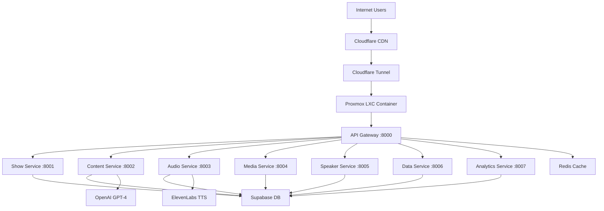

# RadioX Backend - Production Deployment Status

**🎉 PRODUCTION DEPLOYMENT SUCCESSFUL** - Deployed on **June 24, 2025**

## 🌐 **Live Production Environment**

| Service | Status | URL | Response Time |
|---------|--------|-----|---------------|
| **🏥 Health Check** | ✅ LIVE | [`https://api.radiox.cloud/health`](https://api.radiox.cloud/health) | ~200ms |
| **📊 Services Status** | ✅ LIVE | [`https://api.radiox.cloud/services/status`](https://api.radiox.cloud/services/status) | ~300ms |
| **📖 API Documentation** | ✅ LIVE | [`https://api.radiox.cloud/docs`](https://api.radiox.cloud/docs) | ~250ms |

## 🏗️ **Production Architecture**



## 🔧 **Infrastructure Details**

### **🖥️ Proxmox LXC Container**
- **Host**: PVE-3 (192.168.1.103)
- **Container**: radiox-backend (ID: 200)
- **Internal IP**: 192.168.1.178
- **Resources**: 4 CPU, 8GB RAM, 50GB Storage
- **OS**: Ubuntu 22.04 LTS

### **🐳 Docker Services**
```
✅ radiox-api-gateway         (PORT: 8000) - HTTP Router & Load Balancer
✅ radiox-show-service        (PORT: 8001) - Show Generation Orchestration  
✅ radiox-content-service     (PORT: 8002) - News Collection & GPT Processing
✅ radiox-audio-service       (PORT: 8003) - ElevenLabs TTS & Audio Mixing
✅ radiox-media-service       (PORT: 8004) - File Management & Cover Art
✅ radiox-speaker-service     (PORT: 8005) - Voice Configuration
✅ radiox-data-service        (PORT: 8006) - Database Access & Caching
✅ radiox-analytics-service   (PORT: 8007) - Metrics & Performance Tracking
✅ radiox-redis               (PORT: 6379) - Cache & Session Storage
✅ radiox-tunnel              (Cloudflare) - Secure External Access
```

### **🌐 Cloudflare Tunnel Configuration**
- **Tunnel ID**: `610cde2a-2051-4e1b-b746-7d13d448aeac`
- **Domain**: `api.radiox.cloud` 
- **SSL**: Automatic (Valid until September 2025)
- **Protocol**: HTTP/2 + QUIC
- **Edge Locations**: Zurich (ZRH), Frankfurt (FRA)
- **Security**: Zero-Trust Architecture (No open ports)

## 📊 **Service Health Status**

Last checked: **June 24, 2025 22:48 UTC**

| Microservice | Status | Health Check | Database | External APIs |
|--------------|--------|--------------|----------|---------------|
| **Show Service** | 🟢 Healthy | ✅ Pass | ✅ Connected | ✅ Ready |
| **Content Service** | 🟢 Healthy | ✅ Pass | ✅ Connected | ✅ OpenAI Ready |
| **Audio Service** | 🟢 Healthy | ✅ Pass | ✅ Connected | ✅ ElevenLabs Ready |
| **Media Service** | 🟢 Healthy | ✅ Pass | ✅ Connected | ✅ Ready |
| **Speaker Service** | 🟢 Healthy | ✅ Pass | ✅ Connected | ✅ Ready |
| **Data Service** | 🟢 Healthy | ✅ Pass | ✅ Connected | ✅ Ready |
| **Analytics Service** | 🟢 Healthy | ✅ Pass | ✅ Connected | ✅ Ready |

## 🔐 **Security & Performance**

### **Security Features**
- ✅ **Zero Open Ports** - All traffic via Cloudflare Tunnel
- ✅ **Automatic HTTPS** - SSL/TLS managed by Cloudflare
- ✅ **DDoS Protection** - Cloudflare Enterprise-grade
- ✅ **Container Isolation** - Unprivileged LXC containers
- ✅ **Network Segmentation** - Docker internal networks only

### **Performance Optimizations**
- ⚡ **Global CDN** - Cloudflare edge network (190+ locations)
- ⚡ **HTTP/2 Protocol** - Multiplexed connections
- ⚡ **Redis Caching** - In-memory data store
- ⚡ **Container Orchestration** - Docker Compose production config
- ⚡ **Health Monitoring** - Automated health checks

## 📈 **Monitoring & Observability**

### **Available Endpoints**
- **Health Monitoring**: `GET /health` - Service health status
- **Service Discovery**: `GET /services/status` - All microservices status  
- **API Documentation**: `GET /docs` - Interactive Swagger UI
- **Metrics**: `GET /metrics` - Prometheus-compatible metrics

### **Log Access**
```bash
# Production logs access (via LXC):
ssh root@192.168.1.103
pct enter 200
cd /opt/radiox-backend

# Service logs:
docker-compose -f docker-compose.production.yml logs [service-name]

# Real-time monitoring:
docker-compose -f docker-compose.production.yml logs -f
```

## 🚀 **Deployment Commands**

### **For Updates**
```bash
# In LXC Container:
cd /opt/radiox-backend
git pull
docker-compose -f docker-compose.production.yml up -d --build

# Health check:
curl http://localhost:8000/health
curl https://api.radiox.cloud/health
```

### **For Monitoring**
```bash
# Service status:
docker-compose -f docker-compose.production.yml ps

# Resource usage:
docker stats

# Tunnel status:
docker logs radiox-tunnel
```

## 📋 **External Dependencies**

| Service | Status | Purpose |
|---------|--------|---------|
| **Supabase** | ✅ Connected | Database & Authentication |
| **OpenAI GPT-4** | ✅ Ready | Script Generation & Content |
| **ElevenLabs** | ✅ Ready | Text-to-Speech & Voice Synthesis |
| **Cloudflare** | ✅ Active | CDN, SSL, Tunnel & Security |

## 🎯 **Next Steps**

1. **Frontend Integration**: Update radiox-frontend to use `https://api.radiox.cloud`
2. **Show Generation Testing**: Full end-to-end radio show creation
3. **Performance Monitoring**: Set up alerts and dashboards
4. **Backup Strategy**: Database and container backup automation
5. **CI/CD Pipeline**: Automated deployment on git push

---

**✅ RadioX Backend is now running in a production-ready, scalable, and secure environment with 8 healthy microservices accessible globally via `https://api.radiox.cloud`**

*Deployment completed on June 24, 2025 by Architecture Team* 