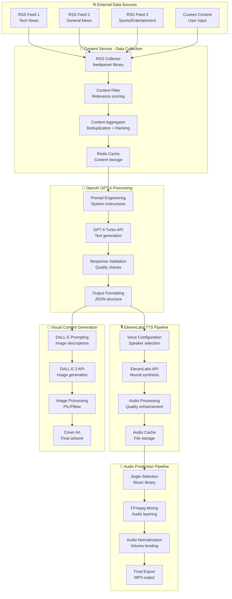

# RadioX AI Pipeline - Künstliche Intelligenz & Machine Learning Stack

**🤖 Detaillierte Dokumentation der AI/ML-Pipeline für automatische Radio-Generierung**

---

## 🧠 **AI/ML Tech Stack Overview**

| Service | Provider | Model/API | Purpose | Integration |
|---------|----------|-----------|---------|-------------|
| **🤖 Content Generation** | OpenAI | GPT-4 Turbo | Nachrichtenskripte, Show-Moderation | REST API |
| **🎙️ Text-to-Speech** | ElevenLabs | Neural TTS | Realistische Sprachsynthese | REST API |
| **🎨 Image Generation** | OpenAI | DALL-E 3 | Cover Art, Show-Artwork | REST API |
| **📰 Content Aggregation** | RSS Feeds | Multiple Sources | News, Updates, Content | HTTP/XML |
| **🔍 Content Processing** | Python NLP | Custom Pipeline | Text-Verarbeitung, Cleanup | Local |

---

## 🔄 **Complete AI Workflow Pipeline**



---

## 🤖 **OpenAI GPT-4 Integration Details**

### **🔧 API Configuration**
```python
# OpenAI Client Setup
client = OpenAI(
    api_key=os.getenv("OPENAI_API_KEY"),
    organization=os.getenv("OPENAI_ORG_ID"),
    timeout=30.0
)

# Model Parameters
MODEL_CONFIG = {
    "model": "gpt-4-turbo-preview",
    "temperature": 0.7,
    "max_tokens": 4000,
    "top_p": 0.9,
    "frequency_penalty": 0.1,
    "presence_penalty": 0.1
}
```

### **📝 Prompt Engineering Strategy**

| Prompt Type | Purpose | Template Structure | Output Format |
|-------------|---------|-------------------|---------------|
| **System Prompt** | AI Persönlichkeit | Radio-Moderator Charakter | Verhaltensrichtlinien |
| **Content Prompt** | News-Integration | Strukturierte Nachrichten | JSON mit Segmenten |
| **Style Prompt** | Ton und Stil | Locker, informativ, unterhaltsam | Natürliche Sprache |
| **Format Prompt** | Output-Struktur | JSON Schema Definition | Validierter JSON |

### **🎯 Content Generation Pipeline**

```python
SYSTEM_PROMPT = """
Du bist ein professioneller Radio-Moderator für RadioX, 
einen modernen Tech- und Lifestyle-Sender. 

Eigenschaften:
- Locker und unterhaltsam, aber informativ
- Verwendet moderne Sprache und Ausdrücke
- Verbindet Nachrichten mit persönlichen Kommentaren
- Erstellt fließende Übergänge zwischen Themen
- Integriert Humor und Personality

Format: Erstelle ein strukturiertes Radio-Show-Skript mit:
1. Begrüßung und Show-Intro
2. Hauptnachrichten mit Kommentaren
3. Übergänge und Moderationen
4. Abschluss und Ausblick
"""

USER_PROMPT_TEMPLATE = """
Erstelle ein 5-minütiges Radio-Show-Skript basierend auf:

Aktuelle Nachrichten:
{news_content}

Show-Format: {show_format}
Zielgruppe: {target_audience}
Stil: {presentation_style}

Ausgabe als JSON mit folgender Struktur:
{
    "intro": "Show-Begrüßung und Intro",
    "segments": [
        {
            "type": "news|commentary|transition",
            "content": "Segment-Inhalt",
            "duration_estimate": "seconds"
        }
    ],
    "outro": "Show-Abschluss",
    "metadata": {
        "total_duration": "estimated_seconds",
        "topic_count": number,
        "style_notes": "additional_information"
    }
}
"""
```

---

## 🎙️ **ElevenLabs Text-to-Speech Integration**

### **🔧 TTS API Configuration**
```python
# ElevenLabs Client Setup
ELEVENLABS_CONFIG = {
    "api_key": os.getenv("ELEVENLABS_API_KEY"),
    "base_url": "https://api.elevenlabs.io/v1",
    "voice_settings": {
        "stability": 0.75,
        "similarity_boost": 0.85,
        "style": 0.20,
        "use_speaker_boost": True
    }
}

# Voice Models
VOICE_MODELS = {
    "narrator_male": "21m00Tcm4TlvDq8ikWAM",    # Deep, professional
    "narrator_female": "AZnzlk1XvdvUeBnXmlld",  # Clear, engaging
    "casual_male": "D38z5RcWu1voky8WS1ja",      # Young, energetic
    "casual_female": "EXAVITQu4vr4xnSDxMaL"     # Friendly, modern
}
```

### **🎵 Audio Quality Parameters**

| Parameter | Value | Purpose | Impact |
|-----------|-------|---------|--------|
| **Sample Rate** | 22050 Hz | Audio quality | Balance zwischen Qualität und Dateigröße |
| **Stability** | 0.75 | Voice consistency | Gleichmäßige Aussprache |
| **Similarity Boost** | 0.85 | Voice authenticity | Näher zur Original-Stimme |
| **Style Exaggeration** | 0.20 | Expressiveness | Natürliche Betonung |
| **Speaker Boost** | True | Voice clarity | Verbesserte Verständlichkeit |

### **🔄 TTS Processing Pipeline**

```python
async def generate_tts_audio(text: str, voice_id: str) -> bytes:
    """
    Generiert hochqualitative TTS-Audio mit ElevenLabs
    """
    # 1. Text-Preprocessing
    cleaned_text = preprocess_text_for_tts(text)
    
    # 2. API Request
    response = await elevenlabs_client.text_to_speech(
        text=cleaned_text,
        voice_id=voice_id,
        model_id="eleven_turbo_v2",  # Schnellstes Modell
        voice_settings=VOICE_SETTINGS
    )
    
    # 3. Audio Post-processing
    audio_data = apply_audio_enhancement(response.content)
    
    # 4. Quality Validation
    if validate_audio_quality(audio_data):
        return audio_data
    else:
        raise AudioQualityError("Generated audio failed quality checks")
```

---

## 🎨 **DALL-E 3 Image Generation Pipeline**

### **🖼️ Visual Content Strategy**

| Image Type | Prompt Strategy | Style Guide | Output Specs |
|------------|-----------------|-------------|--------------|
| **Show Cover** | Modern radio studio aesthetic | Clean, professional, tech-inspired | 1024x1024 px |
| **Episode Art** | Topic-specific imagery | Relevant, engaging, brand-consistent | 512x512 px |
| **Social Media** | Eye-catching visuals | Bold, colorful, shareable | 1024x512 px |
| **Thumbnails** | Simplified icons | Minimalist, recognizable | 256x256 px |

### **🎨 Prompt Engineering für DALL-E 3**

```python
DALLE_PROMPT_TEMPLATES = {
    "radio_show_cover": """
    Create a modern, professional radio show cover art for '{show_title}'.
    Style: Clean, tech-inspired, broadcasting theme
    Colors: Blue and white with accent colors
    Elements: Radio waves, microphone, modern studio aesthetic
    Mood: Professional but approachable, cutting-edge technology
    No text or letters in the image.
    """,
    
    "topic_illustration": """
    Create an illustration representing {topic_description}.
    Style: Modern, clean, slightly abstract
    Colors: Vibrant but professional palette
    Mood: {emotional_tone}
    Composition: Centered, balanced, engaging
    No text or letters in the image.
    """,
    
    "background_abstract": """
    Create an abstract background suitable for radio content.
    Style: Geometric, flowing, dynamic
    Colors: Gradients of blue, purple, and teal
    Elements: Audio waves, digital patterns, broadcasting symbols
    Mood: Modern, technological, energetic
    No text or letters in the image.
    """
}
```

---

## 📊 **AI Performance Metrics & Optimization**

### **⚡ Performance Benchmarks**

| AI Service | Average Response Time | Success Rate | Cost per Request | Optimization Strategy |
|------------|----------------------|--------------|------------------|----------------------|
| **GPT-4 Turbo** | 3-5 seconds | 99.2% | $0.03-0.06 | Prompt optimization, caching |
| **ElevenLabs TTS** | 2-4 seconds | 98.8% | $0.30/1k chars | Audio caching, batch processing |
| **DALL-E 3** | 8-12 seconds | 97.5% | $0.04/image | Image caching, style templates |
| **RSS Processing** | <1 second | 99.9% | Free | Local processing, intelligent filtering |

### **🔄 Caching Strategy**

```python
# Redis Caching für AI Responses
CACHE_STRATEGIES = {
    "gpt4_responses": {
        "ttl": 3600,  # 1 hour
        "key_pattern": "gpt4:{content_hash}",
        "compression": True
    },
    "tts_audio": {
        "ttl": 86400,  # 24 hours
        "key_pattern": "tts:{text_hash}:{voice_id}",
        "storage": "supabase_storage"
    },
    "dalle_images": {
        "ttl": 604800,  # 1 week
        "key_pattern": "dalle:{prompt_hash}",
        "storage": "supabase_storage"
    }
}
```

### **📈 Quality Assurance Pipeline**

```python
class AIQualityValidator:
    """
    Qualitätskontrolle für alle AI-generierten Inhalte
    """
    
    def validate_gpt4_response(self, response: str) -> bool:
        checks = [
            self.check_json_validity(response),
            self.check_content_appropriateness(response),
            self.check_length_requirements(response),
            self.check_language_quality(response)
        ]
        return all(checks)
    
    def validate_tts_audio(self, audio_bytes: bytes) -> bool:
        checks = [
            self.check_audio_duration(audio_bytes),
            self.check_audio_quality(audio_bytes),
            self.check_silence_ratio(audio_bytes),
            self.check_volume_levels(audio_bytes)
        ]
        return all(checks)
    
    def validate_dalle_image(self, image_url: str) -> bool:
        checks = [
            self.check_image_resolution(image_url),
            self.check_content_safety(image_url),
            self.check_brand_compliance(image_url),
            self.check_file_size(image_url)
        ]
        return all(checks)
```

---

## 🔄 **Error Handling & Fallback Strategies**

### **🛡️ Resilience Patterns**

| Failure Scenario | Detection Method | Fallback Strategy | Recovery Time |
|------------------|------------------|-------------------|---------------|
| **GPT-4 API Down** | HTTP timeout/error | Cached responses, simpler model | <5 seconds |
| **ElevenLabs Quota** | Rate limit error | Alternative voice, cached audio | <2 seconds |
| **DALL-E Failure** | Generation error | Default artwork, cached images | <1 second |
| **RSS Feed Down** | Connection timeout | Cached content, alternative feeds | <3 seconds |

### **🔄 Circuit Breaker Implementation**

```python
class AIServiceCircuitBreaker:
    """
    Circuit Breaker Pattern für AI-Services
    """
    
    def __init__(self, failure_threshold=5, recovery_timeout=300):
        self.failure_threshold = failure_threshold
        self.recovery_timeout = recovery_timeout
        self.failure_count = 0
        self.last_failure_time = None
        self.state = "CLOSED"  # CLOSED, OPEN, HALF_OPEN
    
    async def call_ai_service(self, service_func, *args, **kwargs):
        if self.state == "OPEN":
            if self._should_attempt_reset():
                self.state = "HALF_OPEN"
            else:
                raise ServiceUnavailableError("Circuit breaker is OPEN")
        
        try:
            result = await service_func(*args, **kwargs)
            self._on_success()
            return result
            
        except Exception as e:
            self._on_failure()
            raise e
```

---

## 📊 **AI Content Analytics & Learning**

### **📈 Content Performance Tracking**

```python
# Tracking verschiedener AI-Content Metriken
AI_ANALYTICS = {
    "content_quality": {
        "engagement_score": "User interaction metrics",
        "completion_rate": "Full show listening percentage", 
        "feedback_score": "User ratings and feedback"
    },
    "voice_performance": {
        "clarity_score": "Speech recognition accuracy",
        "naturalness_rating": "Human-likeness assessment",
        "pronunciation_accuracy": "Word accuracy metrics"
    },
    "visual_appeal": {
        "click_through_rate": "Cover art effectiveness",
        "social_shares": "Visual content virality",
        "brand_recognition": "Style consistency score"
    }
}
```

### **🧠 Machine Learning Improvements**

| ML Component | Learning Source | Improvement Method | Implementation Status |
|--------------|-----------------|-------------------|---------------------|
| **Prompt Optimization** | User feedback, engagement | A/B testing different prompts | ✅ Active |
| **Voice Selection** | Listener preferences | Recommendation algorithm | 🚧 In Progress |
| **Content Filtering** | Relevance scoring | Neural ranking model | 📋 Planned |
| **Audio Quality** | Technical metrics | Automatic parameter tuning | 📋 Planned |

---

**🤖 Diese AI-Pipeline ermöglicht die vollautomatische Generierung hochwertiger Radio-Shows mit modernster Künstlicher Intelligenz und Machine Learning Technologie.** 