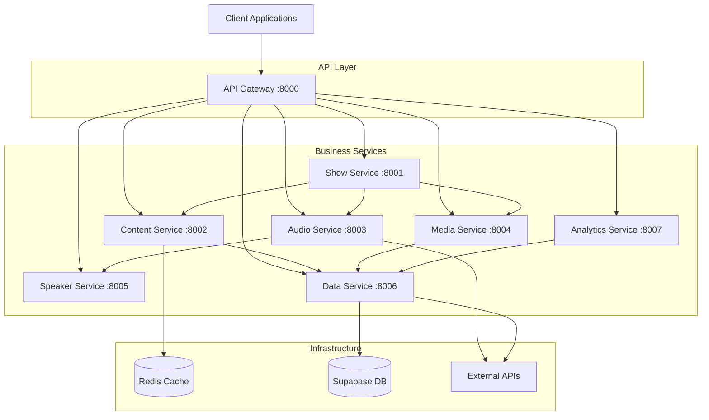
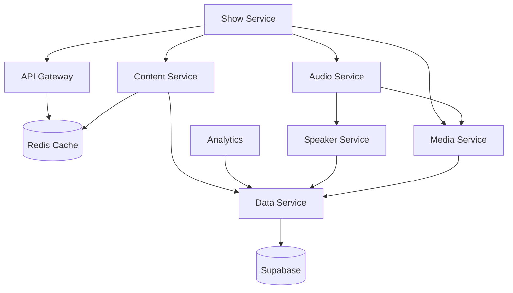
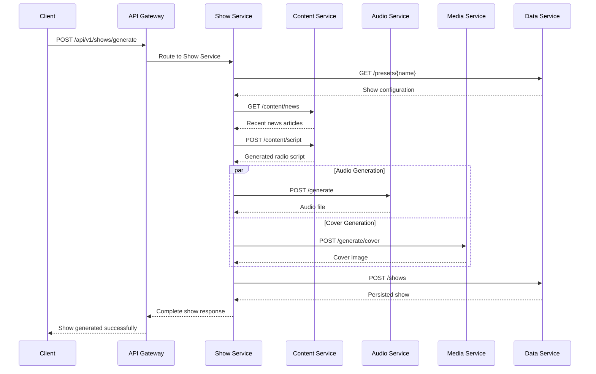

# Microservices Architecture

<div align="center">


**Modern 8-Service Architecture for AI Radio Production**

[🏠 Documentation](../) • [🛠️ Development](development.md) • [🔧 Services](services.md) • [🚀 Deployment](../deployment/)

</div>

---

## Overview

RadioX implements a **cloud-native microservices architecture** with 8 specialized services orchestrated via Docker Compose and deployable to Kubernetes. Each service follows **Google Design Principles** with single responsibility, clean interfaces, and horizontal scalability.

### Architectural Principles

- **🏗️ Clean Architecture** - Separation of concerns across service boundaries
- **📦 Single Responsibility** - Each service owns one business domain
- **🔄 Event-Driven** - Asynchronous communication patterns
- **🚀 Container-First** - Docker-native with Kubernetes deployment
- **📊 Observability** - Comprehensive logging, metrics, and tracing
- **🛡️ Resilience** - Circuit breakers, retries, and graceful degradation

---

## Service Topology



---

## Service Specifications

### 🌐 API Gateway (Port 8000)
**Central routing and service discovery hub**

```yaml
Responsibilities:
  - Request routing and load balancing
  - Service discovery and health monitoring
  - CORS handling and rate limiting
  - Authentication and authorization

Technologies:
  - FastAPI with async/await patterns
  - Redis for session management
  - OpenAPI documentation generation
  
Endpoints:
  - GET /health - System health check
  - GET /services/status - Service registry
  - POST /api/v1/* - Route to appropriate service
```

### 🎭 Show Service (Port 8001)
**Show generation orchestration and workflow management**

```yaml
Responsibilities:
  - End-to-end show generation workflow
  - Service coordination and state management
  - Business logic orchestration
  - Dashboard generation

Technologies:
  - FastAPI with Pydantic models
  - Celery for background tasks
  - State machine pattern implementation
  
Endpoints:
  - POST /generate - Create new radio show
  - GET /shows/{id} - Retrieve show details
  - GET /shows - List all shows
  - GET /dashboard/{id} - Show dashboard
```

### 📰 Content Service (Port 8002)
**News collection and content processing**

```yaml
Responsibilities:
  - RSS feed aggregation (25+ sources)
  - Content filtering and deduplication
  - GPT-4 script generation
  - News categorization and ranking

Technologies:
  - FastAPI with async HTTP clients
  - BeautifulSoup for content parsing
  - OpenAI GPT-4 integration
  - Redis caching layer
  
Endpoints:
  - GET /content/news - Recent news articles
  - POST /content/script - Generate radio script
  - GET /content/feeds - RSS feed status
  - POST /content/process - Process content
```

### 🎤 Audio Service (Port 8003)
**Audio generation and processing**

```yaml
Responsibilities:
  - Text-to-speech via ElevenLabs
  - Audio mixing and mastering
  - Jingle integration (3-phase system)
  - MP3 generation and metadata

Technologies:
  - FastAPI with streaming responses
  - ElevenLabs V3 TTS API
  - FFmpeg for audio processing
  - Pydub for audio manipulation
  
Endpoints:
  - POST /generate - Generate audio from script
  - GET /voices - Available voice models
  - POST /process - Audio post-processing
  - GET /status - Generation queue status
```

### 📁 Media Service (Port 8004)
**File management and media processing**

```yaml
Responsibilities:
  - File upload and storage management
  - Cover art generation via DALL-E 3
  - Archive system management
  - Static file serving

Technologies:
  - FastAPI with file streaming
  - Supabase Storage integration
  - OpenAI DALL-E 3 API
  - Automated backup systems
  
Endpoints:
  - POST /upload - File upload handler
  - GET /files/{id} - File retrieval
  - POST /generate/cover - Cover art creation
  - GET /archive - Archive management
```

### 🗣️ Speaker Service (Port 8005)
**Voice configuration and management**

```yaml
Responsibilities:
  - Voice model configuration
  - Speaker profile management
  - ElevenLabs voice ID mapping
  - Voice quality optimization

Technologies:
  - FastAPI with configuration management
  - Supabase for voice profiles
  - ElevenLabs API integration
  - Voice cloning workflows
  
Endpoints:
  - GET /speakers - Available speakers
  - POST /speakers - Create speaker profile
  - PUT /speakers/{id} - Update configuration
  - DELETE /speakers/{id} - Remove speaker
```

### 💾 Data Service (Port 8006)
**Database access and data management**

```yaml
Responsibilities:
  - Supabase database operations
  - Configuration management
  - Data validation and schemas
  - Caching strategies

Technologies:
  - FastAPI with SQLAlchemy
  - Supabase PostgreSQL
  - Redis for caching
  - Pydantic for validation
  
Endpoints:
  - GET /config - System configuration
  - GET /presets - Show presets
  - POST /data - Store data
  - GET /health - Database health
```

### 📊 Analytics Service (Port 8007)
**Metrics collection and performance monitoring**

```yaml
Responsibilities:
  - Application metrics collection
  - Performance monitoring
  - Usage analytics
  - Alerting and notifications

Technologies:
  - FastAPI with metrics endpoints
  - Prometheus metrics format
  - Grafana dashboard integration
  - Custom monitoring logic
  
Endpoints:
  - GET /metrics - Prometheus metrics
  - GET /health - Service health
  - POST /events - Event tracking
  - GET /analytics - Usage reports
```

---

## Container Architecture

### Docker Composition

```yaml
# docker-compose.yml structure
version: '3.8'

services:
  # API Gateway - Central entry point
  api-gateway:
    build: ./services/api-gateway
    ports: ["8000:8000"]
    environment:
      - REDIS_URL=redis://redis:6379
    depends_on: [redis]
    
  # Business Services
  show-service:
    build: ./services/show-service
    ports: ["8001:8001"]
    environment:
      - GATEWAY_URL=http://api-gateway:8000
    
  # Infrastructure Services  
  redis:
    image: redis:alpine
    ports: ["6379:6379"]
    volumes: ["redis_data:/data"]
    
  # Monitoring
  prometheus:
    image: prom/prometheus
    ports: ["9090:9090"]
    configs: [prometheus.yml]
```

### Service Dependencies



---

## Communication Patterns

### HTTP REST APIs
Primary inter-service communication via RESTful APIs with OpenAPI specifications.

```python
# Service-to-service communication example
async def generate_show(preset_name: str) -> ShowResponse:
    # 1. Get configuration from Data Service
    config = await data_client.get_preset(preset_name)
    
    # 2. Collect content from Content Service  
    content = await content_client.get_recent_news(config.news_count)
    
    # 3. Generate script via Content Service
    script = await content_client.generate_script(content, config)
    
    # 4. Create audio via Audio Service
    audio = await audio_client.generate_audio(script, config.voices)
    
    # 5. Generate cover via Media Service
    cover = await media_client.generate_cover(script.summary)
    
    return ShowResponse(script=script, audio=audio, cover=cover)
```

### Event-Driven Patterns
Asynchronous event processing for non-blocking operations.

```python
# Event publishing example
class ShowGeneratedEvent:
    show_id: str
    timestamp: datetime
    metrics: Dict[str, Any]

# Event handling
@event_handler("show.generated")
async def track_show_metrics(event: ShowGeneratedEvent):
    await analytics_client.track_event(
        event_type="show_generated",
        show_id=event.show_id,
        metrics=event.metrics
    )
```

### Circuit Breaker Pattern
Resilience patterns for external service dependencies.

```python
from circuit_breaker import CircuitBreaker

@CircuitBreaker(failure_threshold=5, timeout=30)
async def call_elevenlabs_api(text: str, voice_id: str) -> bytes:
    """ElevenLabs API call with circuit breaker protection"""
    async with httpx.AsyncClient() as client:
        response = await client.post(
            "https://api.elevenlabs.io/v1/text-to-speech",
            headers={"Authorization": f"Bearer {api_key}"},
            json={"text": text, "voice_id": voice_id}
        )
        response.raise_for_status()
        return response.content
```

---

## Data Flow Architecture

### Show Generation Pipeline



### Data Persistence Strategy

```yaml
Transactional Data (Supabase PostgreSQL):
  - Show configurations and presets
  - Generated scripts and metadata
  - User preferences and settings
  - Analytics and usage metrics

Cache Layer (Redis):
  - API response caching (5-15 minutes TTL)
  - Session data and temporary state
  - Rate limiting counters
  - Content deduplication hashes

File Storage (Supabase Storage + Local):
  - Generated audio files (.mp3)
  - Cover art images (.png)
  - Jingle library (.flac, .mp3, .wav)
  - Archive and backup files
```

---

## Deployment Architecture

### Local Development

```bash
# Start all services
make up

# Service-specific development
make up-service SERVICE=content-service
make logs-service SERVICE=show-service

# Health monitoring
make health
make status
```

### Kubernetes Production

```yaml
# kubernetes/base/kustomization.yaml
resources:
  - namespace.yaml
  - api-gateway-deployment.yaml
  - content-service-deployment.yaml
  - audio-service-deployment.yaml
  - redis-deployment.yaml
  - ingress.yaml

configMapGenerator:
  - name: app-config
    env: config.properties

secretGenerator:
  - name: api-secrets
    env: secrets.properties
```

### Scaling Strategies

```yaml
Horizontal Scaling:
  - Content Service: 2-5 replicas (CPU intensive)
  - Audio Service: 1-3 replicas (I/O intensive)
  - API Gateway: 2+ replicas (high throughput)

Vertical Scaling:
  - Show Service: 2-4 GB RAM (orchestration complexity)
  - Analytics Service: 1-2 GB RAM (data processing)

Resource Limits:
  cpu: "1000m"      # 1 CPU core maximum
  memory: "2Gi"     # 2 GB RAM maximum
  
Resource Requests:
  cpu: "250m"       # 0.25 CPU core baseline
  memory: "512Mi"   # 512 MB RAM baseline
```

---

## Security Architecture

### Authentication & Authorization

```yaml
API Gateway Security:
  - JWT token validation
  - Rate limiting per client
  - CORS policy enforcement
  - Request/response logging

Inter-Service Communication:
  - Service mesh (Istio recommended)
  - mTLS between services
  - Network policies
  - Service account isolation

External API Security:
  - API key rotation strategies
  - Secrets management via Kubernetes
  - Environment-based configurations
  - Audit logging for external calls
```

### Network Security

```yaml
Container Network:
  - Isolated Docker networks
  - No direct external access to business services
  - Gateway-only ingress pattern

Kubernetes Network Policies:
  - Deny-all default policy
  - Explicit allow rules per service
  - Namespace isolation
  - Egress filtering for external APIs
```

---

## Monitoring & Observability

### Metrics Collection

```python
# Prometheus metrics integration
from prometheus_client import Counter, Histogram, generate_latest

# Service-level metrics
REQUEST_COUNT = Counter('http_requests_total', 'Total HTTP requests', ['method', 'endpoint', 'status'])
REQUEST_DURATION = Histogram('http_request_duration_seconds', 'HTTP request duration')

@app.middleware("http")
async def metrics_middleware(request: Request, call_next):
    start_time = time.time()
    
    response = await call_next(request)
    
    REQUEST_COUNT.labels(
        method=request.method,
        endpoint=request.url.path,
        status=response.status_code
    ).inc()
    
    REQUEST_DURATION.observe(time.time() - start_time)
    return response
```

### Health Monitoring

```python
# Comprehensive health checks
@app.get("/health")
async def health_check():
    checks = {
        "database": await check_database_connection(),
        "redis": await check_redis_connection(),
        "external_apis": await check_external_services(),
        "disk_space": check_disk_space(),
        "memory_usage": check_memory_usage()
    }
    
    healthy = all(checks.values())
    status_code = 200 if healthy else 503
    
    return JSONResponse(
        content={"status": "healthy" if healthy else "unhealthy", "checks": checks},
        status_code=status_code
    )
```

### Distributed Tracing

```python
# OpenTelemetry integration
from opentelemetry import trace
from opentelemetry.instrumentation.fastapi import FastAPIInstrumentor

# Automatic instrumentation
FastAPIInstrumentor.instrument_app(app)

# Custom spans for business logic
@trace.get_tracer(__name__)
async def generate_radio_script(content: List[NewsItem]) -> str:
    with tracer.start_as_current_span("gpt_script_generation") as span:
        span.set_attribute("content.count", len(content))
        span.set_attribute("service.name", "content-service")
        
        script = await openai_client.generate_script(content)
        
        span.set_attribute("script.length", len(script))
        return script
```

---

## Performance Optimization

### Caching Strategies

```python
# Multi-layer caching approach
from functools import wraps
import redis

redis_client = redis.Redis(host='redis', port=6379, decode_responses=True)

def cache_result(ttl: int = 300):
    def decorator(func):
        @wraps(func)
        async def wrapper(*args, **kwargs):
            cache_key = f"{func.__name__}:{hash(str(args) + str(kwargs))}"
            
            # Check cache first
            cached = redis_client.get(cache_key)
            if cached:
                return json.loads(cached)
            
            # Execute function and cache result
            result = await func(*args, **kwargs)
            redis_client.setex(cache_key, ttl, json.dumps(result))
            
            return result
        return wrapper
    return decorator

@cache_result(ttl=900)  # 15 minutes
async def get_recent_news() -> List[NewsItem]:
    # Expensive RSS aggregation operation
    return await rss_service.aggregate_all_feeds()
```

### Connection Pooling

```python
# HTTP client connection pooling
import httpx

class HTTPService:
    def __init__(self):
        self.client = httpx.AsyncClient(
            limits=httpx.Limits(
                max_keepalive_connections=20,
                max_connections=100,
                keepalive_expiry=30.0
            ),
            timeout=httpx.Timeout(10.0, connect=5.0)
        )
    
    async def __aenter__(self):
        return self
    
    async def __aexit__(self, exc_type, exc_val, exc_tb):
        await self.client.aclose()
```

### Database Optimization

```python
# Connection pooling and query optimization
from sqlalchemy.ext.asyncio import create_async_engine, AsyncSession
from sqlalchemy.orm import sessionmaker

engine = create_async_engine(
    DATABASE_URL,
    pool_size=20,
    max_overflow=30,
    pool_pre_ping=True,
    pool_recycle=3600
)

AsyncSessionLocal = sessionmaker(
    engine, class_=AsyncSession, expire_on_commit=False
)

# Efficient bulk operations
async def bulk_insert_news_items(items: List[NewsItem]):
    async with AsyncSessionLocal() as session:
        session.add_all([NewsItemModel(**item.dict()) for item in items])
        await session.commit()
```

---

## Development Workflow

### Service Development

```bash
# Local service development
cd services/content-service
python -m uvicorn main:app --reload --port 8002

# Service testing
pytest tests/ -v --cov=.

# Integration testing
docker-compose -f docker-compose.test.yml up --abort-on-container-exit
```

### Code Quality Standards

```python
# Service interface contract
from abc import ABC, abstractmethod
from typing import Dict, Any

class ServiceInterface(ABC):
    """Standard interface for all RadioX services"""
    
    @abstractmethod
    async def health_check(self) -> Dict[str, Any]:
        """Return service health status"""
        pass
    
    @abstractmethod
    async def get_metrics(self) -> Dict[str, Any]:
        """Return service metrics for monitoring"""
        pass

# Implementation example
class ContentService(ServiceInterface):
    async def health_check(self) -> Dict[str, Any]:
        return {
            "status": "healthy",
            "version": "1.0.0",
            "uptime": self.get_uptime(),
            "dependencies": await self.check_dependencies()
        }
```

### Testing Strategies

```python
# Comprehensive testing approach
import pytest
from unittest.mock import AsyncMock, patch

@pytest.mark.asyncio
async def test_show_generation_workflow():
    """Integration test for complete show generation"""
    
    # Mock external dependencies
    with patch('services.content_service.openai_client') as mock_openai:
        mock_openai.generate_script.return_value = "Mock radio script"
        
        # Test the workflow
        result = await show_service.generate_complete_show(
            preset_name="zurich",
            news_count=3
        )
        
        assert result.status == "completed"
        assert result.audio_url is not None
        assert result.cover_url is not None
        mock_openai.generate_script.assert_called_once()

# Performance testing
@pytest.mark.performance
async def test_content_service_load():
    """Load test for content service"""
    import asyncio
    
    tasks = [
        content_service.get_recent_news()
        for _ in range(100)
    ]
    
    start_time = time.time()
    results = await asyncio.gather(*tasks)
    end_time = time.time()
    
    assert end_time - start_time < 5.0  # Must complete within 5 seconds
    assert all(len(result) > 0 for result in results)
```

---

## Migration Guide

### From Legacy Monolith

The previous `src/` monolithic structure has been completely replaced with containerized microservices:

```bash
# OLD (Removed)
src/
├── services/
│   ├── data/
│   ├── generation/
│   └── processing/

# NEW (Current)
services/
├── api-gateway/
├── show-service/
├── content-service/
├── audio-service/
├── media-service/
├── speaker-service/
├── data-service/
└── analytics-service/
```

### Breaking Changes

1. **Service Discovery**: All services now communicate via HTTP APIs instead of direct imports
2. **Configuration**: Centralized via environment variables and Supabase
3. **Deployment**: Docker Compose required for local development
4. **CLI Interface**: `main.py` now acts as HTTP client to services

---

## Related Documentation

- **[🔧 Services Guide](services.md)** - Detailed service specifications
- **[🛠️ Development Setup](development.md)** - Local development environment  
- **[🚀 Deployment Guide](../deployment/production.md)** - Production deployment
- **[📊 Monitoring Guide](../deployment/monitoring.md)** - Observability and monitoring

---

<div align="center">

**🏗️ Modern microservices architecture built for scale**

[🔧 Setup Development](development.md) • [📊 Monitor Services](../deployment/monitoring.md) • [🚀 Deploy Production](../deployment/production.md)

</div> 