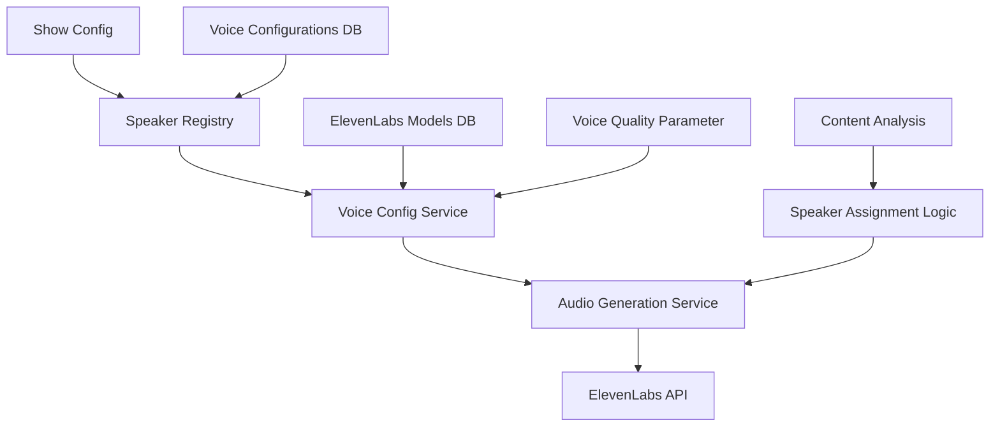

¨# Speaker System Architecture

## 🏗️ Technische Architektur

Das RadioX Dynamic Speaker System basiert auf einer modularen, datenbankgesteuerten Architektur, die maximale Flexibilität und Skalierbarkeit bietet.

## 📊 System Overview



## 🗂️ Datenbank Schema

### voice_configurations
```sql
CREATE TABLE voice_configurations (
    id SERIAL PRIMARY KEY,
    speaker_name VARCHAR(50) UNIQUE NOT NULL,
    voice_name VARCHAR(100) NOT NULL,
    description TEXT,
    voice_id VARCHAR(100) NOT NULL,
    language VARCHAR(20) DEFAULT 'multilingual',
    stability DECIMAL(3,2) DEFAULT 0.60,
    similarity_boost DECIMAL(3,2) DEFAULT 0.80,
    style DECIMAL(3,2) DEFAULT 0.50,
    use_speaker_boost BOOLEAN DEFAULT false,
    is_primary BOOLEAN DEFAULT false,
    is_active BOOLEAN DEFAULT true,
    created_at TIMESTAMPTZ DEFAULT NOW(),
    updated_at TIMESTAMPTZ DEFAULT NOW()
);
```

### elevenlabs_models
```sql
CREATE TABLE elevenlabs_models (
    id SERIAL PRIMARY KEY,
    model_id VARCHAR(100) UNIQUE NOT NULL,
    model_name VARCHAR(200) NOT NULL,
    description TEXT,
    languages JSONB,
    max_characters_free INTEGER,
    max_characters_paid INTEGER,
    cost_multiplier DECIMAL(3,2) DEFAULT 1.0,
    latency_ms INTEGER,
    concurrency_group VARCHAR(50),
    supports_text_to_speech BOOLEAN DEFAULT false,
    supports_voice_conversion BOOLEAN DEFAULT false,
    supports_style_control BOOLEAN DEFAULT false,
    supports_speaker_boost BOOLEAN DEFAULT false,
    requires_alpha_access BOOLEAN DEFAULT false,
    quality_tier VARCHAR(20) CHECK (quality_tier IN ('low', 'mid', 'high')),
    is_active BOOLEAN DEFAULT true,
    created_at TIMESTAMPTZ DEFAULT NOW(),
    updated_at TIMESTAMPTZ DEFAULT NOW()
);
```

## 🎤 Core Components

### 1. SpeakerRegistry (`src/services/infrastructure/speaker_registry.py`)

**Zweck:** Zentrale Verwaltung aller Speaker mit Caching und dynamischen Aliases

**Key Methods:**
```python
class SpeakerRegistry:
    async def get_all_speakers() -> Dict[str, Dict[str, Any]]
    async def get_speaker_names() -> List[str]
    async def get_default_speaker() -> str
    async def get_speaker_mapping() -> Dict[str, str]
    async def is_valid_speaker(speaker_name: str) -> bool
```

**Caching Strategy:**
- 5-Minuten Cache für Performance
- Force-refresh Option
- Singleton Pattern für globalen Zugriff

**Alias System:**
```python
# Dynamische Alias-Generierung
mapping = {
    # Direct mappings (all speakers from database)
    "speaker1": "speaker1",
    "ai_assistant": "ai_assistant",
    
    # Role-based aliases  
    "host": primary_speaker,
    "moderator": primary_speaker,
    
    # Dynamic aliases based on available speakers
    "ai": ai_speaker if ai_speaker_exists else primary_speaker
}
```

### 2. VoiceConfigService (`src/services/infrastructure/voice_config_service.py`)

**Zweck:** Voice-Konfiguration mit Quality-Tier-Integration

**Enhanced Methods:**
```python
async def get_voice_config(
    speaker_name: str, 
    language_override: Optional[str] = None,
    voice_quality: str = "mid"
) -> Optional[Dict[str, Any]]

async def get_model_for_quality(quality: str = "mid") -> Optional[Dict[str, Any]]
```

**Quality Tier Logic:**
```python
# Model Selection basierend auf Quality
quality_mapping = {
    "low": "eleven_flash_v2_5",      # 75ms, 0.5x cost
    "mid": "eleven_turbo_v2_5",      # 275ms, 0.5x cost  
    "high": "eleven_multilingual_v2"  # 800ms, 1.0x cost
}
```

### 3. AudioGenerationService (`src/services/generation/audio_generation_service.py`)

**Zweck:** Intelligente Speaker-Zuweisung und Audio-Generierung

**Enhanced Features:**
```python
async def generate_audio_from_script(
    script: Dict[str, Any],
    voice_quality: str = "mid",  # NEW
    show_config: Dict[str, Any] = None
) -> Dict[str, Any]
```

**Speaker Assignment Logic:**
```python
def _get_speaker_for_content(self, speaker_raw: str, text: str) -> str:
    # 1. Normalize speaker name
    speaker_normalized = self._normalize_speaker_name(speaker_raw)
    
    # 2. Check for weather speaker assignment
    if self._should_use_weather_speaker_for_content(text):
        weather_speaker = self._get_configured_weather_speaker()
        if weather_speaker:
            return weather_speaker
    
    # 3. Return normalized speaker
    return speaker_normalized

def _should_use_weather_speaker_for_content(self, text: str) -> bool:
    # Show-Config-basierte Logik
    if not self._current_show_config:
        return False
    
    # Check if weather is active category
    categories = self._current_show_config.get("categories", [])
    if "weather" not in categories:
        return False
    
    # Check if weather speaker is configured
    weather_speaker_config = self._current_show_config.get("weather_speaker")
    if not weather_speaker_config:
        return False
    
    # Use content detection (temporarily)
    return self._is_weather_content(text)
```

## 🎛️ Voice Quality System

### Model Selection Algorithm

```python
class VoiceQualityManager:
    QUALITY_TIERS = {
        "low": {
            "model": "eleven_flash_v2_5",
            "latency_ms": 75,
            "cost_multiplier": 0.5,
            "use_speaker_boost": False,
            "description": "Ultra-fast for live shows"
        },
        "mid": {
            "model": "eleven_turbo_v2_5", 
            "latency_ms": 275,
            "cost_multiplier": 0.5,
            "use_speaker_boost": False,
            "description": "Balanced for standard production"
        },
        "high": {
            "model": "eleven_multilingual_v2",
            "latency_ms": 800,
            "cost_multiplier": 1.0,
            "use_speaker_boost": True,
            "description": "Best quality for final production"
        }
    }
```

### Dynamic Settings Adjustment

```python
def adjust_voice_settings_for_quality(base_settings: dict, quality: str) -> dict:
    """Adjust voice settings based on quality tier"""
    
    settings = base_settings.copy()
    
    if quality == "low":
        # Optimize for speed
        settings["use_speaker_boost"] = False
        settings["stability"] = min(settings.get("stability", 0.6) + 0.1, 1.0)
        
    elif quality == "mid":
        # Balanced settings
        settings["use_speaker_boost"] = False
        
    elif quality == "high":
        # Optimize for quality
        settings["use_speaker_boost"] = True
        settings["style"] = settings.get("style", 0.5)
    
    return settings
```

## 🎭 Show Configuration System

### Config Structure

```typescript
interface ShowConfig {
    // Primary speakers
    primary_speaker: SpeakerConfig;
    secondary_speaker?: SpeakerConfig;
    
    // Role-based speakers
    weather_speaker?: SpeakerConfig;
    news_speaker?: SpeakerConfig;
    sports_speaker?: SpeakerConfig;
    
    // Active categories
    categories: string[];  // ["weather", "news", "sports"]
    
    // Meta information
    show_type: string;
    duration_minutes: number;
    language: string;
}

interface SpeakerConfig {
    speaker_name: string;
    voice_name: string;
    description: string;
}
```

### Decision Tree Implementation

```python
class SpeakerAssignmentEngine:
    def assign_speaker_for_content(
        self, 
        content: str, 
        speaker_hint: str,
        show_config: ShowConfig
    ) -> str:
        """
        Multi-step speaker assignment logic
        """
        
        # Step 1: Normalize speaker hint
        normalized = self.normalize_speaker_name(speaker_hint)
        
        # Step 2: Check role-based assignments
        if self.is_weather_content(content):
            if self.should_use_weather_speaker(show_config):
                weather_speaker = show_config.get("weather_speaker", {}).get("speaker_name")
                if weather_speaker:
                    return weather_speaker
        
        # Step 3: Check other role assignments (extensible)
        # Future: news_speaker, sports_speaker, etc.
        
        # Step 4: Fallback to normalized speaker
        return normalized
    
    def should_use_weather_speaker(self, show_config: ShowConfig) -> bool:
        """Check if weather speaker should be used"""
        
        # Must be active category
        if "weather" not in show_config.get("categories", []):
            return False
        
        # Must have weather speaker configured
        if not show_config.get("weather_speaker"):
            return False
        
        return True
```

## 🔧 Migration Strategy

### Phase 1: Infrastructure (✅ Complete)
- Speaker Registry implementation
- ElevenLabs Models database
- Voice Quality parameter support

### Phase 2: Core Services (✅ Complete)  
- AudioGenerationService enhancements
- VoiceConfigService quality integration
- Show-config-based assignment logic

### Phase 3: Content Detection Removal (✅ Complete)
- Removed automatic Lucy weather assignment
- Replaced hardcoded speaker mappings
- Implemented explicit show-config logic

### Phase 4: Future Enhancements (Planned)
- Explicit content tagging: `[weather]`, `[news]`
- Multi-language speaker support
- Real-time speaker switching
- Voice cloning integration

## 🧪 Testing Strategy

### Unit Tests
```python
# Speaker Registry Tests
async def test_speaker_registry():
    registry = SpeakerRegistry()
    speakers = await registry.get_all_speakers()
    assert len(speakers) > 0
    assert len(speakers.keys()) >= 1  # At least one speaker exists

# Voice Quality Tests  
async def test_voice_quality_selection():
    service = VoiceConfigService()
    model = await service.get_model_for_quality("high")
    assert model["model_id"] == "eleven_multilingual_v2"

# Speaker Assignment Tests
def test_weather_speaker_assignment():
    audio_service = AudioGenerationService()
    show_config = {
        "weather_speaker": {"speaker_name": "weather_reporter"},
        "categories": ["weather"]
    }
    audio_service._current_show_config = show_config
    
    speaker = audio_service._get_speaker_for_content("HOST", "Temperature is 20°C")
    assert speaker == "weather_reporter"
```

### Integration Tests
```bash
# Full system test with different qualities (no hardcoded speakers)
python3 main.py --voicequality low --news-count 1
python3 main.py --voicequality mid --news-count 2  
python3 main.py --voicequality high --news-count 3

# Test dynamic speaker registry
python3 -c "
import asyncio
from src.services.infrastructure.speaker_registry import test_speaker_registry
asyncio.run(test_speaker_registry())
"
```

## 📈 Performance Considerations

### Caching Strategy
- **Speaker Registry**: 5-minute cache with forced refresh option
- **Voice Configurations**: Loaded once per session
- **ElevenLabs Models**: Static data, cached indefinitely

### Database Optimization
```sql
-- Indexes for performance
CREATE INDEX idx_voice_configs_speaker_name ON voice_configurations(speaker_name);
CREATE INDEX idx_voice_configs_active ON voice_configurations(is_active);
CREATE INDEX idx_elevenlabs_models_quality ON elevenlabs_models(quality_tier);
CREATE INDEX idx_elevenlabs_models_active ON elevenlabs_models(is_active);
```

### Memory Usage
- Singleton pattern for registry instances
- Lazy loading of non-essential data
- Efficient dictionary lookups for speaker mappings

## 🔐 Security Considerations

### Input Validation
```python
def validate_speaker_name(speaker_name: str) -> bool:
    """Validate speaker name input"""
    if not speaker_name or len(speaker_name) > 50:
        return False
    
    # Alphanumeric + underscore only
    if not re.match(r'^[a-zA-Z0-9_]+$', speaker_name):
        return False
    
    return True

def validate_voice_quality(quality: str) -> bool:
    """Validate voice quality parameter"""
    return quality in ["low", "mid", "high"]
```

### Database Security
- Parameterized queries to prevent SQL injection
- Input sanitization for all user inputs
- Read-only access for most operations

## 🚀 Scalability Design

### Horizontal Scaling
- Stateless service design
- Database-driven configuration
- No hardcoded dependencies

### Extensibility Points
```python
# Easy to add new speaker roles
class SpeakerRoleManager:
    SUPPORTED_ROLES = [
        "primary_speaker",
        "secondary_speaker", 
        "weather_speaker",
        "news_speaker",      # Future
        "sports_speaker",    # Future
        "music_speaker"      # Future
    ]
    
    def get_role_speaker(self, role: str, show_config: dict) -> Optional[str]:
        """Extensible role-based speaker selection"""
        role_config = show_config.get(role)
        if role_config:
            return role_config.get("speaker_name")
        return None
```

---

*Technical Documentation | RadioX Dynamic Speaker System | Version 1.0* 