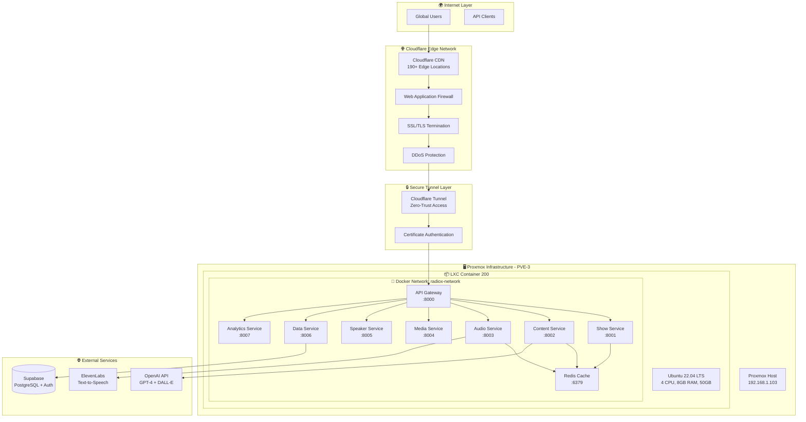
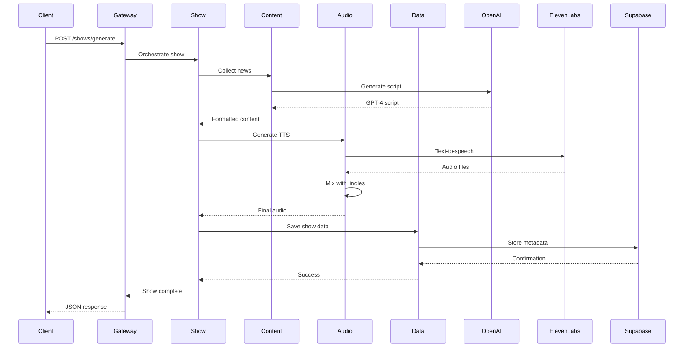

# RadioX Backend - Complete Tech Stack Documentation

**🏗️ Comprehensive Technical Architecture & Technology Stack**

> Production-ready AI Radio System with 8 Microservices, Global CDN, and Zero-Trust Security

---

## 📋 **Tech Stack Overview**

| Layer | Technologies | Purpose |
|-------|-------------|---------|
| **🌐 CDN & Edge** | Cloudflare CDN, HTTP/2, QUIC | Global content delivery, SSL termination |
| **🔒 Security** | Cloudflare Tunnel, Zero Trust, WAF | Secure access without open ports |
| **🖥️ Infrastructure** | Proxmox VE, LXC Containers, Ubuntu 22.04 | Virtualization and container hosting |
| **🐳 Orchestration** | Docker, Docker Compose, Bridge Networks | Container management and networking |
| **⚡ Cache & Queue** | Redis 7.x, In-Memory Store | Session storage, caching, pub/sub |
| **🗄️ Database** | Supabase (PostgreSQL), Row Level Security | Primary data storage with auth |
| **🎯 API Gateway** | FastAPI, Uvicorn, Python 3.9 | HTTP routing and load balancing |
| **🤖 AI Services** | OpenAI GPT-4, ElevenLabs TTS, DALL-E | Content generation and synthesis |
| **📊 Monitoring** | FastAPI Health Checks, Docker Stats | Service health and performance |

---

## 🏗️ **Complete System Architecture**



---

## 🔧 **Infrastructure Layer Details**

### **🖥️ Proxmox Virtual Environment**
- **Host OS**: Proxmox VE 8.x
- **Container Engine**: LXC (Linux Containers)
- **Base Image**: Ubuntu 22.04.3 LTS
- **Resources**: 4 vCPU, 8GB RAM, 50GB Storage
- **Network**: Bridge (vmbr0) with DHCP

### **🐳 Container Orchestration Stack**
- **Docker Engine**: 24.0.7
- **Docker Compose**: 2.21.0
- **Network**: Bridge driver (radiox-network)
- **Restart Policy**: unless-stopped
- **Security**: Unprivileged containers

---

## 🎯 **Application Layer Architecture**

### **📡 API Gateway - Central Router**
```yaml
Technology Stack:
  Framework: FastAPI 0.104.1
  Server: Uvicorn (ASGI)
  Port: 8000
  Purpose: HTTP routing and load balancing
  
Routing Rules:
  /shows/* → show-service:8001
  /content/* → content-service:8002
  /audio/* → audio-service:8003
  /media/* → media-service:8004
  /speakers/* → speaker-service:8005
  /data/* → data-service:8006
  /analytics/* → analytics-service:8007
```

### **🎵 Microservices Detailed Breakdown**

| Service | Port | Stack | Dependencies | Function |
|---------|------|-------|--------------|----------|
| **Show Service** | 8001 | FastAPI + asyncio | Redis, Data Service | Orchestrates radio show generation |
| **Content Service** | 8002 | FastAPI + OpenAI SDK | Redis, OpenAI, RSS | News collection + GPT-4 scripts |
| **Audio Service** | 8003 | FastAPI + ElevenLabs + FFmpeg | Redis, ElevenLabs, Supabase | TTS + audio mixing |
| **Media Service** | 8004 | FastAPI + Supabase Storage | Redis, Supabase, DALL-E | File management + cover art |
| **Speaker Service** | 8005 | FastAPI + JSON Config | Redis, Supabase | Voice configuration |
| **Data Service** | 8006 | FastAPI + Supabase SDK | Redis, Supabase | Database operations |
| **Analytics Service** | 8007 | FastAPI + metrics | Redis, Supabase | Performance monitoring |

---

## 🔗 **Network Architecture & Port Mapping**

### **🔌 Complete Port Configuration**

| Port | Service | Access | Protocol | Purpose |
|------|---------|--------|----------|---------|
| **443** | Cloudflare | 🌍 Global | HTTPS/HTTP2 | External access |
| **8000** | API Gateway | 🔒 Tunnel Only | HTTP/1.1 | Internal routing |
| **8001-8007** | Microservices | 🐳 Docker Only | HTTP/1.1 | Service APIs |
| **6379** | Redis | 🐳 Docker Only | Redis Protocol | Cache & sessions |

### **🌐 External Access Flow**
```
Client → Cloudflare CDN → Cloudflare Tunnel → API Gateway → Microservices
(HTTPS)     (Global)        (Secure)         (HTTP)       (Internal)
```

---

## 🔒 **Security Architecture**

### **🛡️ Zero-Trust Security Model**
- **Edge Protection**: Cloudflare WAF + DDoS (67 Tbps capacity)
- **Access Control**: Cloudflare Tunnel (Certificate-based auth)
- **Container Isolation**: Unprivileged LXC containers
- **Network Segmentation**: Docker bridge networks
- **API Security**: FastAPI request validation
- **Database Security**: Supabase Row Level Security

### **🔑 Security Features**
- ✅ Zero open ports (all traffic via tunnel)
- ✅ Automatic HTTPS with SSL termination
- ✅ Enterprise-grade DDoS protection
- ✅ Container isolation and sandboxing
- ✅ Internal network segmentation

---

## 📊 **Data Flow Architecture**

### **🎵 Radio Show Generation Flow**


---

## ⚡ **Performance & Scalability**

### **📈 Performance Metrics**
| Component | Current | Target | Strategy |
|-----------|---------|--------|----------|
| **CDN Response** | ~50ms | <100ms | Global edge caching |
| **API Gateway** | ~10ms | <50ms | Async FastAPI |
| **GPT-4 Calls** | ~3-5s | <10s | Caching + parallelization |
| **TTS Generation** | ~2-4s | <5s | Streaming + chunking |
| **Full Show** | ~15-30s | <60s | Pipeline optimization |

---

## 🛠️ **Development & Deployment Tools**

### **🔧 Technology Matrix**
- **Orchestration**: Docker Compose 2.21.0
- **Gateway**: FastAPI 0.104.1
- **Server**: Uvicorn 0.24.0
- **Database**: Supabase (PostgreSQL)
- **Cache**: Redis 7.2.3
- **Tunnel**: Cloudflared 2025.6.1
- **Build**: Docker 24.0.7
- **Process**: Make 4.3

### **📁 Project Structure**
```
radiox-backend/
├── docker-compose.production.yml    # Production orchestration
├── tunnel-config.yml               # Cloudflare tunnel config
├── Makefile                        # Build & deployment
├── services/                       # 8 Microservices
├── docs/                          # Documentation
├── config/                        # Configuration
└── scripts/                       # Deployment scripts
```

## 📊 **Monitoring & Health Checks**

### **🔍 Health Check Endpoints**
- `/health` - Service health status
- `/services/status` - All microservices status  
- `/docs` - API documentation
- `/metrics` - Performance metrics

### **📈 Live Production Status**
- **API**: https://api.radiox.cloud
- **Health**: https://api.radiox.cloud/health
- **Status**: https://api.radiox.cloud/services/status
- **Docs**: https://api.radiox.cloud/docs

---

**This comprehensive tech stack powers a production-ready AI radio system with global reach, enterprise security, and scalable microservices architecture.** 