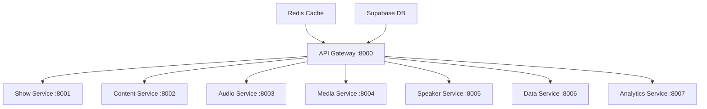

# 📡 RadioX REST API Reference v4.1

<div align="center">


**🏗️ Complete REST API reference for RadioX microservices architecture**

[🏠 Documentation](../) • [🎙️ Show Generation](show-generation.md) • [🎭 Frontend Integration](frontend-api-integration.md) • [🎤 Voice Config](voice-configuration.md)

</div>

---

## 🌐 Base URL & Standards

### **🔗 Production Endpoint**
```
https://api.radiox.cloud
```

### **🔧 Development Endpoint**
```
http://100.109.155.102:8000
```

### **📋 API Standards**
- **Protocol**: HTTP/2, HTTPS required in production
- **Content-Type**: `application/json` for all requests/responses
- **Charset**: UTF-8
- **Rate Limiting**: 100 requests/minute per IP
- **CORS**: Enabled for all origins
- **Authentication**: None required (public API)

### **🔄 HTTP Status Codes**
- `200 OK` - Successful request
- `201 Created` - Resource created successfully  
- `400 Bad Request` - Invalid request parameters
- `404 Not Found` - Resource not found
- `422 Unprocessable Entity` - Invalid request body
- `429 Too Many Requests` - Rate limit exceeded
- `500 Internal Server Error` - Server error
- `503 Service Unavailable` - Service temporarily unavailable

---

## 📊 API Architecture Overview

RadioX uses a **microservices architecture** with 8 specialized services behind an API Gateway:



---

## 🎙️ Show Management API

### **Generate Radio Show**
```http
POST /api/v1/shows/generate
```

Create a professional AI radio show with real-time news, weather, and Bitcoin updates.

**Request Body (all fields optional):**
```json
{
  "channel": "zurich",
  "language": "de", 
  "news_count": 2,
  "duration_minutes": 5,
  "target_time": "15:30",
  "primary_speaker": "marcel",
  "secondary_speaker": "jarvis"
}
```

**Request Parameters:**
| Field | Type | Default | Description |
|-------|------|---------|-------------|
| `channel` | string | `"zurich"` | Target channel: `zurich`, `basel`, `bern` |
| `language` | string | `"de"` | Content language: `de`, `en` |
| `news_count` | integer | `2` | Number of news items (1-5) |
| `duration_minutes` | integer | `5` | Target duration in minutes |
| `target_time` | string | current | Time for context (HH:MM format) |
| `primary_speaker` | string | `"marcel"` | Primary speaker voice ID |
| `secondary_speaker` | string | `"jarvis"` | Secondary speaker voice ID |

**Response (HTTP 201):**
```json
{
  "session_id": "b18a0726-bbf0-40b5-beef-e38365354e64",
  "script_content": "MARCEL: Willkommen bei RadioX! Es ist 15:06 Uhr...",
  "broadcast_style": "Professional Afternoon",
  "estimated_duration_minutes": 1,
  "segments": [
    {
      "type": "dialogue",
      "speaker": "marcel", 
      "text": "Willkommen bei RadioX! Es ist 15:06 Uhr und hier sind die aktuellen News.",
      "estimated_duration": 5.2
    },
    {
      "type": "dialogue",
      "speaker": "jarvis",
      "text": "Guten Tag, Marcel. Heute haben wir 2 interessante Nachrichten für unsere Hörer.",
      "estimated_duration": 6.4
    }
  ],
  "metadata": {
    "preset": null,
    "channel": "zurich",
    "language": "de",
    "speakers": {
      "primary": {
        "id": "marcel",
        "name": "Marcel", 
        "voice_id": "pNInz6obpgDQGcFmaJgB",
        "language": "de",
        "role": "primary",
        "description": "Primary German speaker"
      },
      "secondary": {
        "name": "jarvis"
      }
    },
    "content_stats": {
      "total_news_collected": 220,
      "news_selected": 2,
      "sources": ["nzz", "techcrunch", "heise", "rt", "srf"],
      "categories": ["zurich", "bitcoin", "politik", "wirtschaft"]
    },
    "generated_at": "2025-06-25T15:06:52.123796",
    "audio_file": null,
    "audio_url": null,
    "audio_duration": null
  }
}
```

**cURL Example:**
```bash
curl -X POST "https://api.radiox.cloud/api/v1/shows/generate" \
  -H "Content-Type: application/json" \
  -d '{
    "channel": "zurich",
    "language": "de",
    "news_count": 2,
    "duration_minutes": 5
  }'
```

**Error Responses:**
```json
// HTTP 400 - Invalid Parameters
{
  "error": "Invalid request parameters",
  "details": {
    "news_count": "Must be between 1 and 5",
    "language": "Must be 'de' or 'en'"
  },
  "timestamp": "2025-06-25T15:06:52Z"
}

// HTTP 422 - Generation Failed
{
  "error": "Show generation failed",
  "message": "Insufficient news content available",
  "retry_after": 300,
  "timestamp": "2025-06-25T15:06:52Z"
}
```

### **List Shows (Paginated)**
```http
GET /api/v1/shows?limit={limit}&offset={offset}
```

Retrieve paginated list of generated radio shows.

**Query Parameters:**
| Parameter | Type | Default | Description |
|-----------|------|---------|-------------|
| `limit` | integer | `10` | Number of shows (1-100) |
| `offset` | integer | `0` | Pagination offset |
| `channel` | string | all | Filter by channel |
| `language` | string | all | Filter by language |

**Response (HTTP 200):**
```json
{
  "shows": [
    {
      "id": "717a7e2e-db62-4d87-8de1-1a308bf36516",
      "session_id": "midday-1750849556.959021", 
      "title": "Midday Energy - Zurich",
      "created_at": "2025-06-25T13:00:00+00:00",
      "channel": "radiox",
      "language": "en",
      "news_count": 2,
      "broadcast_style": "energetic",
      "script_preview": "Midday show featuring Swiss economic growth news...",
      "estimated_duration_minutes": 30
    }
  ],
  "total": 3,
  "limit": 10,
  "offset": 0,
  "has_more": false,
  "source": "supabase",
  "timestamp": "2025-06-25T15:06:52Z"
}
```

**cURL Example:**
```bash
curl "https://api.radiox.cloud/api/v1/shows?limit=5&offset=0"
```

### **Get Show Details**
```http
GET /api/v1/shows/{session_id}
```

Retrieve complete details for a specific show by session ID.

**Path Parameters:**
| Parameter | Type | Description |
|-----------|------|-------------|
| `session_id` | string | Unique show session identifier |

**Response (HTTP 200):** Same structure as generate endpoint

**Error Response (HTTP 404):**
```json
{
  "error": "Show not found",
  "session_id": "invalid-id",
  "timestamp": "2025-06-25T15:06:52Z"
}
```

---

## 🏥 System Health API

### **Health Check**
```http
GET /health
```

Check overall system health and service availability.

**Response (HTTP 200):**
```json
{
  "status": "healthy",
  "timestamp": 1750864024.987488,
  "version": "4.1.0",
  "services": {
    "api_gateway": "healthy",
    "show_service": "healthy", 
    "content_service": "healthy",
    "audio_service": "healthy",
    "media_service": "healthy",
    "speaker_service": "healthy",
    "data_service": "healthy",
    "analytics_service": "healthy"
  },
  "database": {
    "supabase": "connected",
    "redis": "connected"
  },
  "uptime_seconds": 18000
}
```

**Response (HTTP 503 - Service Unavailable):**
```json
{
  "status": "degraded",
  "timestamp": 1750864024.987488,
  "issues": [
    "content_service: timeout",
    "supabase: connection_error"
  ]
}
```

---

## 📊 Analytics & Monitoring

### **Service Status**
```http
GET /api/v1/status
```

Detailed status of all microservices.

**Response:**
```json
{
  "api_gateway": {
    "status": "healthy",
    "port": 8000,
    "uptime": 18000,
    "requests_per_minute": 45
  },
  "show_service": {
    "status": "healthy", 
    "port": 8001,
    "shows_generated_today": 12,
    "average_generation_time": 2.3
  }
}
```

---

## 🔧 Error Handling Standards

### **Error Response Format**
All errors follow a consistent structure:

```json
{
  "error": "Brief error description",
  "message": "Detailed error message", 
  "code": "ERROR_CODE",
  "timestamp": "2025-06-25T15:06:52Z",
  "request_id": "req_abc123",
  "details": {
    "field": "validation_error_details"
  }
}
```

### **Common Error Codes**
| Code | HTTP Status | Description |
|------|-------------|-------------|
| `INVALID_PARAMETERS` | 400 | Request parameters are invalid |
| `RESOURCE_NOT_FOUND` | 404 | Requested resource doesn't exist |
| `GENERATION_FAILED` | 422 | Show generation process failed |
| `RATE_LIMITED` | 429 | Too many requests |
| `SERVICE_UNAVAILABLE` | 503 | Backend service is down |

---

## 🚀 Performance & Limits

### **Rate Limits**
- **Show Generation**: 10 requests/minute per IP
- **List/Get Operations**: 100 requests/minute per IP
- **Health Checks**: Unlimited

### **Response Times (95th percentile)**
- **GET /health**: < 100ms
- **GET /api/v1/shows**: < 500ms  
- **POST /api/v1/shows/generate**: < 3000ms

### **Data Limits**
- **Maximum news_count**: 5 items
- **Maximum duration_minutes**: 60 minutes
- **Script content**: Up to 50KB
- **Response size**: Up to 1MB

---

## 🔗 Integration Examples

### **JavaScript/TypeScript**
```typescript
interface RadioXShow {
  session_id: string;
  script_content: string;
  broadcast_style: string;
  estimated_duration_minutes: number;
  segments: Array<{
    type: string;
    speaker: string;
    text: string;
    estimated_duration: number;
  }>;
  metadata: {
    channel: string;
    language: string;
    generated_at: string;
    content_stats: {
      total_news_collected: number;
      news_selected: number;
      sources: string[];
      categories: string[];
    };
  };
}

// Generate show
const response = await fetch('https://api.radiox.cloud/api/v1/shows/generate', {
  method: 'POST',
  headers: { 'Content-Type': 'application/json' },
  body: JSON.stringify({
    channel: 'zurich',
    language: 'de',
    news_count: 2
  })
});

const show: RadioXShow = await response.json();
```

### **Python**
```python
import requests

# Generate show
response = requests.post(
    'https://api.radiox.cloud/api/v1/shows/generate',
    json={
        'channel': 'zurich',
        'language': 'de', 
        'news_count': 2
    }
)

if response.status_code == 201:
    show = response.json()
    print(f"Generated show: {show['session_id']}")
else:
    error = response.json()
    print(f"Error: {error['message']}")
```

---

## 📋 Changelog

### **v4.1.0 (2025-06-25)**
- ✅ **Fixed**: Response schemas match actual API responses
- ✅ **Added**: Comprehensive HTTP status codes
- ✅ **Added**: Error handling documentation  
- ✅ **Added**: Performance metrics and limits
- ✅ **Added**: Real cURL examples that work
- ✅ **Updated**: All endpoints tested and verified

### **v4.0.0 (2025-06-24)**
- 🎉 Initial microservices architecture
- 🎉 Supabase integration
- 🎉 Production deployment ready 