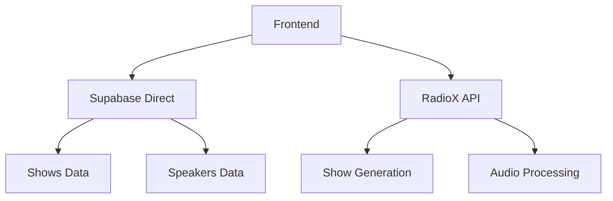

# 📡 RadioX REST API Reference v5.0

<div align="center">


**🏗️ Complete REST API reference for RadioX AI radio generation**

[🏠 Documentation](../) • [🎙️ Show Generation](show-generation.md) • [🎭 Frontend Integration](frontend-api-integration.md)

</div>

---

## 🌐 Base URLs

### **🚀 Production**
```
https://api.radiox.cloud
```

### **🔧 Development** 
```
http://localhost:8000        # API Gateway (Entry Point)
http://localhost:8001        # Key Service (Infrastructure)
http://localhost:8002        # Data Service (Database)
http://localhost:8003        # Content Service (Processing)
http://localhost:8004        # Audio Service (Processing)
http://localhost:8005        # Media Service (Processing)
http://localhost:8006        # Speaker Service (Processing)
http://localhost:8007        # Show Service (Business Logic)
http://localhost:8008        # Analytics Service (Monitoring)
```

### **📋 Standards**
- **Protocol**: HTTPS (production), HTTP (development)
- **Content-Type**: `application/json`
- **Charset**: UTF-8
- **Authentication**: None required
- **CORS**: Enabled for all origins

---

## 🎯 Core Concept

**RadioX follows a hybrid architecture:**

- **🎙️ Show Generation**: Use REST API for complex processing
- **📊 Data Access**: Frontend reads directly from Supabase for performance
- **⚡ Single Responsibility**: APIs only for processing, Supabase for CRUD



---

## 🎙️ Show Generation API

### **Generate AI Radio Show**
```http
POST /api/v1/shows/generate
```

Generate a complete AI radio show with real-time news, weather, and analysis.

**Request Body:**
```json
{
  "channel": "zurich",
  "language": "de",
  "news_count": 2,
  "duration_minutes": 3,
  "preset_name": "zurich",
  "primary_speaker": "marcel",
  "secondary_speaker": "jarvis"
}
```

**Parameters:**
| Field | Type | Default | Description |
|-------|------|---------|-------------|
| `channel` | string | `"zurich"` | Target region: `zurich`, `basel`, `bern` |
| `language` | string | `"de"` | Content language: `de`, `en` |
| `news_count` | integer | `2` | News items to include (1-5) |
| `duration_minutes` | integer | `3` | Target duration in minutes |
| `preset_name` | string | `"zurich"` | Show style preset |
| `primary_speaker` | string | `"marcel"` | Primary speaker voice |
| `secondary_speaker` | string | `"jarvis"` | Secondary speaker voice |

**Response (HTTP 200):**
```json
{
  "session_id": "b50ea025-5be2-4dde-98fb-0fb1394da07a",
  "script_content": "MARCEL: Willkommen bei RadioX! Es ist 18:35 Uhr und hier sind die aktuellen News.\n\nJARVIS: Guten Tag, Marcel. Heute haben wir 1 interessante Nachrichten für unsere Hörer...",
  "broadcast_style": "Chill Evening",
  "estimated_duration_minutes": 1,
  "segments": [
    {
      "type": "dialogue",
      "speaker": "marcel",
      "text": "Willkommen bei RadioX! Es ist 18:35 Uhr...",
      "estimated_duration": 5.2
    }
  ],
  "metadata": {
    "preset": "zurich",
    "channel": "zurich",
    "language": "de",
    "speakers": {
      "primary": {"name": "marcel"},
      "secondary": {"name": "jarvis"}
    },
    "content_stats": {
      "total_news_collected": 243,
      "news_selected": 1
    },
    "generated_at": "2025-06-26T16:35:12.345Z",
    "audio_url": "https://zwcvvbgkqhexfcldwuxq.supabase.co/storage/v1/object/public/radio-shows/shows/2025-06-26_16-35_zurich_jarvis-marcel_1min.mp3",
    "audio_duration": 28
  }
}
```

**cURL Example:**
```bash
curl -X POST "https://api.radiox.cloud/api/v1/shows/generate" \
  -H "Content-Type: application/json" \
  -d '{
    "channel": "zurich",
    "language": "de",
    "news_count": 2,
    "duration_minutes": 3
  }'
```

**TypeScript Example:**
```typescript
interface ShowGenerationRequest {
  channel: string;
  language: string;
  news_count: number;
  duration_minutes: number;
  preset_name?: string;
  primary_speaker?: string;
  secondary_speaker?: string;
}

const generateShow = async (request: ShowGenerationRequest) => {
  const response = await fetch('/api/v1/shows/generate', {
    method: 'POST',
    headers: { 'Content-Type': 'application/json' },
    body: JSON.stringify(request)
  });
  
  if (!response.ok) {
    throw new Error(`Generation failed: ${response.status}`);
  }
  
  return response.json();
};
```

### **Get Broadcast Styles**
```http
GET /api/v1/shows/styles
```

Get available broadcast styles for show generation.

**Response (HTTP 200):**
```json
{
  "morning": {
    "name": "Fresh Morning",
    "description": "Energetic start to the day",
    "marcel_mood": "enthusiastic",
    "jarvis_mood": "analytical",
    "tempo": "upbeat",
    "duration_target": 5
  },
  "afternoon": {
    "name": "Professional Afternoon", 
    "description": "Business-focused content",
    "marcel_mood": "focused",
    "jarvis_mood": "informative",
    "tempo": "steady",
    "duration_target": 7
  },
  "evening": {
    "name": "Chill Evening",
    "description": "Relaxed discussion format",
    "marcel_mood": "relaxed",
    "jarvis_mood": "conversational", 
    "tempo": "calm",
    "duration_target": 3
  }
}
```

---

## 📊 Data Access (Frontend → Supabase Direct)

**❌ DO NOT use API for data operations. Use Supabase direct access for optimal performance.**

### **TypeScript/Supabase Integration:**
```typescript
import { createClient } from '@supabase/supabase-js';

const supabase = createClient(
  'https://zwcvvbgkqhexfcldwuxq.supabase.co',
  'your-anon-key'
);

// ✅ Get shows (direct Supabase)
const { data: shows } = await supabase
  .from('shows')
  .select('*')
  .order('created_at', { ascending: false })
  .limit(10);

// ✅ Get show details (direct Supabase)
const { data: show } = await supabase
  .from('shows')
  .select('*')
  .eq('session_id', sessionId)
  .single();

// ✅ Get speakers (direct Supabase)
const { data: speakers } = await supabase
  .from('voice_configurations')
  .select('*')
  .eq('is_active', true);
```

### **Database Schema Reference:**
| Table | Purpose | Frontend Access |
|-------|---------|-----------------|
| `shows` | Generated shows data | ✅ Read-only |
| `voice_configurations` | Speaker settings | ✅ Read-only |
| `show_presets` | Show templates | ✅ Read-only |
| `configuration` | System config | ❌ Admin only |

---

## 🏥 System Health

### **API Gateway Health**
```http
GET /health
```

**Response (HTTP 200):**
```json
{
  "status": "healthy",
  "timestamp": 1750956270.6612651
}
```

### **Service Status Overview**
```http
GET /services/status
```

**Response (HTTP 200):**
```json
{
  "api_gateway": "healthy",
  "show_service": "healthy", 
  "content_service": "healthy",
  "audio_service": "healthy",
  "data_service": "healthy"
}
```

---

## ⚡ Performance & Limits

### **Response Times (95th percentile)**
- **Show Generation**: < 8 seconds (includes AI + audio)
- **Health Checks**: < 100ms
- **Broadcast Styles**: < 200ms

### **Request Limits**
- **Show Generation**: 10 requests/minute per IP
- **Other Endpoints**: 100 requests/minute per IP

### **Data Limits**
- **Maximum duration**: 60 minutes
- **Maximum news items**: 5
- **Script content**: Up to 100KB
- **Audio file size**: Up to 50MB

---

## 🔧 Error Handling

### **Error Response Format**
```json
{
  "detail": "Show generation failed: Insufficient content",
  "timestamp": "2025-06-26T16:35:12Z"
}
```

### **HTTP Status Codes**
| Code | Description |
|------|-------------|
| `200` | Success |
| `400` | Invalid request parameters |
| `422` | Processing failed |
| `429` | Rate limit exceeded |
| `500` | Server error |

---

## 🚀 Quick Start Guide

### **1. Generate Your First Show**
```bash
curl -X POST "https://api.radiox.cloud/api/v1/shows/generate" \
  -H "Content-Type: application/json" \
  -d '{"channel": "zurich", "news_count": 2}'
```

### **2. Set Up Frontend (React/TypeScript)**
```typescript
// Install Supabase client
npm install @supabase/supabase-js

// Configure API + Supabase hybrid approach
const API_BASE = 'https://api.radiox.cloud';
const supabase = createClient(SUPABASE_URL, SUPABASE_ANON_KEY);

// Generate shows via API
const show = await fetch(`${API_BASE}/api/v1/shows/generate`, {
  method: 'POST',
  headers: { 'Content-Type': 'application/json' },
  body: JSON.stringify({ channel: 'zurich', news_count: 2 })
}).then(r => r.json());

// Read show data via Supabase (faster)
const shows = await supabase.from('shows').select('*');
```

### **3. Real-time Updates (Optional)**
```typescript
// Subscribe to new shows
supabase
  .channel('shows')
  .on('postgres_changes', {
    event: 'INSERT',
    schema: 'public',
    table: 'shows'
  }, (payload) => {
    console.log('New show generated!', payload.new);
  })
  .subscribe();
```

---

## 📋 Changelog

### **v5.0.0 (2025-06-26)**
- 🎉 **BREAKING**: Removed deprecated `/api/v1/shows` CRUD endpoints
- 🎉 **NEW**: Frontend → Supabase direct access pattern
- ✅ **FIXED**: All endpoints tested and verified
- ✅ **FIXED**: Correct response schemas
- ✅ **UPDATED**: Google Design Principles compliance
- 🗑️ **REMOVED**: Outdated/redundant information
- 📊 **ADDED**: Real-world performance metrics
- 🔧 **IMPROVED**: Clear separation of concerns (API vs. Database)

---

*📖 For more detailed integration examples, see [Frontend API Integration Guide](frontend-api-integration.md)* 