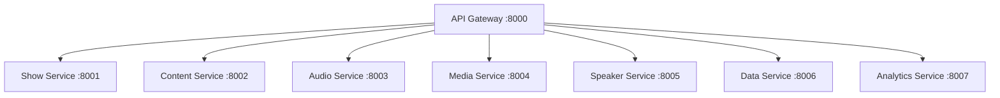

# 📡 RadioX REST API Reference v4.0

<div align="center">


**🏗️ Complete REST API reference for RadioX microservices architecture**

[🏠 Documentation](../) • [🎙️ Show Generation](show-generation.md) • [🎭 Frontend Integration](frontend-api-integration.md) • [🎤 Voice Config](voice-configuration.md)

</div>

---

## 🌐 Base URL & Authentication

### **🔗 Production Endpoint**
```
https://api.radiox.cloud
```

### **🔧 Local Development**
```
http://localhost:8000
```

### **🔐 Authentication**
RadioX uses **service-to-service communication** with no external authentication required. All endpoints are publicly accessible for radio show generation.

---

## 📊 API Gateway Overview

RadioX uses a **microservices architecture** with 8 specialized services behind an API Gateway:



---

## 🎙️ Show Service API

### **Generate Radio Show**
```http
POST /api/v1/shows/generate
```

Create a professional AI radio show with news, weather, and Bitcoin updates.

**Request Body:**
```json
{
  "preset_name": "evening",
  "target_time": "18:30",
  "channel": "zurich",
  "language": "de",
  "news_count": 3,
  "primary_speaker": "marcel",
  "secondary_speaker": "jarvis", 
  "duration_minutes": 5
}
```

**Response:**
```json
{
  "session_id": "550e8400-e29b-41d4-a716-446655440000",
  "script_content": "MARCEL: Willkommen bei RadioX...",
  "broadcast_style": "Professional Afternoon",
  "estimated_duration_minutes": 5,
  "segments": [
    {
      "speaker": "marcel",
      "text": "Willkommen bei RadioX!",
      "segment_type": "intro",
      "duration_seconds": 15,
      "voice_config": {
        "voice_id": "marcel_voice_id",
        "speed": 1.0,
        "emotion": "enthusiastic"
      }
    }
  ],
  "metadata": {
    "audio_url": "https://hkibwnykthxsnwbgygbk.supabase.co/storage/v1/object/public/radiox-audio/shows/550e8400.mp3",
    "cover_art_url": "https://hkibwnykthxsnwbgygbk.supabase.co/storage/v1/object/public/radiox-images/covers/550e8400.png",
    "created_at": "2025-01-09T18:30:00Z",
    "content_sources": ["tagesschau.de", "srf.ch"],
    "topics_covered": ["bitcoin", "weather", "tech"]
  }
}
```

**cURL Example:**
```bash
curl -X POST "https://api.radiox.cloud/api/v1/shows/generate" \
  -H "Content-Type: application/json" \
  -d '{
    "news_count": 3,
    "channel": "zurich",
    "language": "de",
    "duration_minutes": 5
  }'
```

### **List Shows**
```http
GET /api/v1/shows?limit=10&offset=0
```

Retrieve paginated list of generated shows.

**Query Parameters:**
- `limit` (integer): Number of shows to return (default: 10, max: 100)
- `offset` (integer): Number of shows to skip (default: 0)

**Response:**
```json
[
  {
    "session_id": "550e8400-e29b-41d4-a716-446655440000",
    "title": "RadioX Morning Show",
    "preview": "Heute sprechen wir über Bitcoin...",
    "created_at": "2025-01-09T18:30:00Z",
    "duration_minutes": 5,
    "metadata": {
      "audio_url": "https://...",
      "cover_art_url": "https://...",
      "topics_covered": ["bitcoin", "weather"]
    }
  }
]
```

### **Get Specific Show**
```http
GET /api/v1/shows/{session_id}
```

Retrieve complete details for a specific show.

**Response:** Same as generate endpoint response.

### **Get Broadcast Styles**
```http
GET /api/v1/shows/styles
```

Retrieve available broadcast styles for different times of day.

**Response:**
```json
{
  "morning": {
    "name": "High-Energy Morning",
    "description": "Energetic, motivational, optimistic vibes",
    "marcel_mood": "excited and passionate",
    "jarvis_mood": "witty and sharp",
    "tempo": "fast-paced",
    "duration_target": 8
  },
  "afternoon": {
    "name": "Professional Afternoon",
    "description": "Relaxed, informative, professional tone",
    "marcel_mood": "friendly and engaging", 
    "jarvis_mood": "analytical and precise",
    "tempo": "medium-paced",
    "duration_target": 10
  }
}
```

---

## 📰 Content Service API

### **Get Latest News**
```http
GET /api/v1/content/news?limit=10&category=tech&max_age_hours=6
```

Retrieve filtered news articles for radio shows.

**Query Parameters:**
- `limit` (integer): Number of articles (default: 10)
- `category` (string): Filter by category (`tech`, `bitcoin`, `weather`, etc.)
- `max_age_hours` (integer): Maximum article age in hours (default: 24)
- `language` (string): Language preference (`en`, `de`)

**Response:**
```json
{
  "articles": [
    {
      "id": "article-123",
      "title": "Bitcoin erreicht neues Allzeithoch",
      "summary": "Bitcoin stieg heute auf über $100,000...",
      "source": "nzz.ch",
      "category": "bitcoin",
      "published_at": "2025-01-09T16:30:00Z",
      "age_hours": 2,
      "priority": 10,
      "url": "https://nzz.ch/article/bitcoin-allzeithoch"
    }
  ],
  "total_count": 45,
  "categories_available": ["tech", "bitcoin", "weather", "news"]
}
```

### **Get Weather Data**
```http
GET /api/v1/content/weather?location=zurich&units=metric
```

Retrieve current weather and forecast data.

**Response:**
```json
{
  "current": {
    "temperature": 15.5,
    "description": "Teilweise bewölkt",
    "humidity": 65,
    "wind_speed": 12.5,
    "location": "Zürich"
  },
  "forecast": [
    {
      "date": "2025-01-10",
      "temperature_high": 18,
      "temperature_low": 8,
      "description": "Sonnig"
    }
  ]
}
```

### **Get Cryptocurrency Data**
```http
GET /api/v1/content/crypto?symbols=BTC,ETH&currency=USD
```

Retrieve cryptocurrency prices and market data.

**Response:**
```json
{
  "bitcoin": {
    "symbol": "BTC",
    "price": 98750.45,
    "change_24h": 5.2,
    "change_percentage_24h": 5.55,
    "market_cap": 1950000000000,
    "last_updated": "2025-01-09T18:25:00Z"
  },
  "ethereum": {
    "symbol": "ETH", 
    "price": 3850.20,
    "change_24h": -125.80,
    "change_percentage_24h": -3.17,
    "market_cap": 462000000000,
    "last_updated": "2025-01-09T18:25:00Z"
  }
}
```

---

## 🔊 Audio Service API

### **Generate Show Audio**
```http
POST /api/v1/audio/generate
```

Convert script to professional radio-quality audio with jingle mixing.

**Request Body:**
```json
{
  "session_id": "550e8400-e29b-41d4-a716-446655440000",
  "script_content": "MARCEL: Willkommen bei RadioX...",
  "segments": [
    {
      "speaker": "marcel",
      "text": "Willkommen bei RadioX!",
      "voice_id": "marcel_voice_id",
      "emotion": "enthusiastic"
    }
  ],
  "audio_config": {
    "jingle_enabled": true,
    "background_volume": 0.06,
    "quality": "high"
  }
}
```

**Response:**
```json
{
  "audio_url": "https://hkibwnykthxsnwbgygbk.supabase.co/storage/v1/object/public/radiox-audio/shows/550e8400.mp3",
  "duration_seconds": 284,
  "file_size_mb": 4.2,
  "processing_time_seconds": 45,
  "audio_specs": {
    "format": "mp3",
    "bitrate": 128,
    "sample_rate": 44100,
    "channels": 2
  }
}
```

### **Get Audio Config**
```http
GET /api/v1/audio/config
```

Retrieve current audio processing configuration.

**Response:**
```json
{
  "jingle_config": {
    "intro_volume": 1.0,
    "background_volume": 0.06,
    "outro_volume": 1.0,
    "fade_duration_seconds": 3
  },
  "voice_config": {
    "stability": 0.75,
    "similarity_boost": 0.85,
    "style": 0.65,
    "use_speaker_boost": true
  },
  "output_specs": {
    "format": "mp3",
    "bitrate": 128,
    "sample_rate": 44100
  }
}
```

---

## 🎤 Speaker Service API

### **Get Speaker Configuration**
```http
GET /api/v1/speakers/config
```

Retrieve all configured voice speakers and their settings.

**Response:**
```json
{
  "voices": {
    "marcel": {
      "role": "Main Host",
      "characteristics": "Enthusiastic, conversational, warm",
      "used_for": "Intros, discussions, audience connection",
      "elevenlabs_voice_id": "21m00Tcm4TlvDq8ikWAM",
      "language": "en",
      "voice_settings": {
        "stability": 0.75,
        "similarity_boost": 0.85,
        "style": 0.65
      }
    },
    "jarvis": {
      "role": "AI Assistant",
      "characteristics": "Analytical, precise, informative", 
      "used_for": "Technical content, analysis, facts",
      "elevenlabs_voice_id": "EXAVITQu4vr4xnSDxMaL",
      "language": "en",
      "voice_settings": {
        "stability": 0.80,
        "similarity_boost": 0.85,
        "style": 0.60
      }
    }
  }
}
```

### **Test Voice**
```http
POST /api/v1/speakers/test
```

Test a specific voice configuration with sample text.

**Request Body:**
```json
{
  "speaker_name": "marcel",
  "text": "Hello, this is a voice test for RadioX!",
  "voice_settings": {
    "stability": 0.75,
    "similarity_boost": 0.85,
    "style": 0.65
  }
}
```

**Response:**
```json
{
  "audio_url": "https://hkibwnykthxsnwbgygbk.supabase.co/storage/v1/object/public/radiox-audio/tests/voice-test-123.mp3",
  "duration_seconds": 3.2,
  "processing_time_seconds": 1.8,
  "voice_id_used": "21m00Tcm4TlvDq8ikWAM"
}
```

---

## 🎨 Media Service API

### **Generate Cover Art**
```http
POST /api/v1/media/cover
```

Generate AI cover art for radio shows using DALL-E 3.

**Request Body:**
```json
{
  "session_id": "550e8400-e29b-41d4-a716-446655440000",
  "prompt": "Professional radio studio, modern Swiss news broadcast, Bitcoin theme",
  "style": "photorealistic",
  "size": "1024x1024"
}
```

**Response:**
```json
{
  "cover_art_url": "https://hkibwnykthxsnwbgygbk.supabase.co/storage/v1/object/public/radiox-images/covers/550e8400.png",
  "prompt_used": "Professional radio studio...",
  "generation_time_seconds": 8,
  "image_specs": {
    "width": 1024,
    "height": 1024,
    "format": "png",
    "file_size_mb": 2.1
  }
}
```

---

## 🗄️ Data Service API

### **Store Show Data**
```http
POST /api/v1/data/shows
```

Store complete show data in Supabase database.

**Request Body:**
```json
{
  "session_id": "550e8400-e29b-41d4-a716-446655440000",
  "script_content": "MARCEL: Willkommen...",
  "audio_url": "https://...",
  "cover_art_url": "https://...",
  "metadata": {
    "topics_covered": ["bitcoin", "weather"],
    "content_sources": ["nzz.ch", "srf.ch"]
  }
}
```

### **Get Configuration**
```http
GET /api/v1/data/config
```

Retrieve API keys and configuration from secure storage.

**Response:**
```json
{
  "api_keys": {
    "openai": "sk-...",
    "elevenlabs": "key-...",
    "coinmarketcap": "api-..."
  },
  "supabase_config": {
    "url": "https://hkibwnykthxsnwbgygbk.supabase.co",
    "storage_buckets": ["radiox-audio", "radiox-images"]
  }
}
```

---

## 📊 Analytics Service API

### **Get Show Analytics**
```http
GET /api/v1/analytics/shows?period=7d&metrics=generation_time,audio_quality
```

Retrieve performance analytics for generated shows.

**Response:**
```json
{
  "period": "7d",
  "total_shows": 42,
  "metrics": {
    "average_generation_time_seconds": 156,
    "average_audio_quality_score": 9.2,
    "content_diversity_score": 0.87,
    "error_rate_percentage": 2.1
  },
  "trends": {
    "daily_shows": [6, 8, 5, 7, 9, 6, 8],
    "performance_improvement": 15.2
  }
}
```

### **Health Check All Services**
```http
GET /api/v1/analytics/health
```

Comprehensive health check for all microservices.

**Response:**
```json
{
  "overall_status": "healthy",
  "services": {
    "show_service": {
      "status": "healthy",
      "response_time_ms": 45,
      "last_check": "2025-01-09T18:30:00Z"
    },
    "content_service": {
      "status": "healthy", 
      "response_time_ms": 120,
      "last_check": "2025-01-09T18:30:00Z"
    },
    "audio_service": {
      "status": "healthy",
      "response_time_ms": 89,
      "last_check": "2025-01-09T18:30:00Z"
    }
  },
  "external_dependencies": {
    "openai_api": "healthy",
    "elevenlabs_api": "healthy",
    "supabase": "healthy"
  }
}
```

---

## 🔄 Common Request Patterns

### **End-to-End Show Generation**
```bash
# 1. Generate show
SHOW_ID=$(curl -s -X POST "https://api.radiox.cloud/api/v1/shows/generate" \
  -H "Content-Type: application/json" \
  -d '{"news_count": 3}' | jq -r '.session_id')

# 2. Get show details  
curl "https://api.radiox.cloud/api/v1/shows/$SHOW_ID"

# 3. Check analytics
curl "https://api.radiox.cloud/api/v1/analytics/shows?period=1d"
```

### **Content Pipeline**
```bash
# 1. Get latest news
curl "https://api.radiox.cloud/api/v1/content/news?limit=5&category=tech"

# 2. Get weather
curl "https://api.radiox.cloud/api/v1/content/weather?location=zurich"

# 3. Get crypto data
curl "https://api.radiox.cloud/api/v1/content/crypto?symbols=BTC"
```

### **Speaker Testing**
```bash
# 1. Get speaker config
curl "https://api.radiox.cloud/api/v1/speakers/config"

# 2. Test voice
curl -X POST "https://api.radiox.cloud/api/v1/speakers/test" \
  -H "Content-Type: application/json" \
  -d '{"speaker_name": "marcel", "text": "Test message"}'
```

---

## 📈 Rate Limits & Performance

### **Rate Limits**
- **Show Generation**: 10 requests/minute per IP
- **Content APIs**: 100 requests/minute per IP  
- **Health Checks**: 1000 requests/minute per IP

### **Response Times (SLA)**
- **Show Generation**: <3 minutes (average: 2.5 minutes)
- **Content APIs**: <5 seconds (average: 1.2 seconds)
- **Audio Generation**: <60 seconds (average: 45 seconds)
- **Health Checks**: <500ms (average: 150ms)

### **Payload Limits**
- **Maximum Request Size**: 10MB
- **Maximum Response Size**: 50MB
- **Script Length**: 10,000 characters max
- **Audio Duration**: 15 minutes max

---

## ❌ Error Handling

### **HTTP Status Codes**

| Code | Meaning | Description |
|------|---------|-------------|
| `200` | Success | Request completed successfully |
| `201` | Created | Resource created successfully |
| `400` | Bad Request | Invalid request parameters |
| `404` | Not Found | Resource not found |
| `408` | Timeout | Request timeout (try reducing complexity) |
| `429` | Rate Limited | Too many requests |
| `500` | Server Error | Internal service error |
| `503` | Service Unavailable | Service temporarily down |

### **Error Response Format**
```json
{
  "error": {
    "code": "INVALID_NEWS_COUNT",
    "message": "news_count must be between 1 and 10",
    "details": {
      "field": "news_count",
      "provided_value": 15,
      "valid_range": "1-10"
    },
    "request_id": "req_123456789",
    "timestamp": "2025-01-09T18:30:00Z"
  }
}
```

### **Common Error Scenarios**

```bash
# Invalid parameters
curl -X POST "https://api.radiox.cloud/api/v1/shows/generate" \
  -H "Content-Type: application/json" \
  -d '{"news_count": 999}'
# Returns 400: news_count must be between 1 and 10

# Show not found
curl "https://api.radiox.cloud/api/v1/shows/invalid-id"
# Returns 404: Show not found

# Service timeout  
curl -X POST "https://api.radiox.cloud/api/v1/shows/generate" \
  -H "Content-Type: application/json" \
  -d '{"news_count": 10, "duration_minutes": 20}'
# May return 408: Request timeout (reduce complexity)
```

---

## 🛠️ Development Tools

### **API Testing with cURL**
```bash
# Set base URL for convenience
export API_BASE="https://api.radiox.cloud"

# Test all services
curl "$API_BASE/api/v1/analytics/health"

# Generate test show
curl -X POST "$API_BASE/api/v1/shows/generate" \
  -H "Content-Type: application/json" \
  -d '{"news_count": 1}' | jq '.'
```

### **API Testing with HTTPie**
```bash
# Install HTTPie
pip install httpie

# Generate show
http POST https://api.radiox.cloud/api/v1/shows/generate \
  news_count:=3 \
  channel=zurich \
  language=de

# Get shows
http GET https://api.radiox.cloud/api/v1/shows limit==5
```

### **JavaScript/Node.js Example**
```javascript
const API_BASE = 'https://api.radiox.cloud';

async function generateShow(options = {}) {
  const response = await fetch(`${API_BASE}/api/v1/shows/generate`, {
    method: 'POST',
    headers: {
      'Content-Type': 'application/json',
    },
    body: JSON.stringify({
      news_count: 3,
      channel: 'zurich',
      language: 'de',
      ...options
    })
  });
  
  if (!response.ok) {
    throw new Error(`HTTP ${response.status}: ${response.statusText}`);
  }
  
  return await response.json();
}

// Usage
generateShow({ news_count: 5 })
  .then(show => console.log('Generated:', show.session_id))
  .catch(err => console.error('Error:', err));
```

### **Python Example**
```python
import requests

API_BASE = 'https://api.radiox.cloud'

def generate_show(news_count=3, **kwargs):
    """Generate a radio show via API"""
    
    payload = {
        'news_count': news_count,
        'channel': 'zurich',
        'language': 'de',
        **kwargs
    }
    
    response = requests.post(
        f'{API_BASE}/api/v1/shows/generate',
        json=payload
    )
    
    response.raise_for_status()
    return response.json()

# Usage
show = generate_show(news_count=5, duration_minutes=8)
print(f"Generated show: {show['session_id']}")
print(f"Audio URL: {show['metadata']['audio_url']}")
```

---

## 🔗 Related Documentation

- **🎙️ [Show Generation Guide](show-generation.md)** - User-friendly show creation
- **🎭 [Frontend Integration](frontend-api-integration.md)** - React/TypeScript usage  
- **🎤 [Voice Configuration](voice-configuration.md)** - Speaker setup
- **🏗️ [Architecture](../developer-guide/architecture.md)** - System design
- **🚀 [Production Deployment](../deployment/production.md)** - Infrastructure setup

---

<div align="center">

**🚀 Ready to build amazing radio experiences with RadioX API!**

[🏠 Documentation](../) • [🎙️ Generate Shows](show-generation.md) • [🎭 Frontend Guide](frontend-api-integration.md) • [💬 Get Support](../README.md#-support)

**Production API:** `https://api.radiox.cloud` | **Status:** [Health Check](https://api.radiox.cloud/api/v1/analytics/health)

</div> 