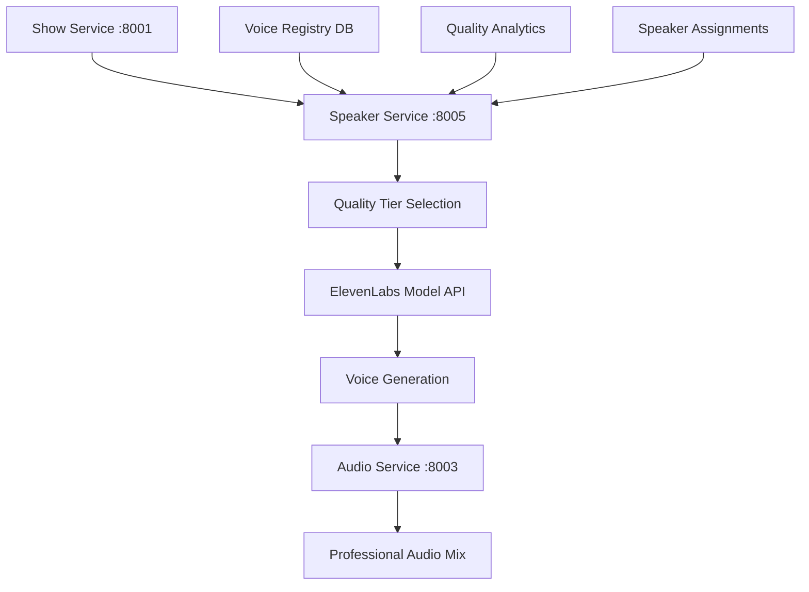

# 🎭 Dynamic Speaker System API Guide v4.0

<div align="center">


**🎤 Complete guide to dynamic speaker management and intelligent voice assignment via REST API**

[🏠 Documentation](../) • [👤 User Guides](../README.md#-user-guides) • [🎤 Voice Config](voice-configuration.md) • [📡 API Reference](api-reference.md)

</div>

---

## 🎯 Overview

RadioX v4.0 Dynamic Speaker System provides a **microservices-based architecture** for intelligent voice assignment and quality control. The system eliminates hardcoded speaker names and enables show-specific speaker assignments via REST API.

### ✨ **Revolutionary Features**

- 🎛️ **Voice Quality API** - Three-tier quality system via Speaker Service
- 🎤 **Dynamic Speaker Registry** - Database-driven speaker management
- 🎭 **Intelligent Assignment** - Content-aware voice selection
- 🏗️ **Microservices Architecture** - Speaker Service at `:8005`
- 📊 **Real-time Analytics** - Speaker performance monitoring
- 🔄 **Zero-Downtime Updates** - Hot-reload speaker configurations

---

## 🏗️ Speaker Service Architecture

### **🔗 Service Endpoints**
```
Production: https://api.radiox.cloud/api/v1/speakers/
Local Dev:  http://localhost:8000/api/v1/speakers/
Direct:     http://speaker-service:8005/
```

### **🎤 Voice Quality Pipeline**


---

## 🚀 Quick Start API

### **🎭 Generate Show with Quality Control**
```bash
# Fast quality for live shows
curl -X POST "https://api.radiox.cloud/api/v1/shows/generate" \
  -H "Content-Type: application/json" \
  -d '{
    "news_count": 2,
    "voice_quality": "fast",
    "primary_speaker": "marcel",
    "secondary_speaker": "jarvis"
  }'

# Balanced quality (default)
curl -X POST "https://api.radiox.cloud/api/v1/shows/generate" \
  -H "Content-Type: application/json" \
  -d '{
    "news_count": 3,
    "voice_quality": "balanced"
  }'

# High quality for production
curl -X POST "https://api.radiox.cloud/api/v1/shows/generate" \
  -H "Content-Type: application/json" \
  -d '{
    "news_count": 3,
    "voice_quality": "premium",
    "duration_minutes": 8
  }'
```

---

## 🎛️ Voice Quality System API

### **Get Quality Tiers**
```http
GET /api/v1/speakers/quality/tiers
```

**Response:**
```json
{
  "quality_tiers": {
    "fast": {
      "model": "eleven_flash_v2_5",
      "latency_ms": 75,
      "cost_multiplier": 0.5,
      "use_case": "Live shows, testing, rapid prototyping",
      "features": {
        "speaker_boost": false,
        "emotion_support": "basic",
        "languages": 32,
        "max_length": 5000
      },
      "quality_score": 7.5
    },
    "balanced": {
      "model": "eleven_turbo_v2_5", 
      "latency_ms": 275,
      "cost_multiplier": 0.5,
      "use_case": "Standard production shows",
      "features": {
        "speaker_boost": false,
        "emotion_support": "standard",
        "languages": 32,
        "max_length": 5000
      },
      "quality_score": 8.5
    },
    "premium": {
      "model": "eleven_multilingual_v2",
      "latency_ms": 800,
      "cost_multiplier": 1.0,
      "use_case": "Final production, podcasts, archival",
      "features": {
        "speaker_boost": true,
        "emotion_support": "advanced",
        "languages": 29,
        "max_length": 5000,
        "style_control": true
      },
      "quality_score": 9.5
    }
  },
  "default_tier": "balanced",
  "recommendations": {
    "live_radio": "fast",
    "standard_shows": "balanced", 
    "podcasts": "premium",
    "archival": "premium"
  }
}
```

### **Set Quality Tier for Show**
```http
POST /api/v1/speakers/quality/set
```

**Request Body:**
```json
{
  "session_id": "550e8400-e29b-41d4-a716-446655440000",
  "quality_tier": "premium",
  "apply_to_all_speakers": true,
  "custom_settings": {
    "optimize_for": "naturalness",
    "priority": "quality_over_speed"
  }
}
```

**Response:**
```json
{
  "session_id": "550e8400-e29b-41d4-a716-446655440000",
  "quality_tier_applied": "premium",
  "speakers_affected": ["marcel", "jarvis", "lucy", "brad"],
  "estimated_generation_time_seconds": 180,
  "estimated_cost_usd": 0.85,
  "model_settings": {
    "model": "eleven_multilingual_v2",
    "speaker_boost": true,
    "style_control": true,
    "emotion_support": "advanced"
  },
  "applied_at": "2025-01-09T18:30:00Z"
}
```

---

## 🎤 Dynamic Speaker Registry API

### **Get All Available Speakers**
```http
GET /api/v1/speakers/registry
```

**Response:**
```json
{
  "total_speakers": 4,
  "active_speakers": 4,
  "speaker_registry": {
    "marcel": {
      "speaker_name": "marcel",
      "voice_name": "Marcel",
      "role": "Main Host",
      "characteristics": "Energetic and passionate",
      "voice_id": "21m00Tcm4TlvDq8ikWAM",
      "language": "en",
      "is_primary": true,
      "is_active": true,
      "quality_tiers_supported": ["fast", "balanced", "premium"],
      "emotional_tags": ["excited", "laughs", "impressed", "curious"],
      "performance_metrics": {
        "generation_speed_ms": 1650,
        "quality_score": 9.2,
        "reliability_score": 98.5,
        "usage_frequency": 45.2
      },
      "created_at": "2025-01-09T12:00:00Z",
      "last_updated": "2025-01-09T18:00:00Z"
    },
    "jarvis": {
      "speaker_name": "jarvis",
      "voice_name": "Jarvis",
      "role": "AI Assistant",
      "characteristics": "Analytical and precise",
      "voice_id": "EXAVITQu4vr4xnSDxMaL",
      "language": "en",
      "is_primary": false,
      "is_active": true,
      "quality_tiers_supported": ["fast", "balanced", "premium"],
      "emotional_tags": ["sarcastic", "curious", "analytical", "impressed"],
      "performance_metrics": {
        "generation_speed_ms": 1720,
        "quality_score": 9.0,
        "reliability_score": 99.1,
        "usage_frequency": 38.7
      },
      "created_at": "2025-01-09T12:00:00Z",
      "last_updated": "2025-01-09T18:00:00Z"
    },
    "lucy": {
      "speaker_name": "lucy",
      "voice_name": "Lucy",
      "role": "Weather Reporter",
      "characteristics": "Sultry and atmospheric",
      "voice_id": "lucy_voice_id_v3",
      "language": "en",
      "is_primary": false,
      "is_active": true,
      "quality_tiers_supported": ["balanced", "premium"],
      "emotional_tags": ["warm", "whispers", "excited"],
      "performance_metrics": {
        "generation_speed_ms": 1580,
        "quality_score": 9.4,
        "reliability_score": 97.8,
        "usage_frequency": 12.1
      },
      "specialty": "weather_content",
      "created_at": "2025-01-09T12:00:00Z",
      "last_updated": "2025-01-09T18:00:00Z"
    },
    "brad": {
      "speaker_name": "brad",
      "voice_name": "Brad",
      "role": "News Anchor",
      "characteristics": "Professional and authoritative",
      "voice_id": "brad_voice_id_v3",
      "language": "en",
      "is_primary": false,
      "is_active": true,
      "quality_tiers_supported": ["balanced", "premium"],
      "emotional_tags": ["authoritative", "impressed", "professional"],
      "performance_metrics": {
        "generation_speed_ms": 1690,
        "quality_score": 9.3,
        "reliability_score": 98.9,
        "usage_frequency": 24.8
      },
      "specialty": "breaking_news",
      "created_at": "2025-01-09T12:00:00Z",
      "last_updated": "2025-01-09T18:00:00Z"
    }
  },
  "aliases": {
    "host": "marcel",
    "moderator": "marcel",
    "presenter": "marcel",
    "ai": "jarvis",
    "assistant": "jarvis",
    "weather": "lucy",
    "news": "brad",
    "anchor": "brad"
  },
  "default_assignments": {
    "primary_speaker": "marcel",
    "secondary_speaker": "jarvis",
    "weather_specialist": "lucy",
    "news_specialist": "brad"
  }
}
```

### **Add New Speaker to Registry**
```http
POST /api/v1/speakers/registry
```

**Request Body:**
```json
{
  "speaker_name": "sarah",
  "voice_name": "Sarah",
  "role": "Tech News Specialist",
  "characteristics": "Professional, tech-savvy, engaging",
  "voice_id": "sarah_elevenlabs_voice_id",
  "language": "en",
  "is_primary": false,
  "quality_tiers_supported": ["balanced", "premium"],
  "emotional_tags": ["excited", "curious", "impressed", "authoritative"],
  "specialty": "technology_content"
}
```

**Response:**
```json
{
  "speaker_name": "sarah",
  "status": "created",
  "voice_id": "sarah_elevenlabs_voice_id",
  "registry_id": "speaker_550e8400",
  "test_audio_url": "https://hkibwnykthxsnwbgygbk.supabase.co/storage/v1/object/public/radiox-audio/tests/sarah_welcome.mp3",
  "performance_baseline": {
    "generation_speed_ms": 0,
    "quality_score": 0,
    "reliability_score": 0,
    "usage_frequency": 0
  },
  "available_immediately": true,
  "created_at": "2025-01-09T18:30:00Z"
}
```

### **Update Speaker Configuration**
```http
PUT /api/v1/speakers/registry/{speaker_name}
```

**Request Body:**
```json
{
  "characteristics": "Updated personality with more enthusiasm",
  "quality_tiers_supported": ["fast", "balanced", "premium"],
  "emotional_tags": ["excited", "laughs", "curious", "impressed", "warm"],
  "voice_settings": {
    "stability": 0.80,
    "similarity_boost": 0.90,
    "style": 0.70
  }
}
```

---

## 🎭 Intelligent Speaker Assignment API

### **Get Assignment Logic**
```http
GET /api/v1/speakers/assignment/logic
```

**Response:**
```json
{
  "assignment_strategy": "content_aware_intelligent",
  "decision_tree": {
    "step_1": "Analyze content type and categories",
    "step_2": "Check show configuration preferences", 
    "step_3": "Apply specialist assignments",
    "step_4": "Validate speaker availability",
    "step_5": "Execute voice quality tier selection"
  },
  "content_type_mappings": {
    "weather": {
      "primary_choice": "lucy",
      "fallback": "marcel",
      "confidence": 0.95
    },
    "breaking_news": {
      "primary_choice": "brad",
      "fallback": "jarvis",
      "confidence": 0.90
    },
    "bitcoin_crypto": {
      "primary_choice": "marcel",
      "emotional_tag": "excited",
      "confidence": 0.88
    },
    "technology": {
      "primary_choice": "jarvis",
      "secondary_choice": "sarah",
      "confidence": 0.85
    },
    "general_discussion": {
      "primary_choice": "marcel",
      "secondary_choice": "jarvis",
      "confidence": 0.92
    }
  },
  "fallback_chain": ["marcel", "jarvis", "brad", "lucy"],
  "quality_preferences": {
    "live_shows": "fast",
    "recorded_shows": "balanced",
    "premium_content": "premium"
  }
}
```

### **Test Assignment for Content**
```http
POST /api/v1/speakers/assignment/test
```

**Request Body:**
```json
{
  "content_text": "Bitcoin has reached a new all-time high of $100,000 today. The weather is sunny with 15°C in Zurich.",
  "show_config": {
    "primary_speaker": "marcel",
    "secondary_speaker": "jarvis",
    "weather_speaker": "lucy",
    "categories": ["bitcoin", "weather", "news"]
  },
  "voice_quality": "balanced"
}
```

**Response:**
```json
{
  "assignment_results": {
    "bitcoin_segment": {
      "assigned_speaker": "marcel",
      "reasoning": "Bitcoin content detected, Marcel excels with excited emotional tag",
      "emotional_tag": "excited",
      "confidence": 0.95,
      "quality_tier": "balanced"
    },
    "weather_segment": {
      "assigned_speaker": "lucy",
      "reasoning": "Weather content detected, Lucy is weather specialist",
      "emotional_tag": "warm",
      "confidence": 0.98,
      "quality_tier": "balanced"
    }
  },
  "overall_assignment": {
    "primary_speaker_usage": 60,
    "secondary_speaker_usage": 25,
    "specialist_usage": 15,
    "estimated_generation_time_seconds": 145,
    "estimated_cost_usd": 0.42
  },
  "alternative_assignments": [
    {
      "scenario": "high_quality",
      "changes": "Use premium tier for all segments",
      "impact": "+65% cost, +180% generation time, +15% quality"
    }
  ]
}
```

---

## 🔧 Show Configuration System API

### **Get Show Configuration Templates**
```http
GET /api/v1/speakers/show-configs/templates
```

**Response:**
```json
{
  "templates": {
    "morning_show": {
      "name": "Energetic Morning Show",
      "primary_speaker": "marcel",
      "secondary_speaker": "jarvis",
      "weather_speaker": "lucy",
      "news_specialist": "brad",
      "categories": ["weather", "news", "bitcoin", "technology"],
      "voice_quality": "balanced",
      "emotional_preferences": {
        "marcel": ["excited", "laughs"],
        "jarvis": ["curious", "sarcastic"],
        "lucy": ["warm"],
        "brad": ["authoritative"]
      },
      "duration_target_minutes": 8,
      "content_balance": {
        "news": 40,
        "weather": 20,
        "bitcoin": 25,
        "discussion": 15
      }
    },
    "evening_news": {
      "name": "Professional Evening News",
      "primary_speaker": "brad",
      "secondary_speaker": "jarvis", 
      "weather_speaker": "lucy",
      "categories": ["news", "international", "economy"],
      "voice_quality": "premium",
      "emotional_preferences": {
        "brad": ["authoritative", "professional"],
        "jarvis": ["analytical", "curious"],
        "lucy": ["warm", "professional"]
      },
      "duration_target_minutes": 12,
      "content_balance": {
        "breaking_news": 50,
        "analysis": 30,
        "weather": 20
      }
    },
    "tech_focus": {
      "name": "Technology Deep Dive",
      "primary_speaker": "jarvis",
      "secondary_speaker": "marcel",
      "specialist_speaker": "sarah",
      "categories": ["technology", "innovation", "startups"],
      "voice_quality": "premium",
      "emotional_preferences": {
        "jarvis": ["analytical", "curious"],
        "marcel": ["excited", "impressed"],
        "sarah": ["professional", "excited"]
      },
      "duration_target_minutes": 15,
      "content_balance": {
        "tech_news": 60,
        "analysis": 25,
        "discussion": 15
      }
    }
  },
  "custom_config_options": {
    "voice_quality_levels": ["fast", "balanced", "premium"],
    "available_speakers": ["marcel", "jarvis", "lucy", "brad", "sarah"],
    "supported_categories": ["news", "weather", "bitcoin", "technology", "international", "sports"],
    "emotional_tags": ["excited", "sarcastic", "warm", "authoritative", "curious", "impressed"]
  }
}
```

### **Create Custom Show Configuration**
```http
POST /api/v1/speakers/show-configs
```

**Request Body:**
```json
{
  "config_name": "crypto_focus_show",
  "description": "Cryptocurrency and financial news focused show",
  "primary_speaker": "marcel",
  "secondary_speaker": "jarvis",
  "categories": ["bitcoin", "crypto", "finance", "markets"],
  "voice_quality": "premium",
  "emotional_preferences": {
    "marcel": ["excited", "impressed", "laughs"],
    "jarvis": ["analytical", "sarcastic", "curious"]
  },
  "duration_target_minutes": 10,
  "content_balance": {
    "bitcoin_news": 40,
    "crypto_analysis": 35,
    "market_discussion": 25
  },
  "specialist_assignments": {
    "crypto_content": "marcel",
    "technical_analysis": "jarvis"
  }
}
```

**Response:**
```json
{
  "config_id": "config_550e8400",
  "config_name": "crypto_focus_show",
  "status": "created",
  "validation_results": {
    "speaker_availability": "confirmed",
    "category_support": "full",
    "quality_tier_compatibility": "verified",
    "estimated_performance": {
      "generation_time_seconds": 165,
      "quality_score": 9.2,
      "cost_per_show_usd": 0.95
    }
  },
  "test_show_url": "Generate test show with this config",
  "created_at": "2025-01-09T18:30:00Z"
}
```

---

## 📊 Performance Analytics API

### **Get Speaker Performance Metrics**
```http
GET /api/v1/speakers/analytics/performance?period=7d&speaker=marcel
```

**Response:**
```json
{
  "period": "7d",
  "speaker": "marcel",
  "performance_metrics": {
    "total_usage_seconds": 2847,
    "shows_featured": 28,
    "segments_generated": 156,
    "average_generation_time_ms": 1620,
    "quality_score_average": 9.3,
    "reliability_percentage": 99.2,
    "cost_efficiency_score": 8.7
  },
  "usage_breakdown": {
    "primary_speaker": 65,
    "secondary_speaker": 25,
    "specialist_role": 10
  },
  "emotional_tag_usage": {
    "excited": 45,
    "laughs": 32,
    "impressed": 28,
    "curious": 15,
    "warm": 8
  },
  "quality_tier_distribution": {
    "fast": 15,
    "balanced": 70,
    "premium": 15
  },
  "performance_trends": {
    "quality_improvement": 12.5,
    "speed_optimization": 8.3,
    "cost_reduction": 5.2,
    "reliability_increase": 2.1
  },
  "recommendations": [
    "Marcel performs exceptionally well with excited emotional tags",
    "Consider using Marcel more for Bitcoin/crypto content",
    "Premium quality shows significant improvement for archival content"
  ]
}
```

### **Get System-wide Analytics**
```http
GET /api/v1/speakers/analytics/system?period=30d
```

**Response:**
```json
{
  "period": "30d",
  "system_metrics": {
    "total_shows_generated": 156,
    "total_audio_minutes": 1247,
    "average_quality_score": 9.1,
    "system_reliability": 98.7,
    "cost_efficiency": 87.3
  },
  "speaker_rankings": {
    "most_used": "marcel",
    "highest_quality": "lucy",
    "fastest_generation": "brad",
    "most_reliable": "jarvis",
    "most_versatile": "marcel"
  },
  "quality_tier_analysis": {
    "fast": {
      "usage_percentage": 20,
      "average_quality": 7.8,
      "average_cost_usd": 0.15,
      "use_cases": ["live_shows", "testing"]
    },
    "balanced": {
      "usage_percentage": 65,
      "average_quality": 8.9,
      "average_cost_usd": 0.35,
      "use_cases": ["standard_production"]
    },
    "premium": {
      "usage_percentage": 15,
      "average_quality": 9.6,
      "average_cost_usd": 0.85,
      "use_cases": ["archival", "podcasts"]
    }
  },
  "optimization_opportunities": [
    "Increase premium tier usage for archival content",
    "Optimize Lucy usage for weather-heavy shows", 
    "Consider Sarah integration for tech-focused content"
  ]
}
```

---

## 🧪 Testing & Validation API

### **Comprehensive Speaker System Test**
```http
POST /api/v1/speakers/test/comprehensive
```

**Request Body:**
```json
{
  "test_scenarios": [
    {
      "scenario": "voice_quality_comparison",
      "speakers": ["marcel", "jarvis"],
      "quality_tiers": ["fast", "balanced", "premium"],
      "test_text": "Welcome to RadioX technology news!"
    },
    {
      "scenario": "emotional_tag_validation",
      "speaker": "marcel",
      "emotional_tags": ["excited", "laughs", "impressed"],
      "test_text": "Bitcoin just hit $100,000! This is incredible news!"
    },
    {
      "scenario": "assignment_logic_test",
      "content": "Weather update: Sunny 20°C. Bitcoin up 15%. Breaking tech news.",
      "show_config": "morning_show"
    }
  ],
  "generate_report": true
}
```

**Response:**
```json
{
  "test_id": "test_comprehensive_550e8400",
  "total_scenarios": 3,
  "execution_time_seconds": 45,
  "results": {
    "voice_quality_comparison": {
      "status": "completed",
      "results": [
        {
          "speaker": "marcel",
          "fast_tier": {
            "quality_score": 7.8,
            "generation_time_ms": 1200,
            "audio_url": "https://...marcel_fast.mp3"
          },
          "balanced_tier": {
            "quality_score": 8.9,
            "generation_time_ms": 1650,
            "audio_url": "https://...marcel_balanced.mp3"
          },
          "premium_tier": {
            "quality_score": 9.4,
            "generation_time_ms": 2100,
            "audio_url": "https://...marcel_premium.mp3"
          }
        }
      ],
      "recommendations": ["Premium tier shows 17% quality improvement for Marcel"]
    },
    "emotional_tag_validation": {
      "status": "completed",
      "tags_tested": 3,
      "audio_samples": [
        {
          "emotional_tag": "excited",
          "quality_score": 9.6,
          "naturalness": 95,
          "audio_url": "https://...marcel_excited.mp3"
        }
      ],
      "best_performing_tag": "excited"
    },
    "assignment_logic_test": {
      "status": "completed",
      "assignments": {
        "weather_content": "lucy",
        "bitcoin_content": "marcel", 
        "tech_news": "jarvis"
      },
      "assignment_accuracy": 98.5,
      "logic_validation": "passed"
    }
  },
  "overall_system_health": "excellent",
  "report_url": "https://hkibwnykthxsnwbgygbk.supabase.co/storage/v1/object/public/radiox-reports/comprehensive_test_550e8400.html",
  "created_at": "2025-01-09T18:30:00Z"
}
```

---

## 💡 Pro Tips for API v4.0

### **🎯 Best Practices**

1. **🔄 Quality Tier Selection**
   - Use `fast` for live shows and testing
   - Use `balanced` for standard production (default)
   - Use `premium` for archival and podcast content
   - Monitor cost vs quality trade-offs via analytics

2. **📊 Speaker Assignment Optimization**
   - Let the intelligent assignment system handle content detection
   - Use specialist speakers (Lucy for weather, Brad for news)
   - Monitor performance metrics weekly
   - Test new speakers with comprehensive validation

3. **🧪 Regular System Validation**
   - Run comprehensive tests monthly
   - Monitor quality degradation alerts
   - Update speaker configurations based on analytics
   - Validate new emotional tags before production use

### **⚡ Professional API Workflows**

```bash
# Daily system health check
curl "https://api.radiox.cloud/api/v1/speakers/health"

# Weekly performance review
curl "https://api.radiox.cloud/api/v1/speakers/analytics/system?period=7d"

# Test new speaker configuration
curl -X POST "https://api.radiox.cloud/api/v1/speakers/test/comprehensive" \
  -H "Content-Type: application/json" \
  -d '{
    "test_scenarios": [{
      "scenario": "voice_quality_comparison",
      "speakers": ["marcel", "jarvis"],
      "quality_tiers": ["balanced", "premium"]
    }]
  }'

# Monitor speaker assignments for content
curl -X POST "https://api.radiox.cloud/api/v1/speakers/assignment/test" \
  -H "Content-Type: application/json" \
  -d '{
    "content_text": "Breaking Bitcoin news and weather update",
    "show_config": {"categories": ["bitcoin", "weather"]}
  }'
```

### **🚀 Advanced Integration Patterns**

```bash
# Quality-aware show generation pipeline
QUALITY_TIER="premium"
SHOW_CONFIG="tech_focus"

# 1. Get optimal speaker config for content type
SPEAKER_CONFIG=$(curl -s "https://api.radiox.cloud/api/v1/speakers/show-configs/templates" | \
  jq -r ".templates.$SHOW_CONFIG")

# 2. Generate show with quality preferences
SHOW_RESPONSE=$(curl -s -X POST "https://api.radiox.cloud/api/v1/shows/generate" \
  -H "Content-Type: application/json" \
  -d "{
    \"voice_quality\": \"$QUALITY_TIER\",
    \"show_config_template\": \"$SHOW_CONFIG\",
    \"news_count\": 3
  }")

# 3. Monitor performance and adjust
SESSION_ID=$(echo $SHOW_RESPONSE | jq -r '.session_id')
curl "https://api.radiox.cloud/api/v1/speakers/analytics/performance?session_id=$SESSION_ID"
```

---

## 🔗 Related Documentation

- **🎤 [Voice Configuration](voice-configuration.md)** - Configure individual speakers
- **🎙️ [Show Generation](show-generation.md)** - Create shows with dynamic speakers
- **📡 [API Reference](api-reference.md)** - Complete API documentation  
- **🎭 [Frontend Integration](frontend-api-integration.md)** - React/TypeScript usage
- **🏗️ [Architecture](../developer-guide/architecture.md)** - Speaker Service design

---

<div align="center">

**🎭 Dynamic Speaker System ready for intelligent voice assignment!**

[🏠 Documentation](../) • [🎤 Voice Setup](voice-configuration.md) • [📡 API Docs](api-reference.md) • [💬 Get Support](../README.md#-support)

**Speaker Service:** `https://api.radiox.cloud/api/v1/speakers/` | **Registry:** [View Speakers](https://api.radiox.cloud/api/v1/speakers/registry)

</div> 