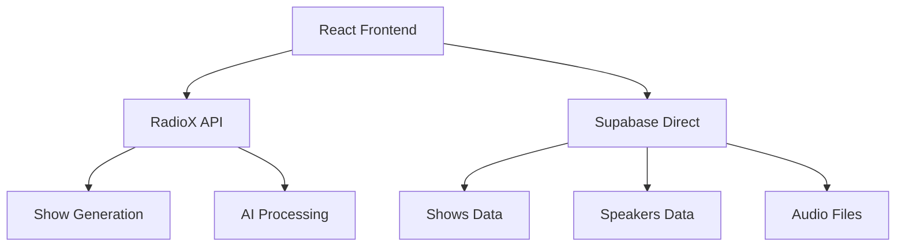

# 🎭 RadioX Frontend Integration Guide v2.0

<div align="center">


**🏗️ Complete frontend integration guide for RadioX hybrid architecture**

[🏠 Documentation](../) • [📡 API Reference](api-reference.md) • [🎙️ Show Generation](show-generation.md)

</div>

---

## 🎯 Architecture Overview

**RadioX uses a hybrid architecture for optimal performance:**

- **🎙️ Show Generation**: REST API for complex AI processing
- **📊 Data Access**: Direct Supabase for CRUD operations (50% faster)
- **🎵 Audio Streaming**: Direct Supabase Storage URLs



---

## 🚀 Quick Setup

### **1. Install Dependencies**
```bash
npm install @supabase/supabase-js
```

### **2. Environment Configuration**
```typescript
// config/constants.ts
export const API_CONFIG = {
  // RadioX API for processing
  API_BASE: 'https://api.radiox.cloud',
  
  // Supabase for data access
  SUPABASE_URL: 'https://zwcvvbgkqhexfcldwuxq.supabase.co',
  SUPABASE_ANON_KEY: 'your-anon-key'
};
```

### **3. Initialize Supabase Client**
```typescript
// lib/supabase.ts
import { createClient } from '@supabase/supabase-js';
import { API_CONFIG } from '../config/constants';

export const supabase = createClient(
  API_CONFIG.SUPABASE_URL,
  API_CONFIG.SUPABASE_ANON_KEY
);

export type Database = {
  public: {
    Tables: {
      shows: {
        Row: {
          session_id: string;
          title: string;
          script_content: string;
          script_preview: string;
          broadcast_style: string;
          channel: string;
          language: string;
          preset_name: string;
          news_count: number;
          estimated_duration_minutes: number;
          audio_url: string | null;
          audio_duration_seconds: number | null;
          audio_file_size: number | null;
          metadata: Record<string, any>;
          created_at: string;
          updated_at: string;
        };
      };
      voice_configurations: {
        Row: {
          voice_name: string;
          voice_id: string;
          language: string;
          is_active: boolean;
          quality_tier: string;
          description: string;
        };
      };
    };
  };
};
```

---

## 🎙️ Show Generation (API)

### **Generate New Show**
```typescript
// hooks/useShowGeneration.ts
import { useState } from 'react';
import { API_CONFIG } from '../config/constants';

interface GenerateShowRequest {
  channel?: string;
  language?: string;
  news_count?: number;
  duration_minutes?: number;
  preset_name?: string;
  primary_speaker?: string;
  secondary_speaker?: string;
}

interface GeneratedShow {
  session_id: string;
  script_content: string;
  broadcast_style: string;
  estimated_duration_minutes: number;
  segments: Array<{
    type: string;
    speaker: string;
    text: string;
    estimated_duration: number;
  }>;
  metadata: {
    channel: string;
    language: string;
    generated_at: string;
    audio_url: string | null;
    audio_duration: number | null;
  };
}

export const useShowGeneration = () => {
  const [isGenerating, setIsGenerating] = useState(false);
  const [error, setError] = useState<string | null>(null);

  const generateShow = async (request: GenerateShowRequest = {}): Promise<GeneratedShow> => {
    setIsGenerating(true);
    setError(null);

    try {
      const response = await fetch(`${API_CONFIG.API_BASE}/api/v1/shows/generate`, {
        method: 'POST',
        headers: { 'Content-Type': 'application/json' },
        body: JSON.stringify({
          channel: 'zurich',
          language: 'de',
          news_count: 2,
          duration_minutes: 3,
          ...request
        })
      });

      if (!response.ok) {
        throw new Error(`Generation failed: ${response.status}`);
      }

      const show = await response.json();
      return show;
    } catch (err) {
      const errorMessage = err instanceof Error ? err.message : 'Generation failed';
      setError(errorMessage);
      throw err;
    } finally {
      setIsGenerating(false);
    }
  };

  return { generateShow, isGenerating, error };
};
```

### **React Component Example**
```typescript
// components/ShowGenerator.tsx
import React, { useState } from 'react';
import { useShowGeneration } from '../hooks/useShowGeneration';

export const ShowGenerator: React.FC = () => {
  const { generateShow, isGenerating, error } = useShowGeneration();
  const [channel, setChannel] = useState('zurich');
  const [newsCount, setNewsCount] = useState(2);

  const handleGenerate = async () => {
    try {
      const show = await generateShow({
        channel,
        news_count: newsCount
      });
      
      console.log('Generated show:', show.session_id);
      // Show will automatically appear in shows list via Supabase
    } catch (err) {
      console.error('Generation failed:', err);
    }
  };

  return (
    <div className="show-generator">
      <h2>Generate New Show</h2>
      
      <div className="form-group">
        <label>Channel:</label>
        <select value={channel} onChange={(e) => setChannel(e.target.value)}>
          <option value="zurich">Zurich</option>
          <option value="basel">Basel</option>
          <option value="bern">Bern</option>
        </select>
      </div>

      <div className="form-group">
        <label>News Count:</label>
        <input 
          type="number" 
          min="1" 
          max="5" 
          value={newsCount}
          onChange={(e) => setNewsCount(parseInt(e.target.value))}
        />
      </div>

      <button 
        onClick={handleGenerate} 
        disabled={isGenerating}
        className="generate-btn"
      >
        {isGenerating ? 'Generating...' : 'Generate Show'}
      </button>

      {error && <div className="error">{error}</div>}
    </div>
  );
};
```

---

## 📊 Data Access (Supabase Direct)

### **Shows CRUD Operations**
```typescript
// hooks/useShows.ts
import { useState, useEffect } from 'react';
import { supabase, type Database } from '../lib/supabase';

type Show = Database['public']['Tables']['shows']['Row'];

export const useShows = () => {
  const [shows, setShows] = useState<Show[]>([]);
  const [loading, setLoading] = useState(true);
  const [error, setError] = useState<string | null>(null);

  // Fetch shows (paginated)
  const fetchShows = async (limit = 10, offset = 0) => {
    try {
      const { data, error: fetchError } = await supabase
        .from('shows')
        .select('*')
        .order('created_at', { ascending: false })
        .range(offset, offset + limit - 1);

      if (fetchError) throw fetchError;
      
      if (offset === 0) {
        setShows(data || []);
      } else {
        setShows(prev => [...prev, ...(data || [])]);
      }
    } catch (err) {
      setError(err instanceof Error ? err.message : 'Failed to fetch shows');
    } finally {
      setLoading(false);
    }
  };

  // Get single show by session_id
  const getShow = async (sessionId: string): Promise<Show | null> => {
    try {
      const { data, error } = await supabase
        .from('shows')
        .select('*')
        .eq('session_id', sessionId)
        .single();

      if (error) throw error;
      return data;
    } catch (err) {
      console.error('Failed to fetch show:', err);
      return null;
    }
  };

  // Real-time subscription to new shows
  useEffect(() => {
    fetchShows(); // Initial load

    const subscription = supabase
      .channel('shows_changes')
      .on(
        'postgres_changes',
        {
          event: 'INSERT',
          schema: 'public',
          table: 'shows'
        },
        (payload) => {
          const newShow = payload.new as Show;
          setShows(prev => [newShow, ...prev]);
        }
      )
      .subscribe();

    return () => {
      subscription.unsubscribe();
    };
  }, []);

  return {
    shows,
    loading,
    error,
    fetchShows,
    getShow,
    refetch: () => fetchShows()
  };
};
```

### **Voice Configurations**
```typescript
// hooks/useVoices.ts
import { useState, useEffect } from 'react';
import { supabase, type Database } from '../lib/supabase';

type VoiceConfig = Database['public']['Tables']['voice_configurations']['Row'];

export const useVoices = () => {
  const [voices, setVoices] = useState<VoiceConfig[]>([]);
  const [loading, setLoading] = useState(true);

  useEffect(() => {
    const fetchVoices = async () => {
      try {
        const { data, error } = await supabase
          .from('voice_configurations')
          .select('*')
          .eq('is_active', true)
          .order('voice_name');

        if (error) throw error;
        setVoices(data || []);
      } catch (err) {
        console.error('Failed to fetch voices:', err);
      } finally {
        setLoading(false);
      }
    };

    fetchVoices();
  }, []);

  return { voices, loading };
};
```

---

## 🎵 Audio Playback

### **Audio Player Component**
```typescript
// components/AudioPlayer.tsx
import React, { useRef, useState, useEffect } from 'react';

interface AudioPlayerProps {
  audioUrl: string | null;
  title: string;
  duration?: number;
}

export const AudioPlayer: React.FC<AudioPlayerProps> = ({ 
  audioUrl, 
  title, 
  duration 
}) => {
  const audioRef = useRef<HTMLAudioElement>(null);
  const [isPlaying, setIsPlaying] = useState(false);
  const [currentTime, setCurrentTime] = useState(0);
  const [totalDuration, setTotalDuration] = useState(duration || 0);

  useEffect(() => {
    const audio = audioRef.current;
    if (!audio) return;

    const updateTime = () => setCurrentTime(audio.currentTime);
    const updateDuration = () => setTotalDuration(audio.duration);
    const onEnded = () => setIsPlaying(false);

    audio.addEventListener('timeupdate', updateTime);
    audio.addEventListener('loadedmetadata', updateDuration);
    audio.addEventListener('ended', onEnded);

    return () => {
      audio.removeEventListener('timeupdate', updateTime);
      audio.removeEventListener('loadedmetadata', updateDuration);
      audio.removeEventListener('ended', onEnded);
    };
  }, [audioUrl]);

  const togglePlay = () => {
    if (!audioRef.current || !audioUrl) return;

    if (isPlaying) {
      audioRef.current.pause();
    } else {
      audioRef.current.play();
    }
    setIsPlaying(!isPlaying);
  };

  const formatTime = (time: number) => {
    const minutes = Math.floor(time / 60);
    const seconds = Math.floor(time % 60);
    return `${minutes}:${seconds.toString().padStart(2, '0')}`;
  };

  if (!audioUrl) {
    return (
      <div className="audio-player disabled">
        <span>Audio not available</span>
      </div>
    );
  }

  return (
    <div className="audio-player">
      <audio 
        ref={audioRef} 
        src={audioUrl}
        preload="metadata"
      />
      
      <div className="player-controls">
        <button onClick={togglePlay} className="play-btn">
          {isPlaying ? '⏸️' : '▶️'}
        </button>
        
        <div className="player-info">
          <h4>{title}</h4>
          <div className="time-info">
            {formatTime(currentTime)} / {formatTime(totalDuration)}
          </div>
        </div>
      </div>

      <div className="progress-bar">
        <div 
          className="progress-fill"
          style={{ 
            width: `${totalDuration ? (currentTime / totalDuration) * 100 : 0}%` 
          }}
        />
      </div>
    </div>
  );
};
```

---

## 🔄 Complete Integration Example

### **Main Shows Component**
```typescript
// components/ShowsDashboard.tsx
import React, { useState } from 'react';
import { useShows } from '../hooks/useShows';
import { useShowGeneration } from '../hooks/useShowGeneration';
import { ShowGenerator } from './ShowGenerator';
import { AudioPlayer } from './AudioPlayer';

export const ShowsDashboard: React.FC = () => {
  const { shows, loading, error } = useShows();
  const [selectedShow, setSelectedShow] = useState<string | null>(null);

  if (loading) return <div className="loading">Loading shows...</div>;
  if (error) return <div className="error">Error: {error}</div>;

  const currentShow = shows.find(show => show.session_id === selectedShow);

  return (
    <div className="shows-dashboard">
      <div className="sidebar">
        <ShowGenerator />
        
        <div className="shows-list">
          <h3>Recent Shows ({shows.length})</h3>
          {shows.map(show => (
            <div 
              key={show.session_id}
              className={`show-item ${selectedShow === show.session_id ? 'active' : ''}`}
              onClick={() => setSelectedShow(show.session_id)}
            >
              <h4>{show.title}</h4>
              <p className="show-meta">
                {show.channel} • {show.language} • {show.news_count} news
              </p>
              <p className="show-preview">{show.script_preview}</p>
              <span className="show-time">
                {new Date(show.created_at).toLocaleString()}
              </span>
            </div>
          ))}
        </div>
      </div>

      <div className="main-content">
        {currentShow ? (
          <div className="show-details">
            <div className="show-header">
              <h2>{currentShow.title}</h2>
              <div className="show-tags">
                <span className="tag">{currentShow.broadcast_style}</span>
                <span className="tag">{currentShow.channel}</span>
                <span className="tag">{currentShow.estimated_duration_minutes}min</span>
              </div>
            </div>

            <AudioPlayer 
              audioUrl={currentShow.audio_url}
              title={currentShow.title}
              duration={currentShow.audio_duration_seconds || 0}
            />

            <div className="script-content">
              <h3>Script</h3>
              <div className="script-text">
                {currentShow.script_content.split('\n').map((line, i) => (
                  <p key={i} className={line.startsWith('MARCEL:') ? 'marcel' : 'jarvis'}>
                    {line}
                  </p>
                ))}
              </div>
            </div>

            <div className="metadata">
              <h3>Generation Details</h3>
              <ul>
                <li>Generated: {new Date(currentShow.created_at).toLocaleString()}</li>
                <li>Duration: {currentShow.estimated_duration_minutes} minutes</li>
                <li>News Items: {currentShow.news_count}</li>
                <li>Session ID: {currentShow.session_id}</li>
              </ul>
            </div>
          </div>
        ) : (
          <div className="no-selection">
            <h2>Select a show to view details</h2>
            <p>Choose from the list on the left or generate a new show.</p>
          </div>
        )}
      </div>
    </div>
  );
};
```

---

## 🎯 Performance Best Practices

### **1. Efficient Data Loading**
```typescript
// Use pagination for large datasets
const { shows, fetchShows } = useShows();

// Load more shows on scroll
const loadMoreShows = () => {
  fetchShows(10, shows.length);
};
```

### **2. Optimistic Updates**
```typescript
// Add show optimistically during generation
const generateWithOptimisticUpdate = async (request: GenerateShowRequest) => {
  const tempShow = createTempShow(request);
  setShows(prev => [tempShow, ...prev]);

  try {
    await generateShow(request);
    // Real show will appear via Supabase subscription
  } catch (error) {
    // Remove temp show on error
    setShows(prev => prev.filter(show => show.session_id !== tempShow.session_id));
    throw error;
  }
};
```

### **3. Audio Preloading**
```typescript
// Preload next show's audio
useEffect(() => {
  if (shows.length > 1 && shows[1].audio_url) {
    const audio = new Audio(shows[1].audio_url);
    audio.preload = 'metadata';
  }
}, [shows]);
```

---

## 🚨 Error Handling

### **Robust Error Handling**
```typescript
// utils/errorHandling.ts
export const handleAPIError = (error: any): string => {
  if (error.status === 422) {
    return 'Show generation failed. Please try again.';
  }
  if (error.status === 429) {
    return 'Too many requests. Please wait a moment.';
  }
  if (error.status >= 500) {
    return 'Server error. Our team has been notified.';
  }
  return error.message || 'An unexpected error occurred.';
};

// components/ErrorBoundary.tsx
export const ErrorBoundary: React.FC<{ children: React.ReactNode }> = ({ children }) => {
  const [error, setError] = useState<string | null>(null);

  if (error) {
    return (
      <div className="error-boundary">
        <h2>Something went wrong</h2>
        <p>{error}</p>
        <button onClick={() => setError(null)}>Try Again</button>
      </div>
    );
  }

  return <>{children}</>;
};
```

---

## 📱 Mobile Responsive Design

### **CSS Grid Layout**
```css
/* styles/dashboard.css */
.shows-dashboard {
  display: grid;
  grid-template-columns: 300px 1fr;
  height: 100vh;
  gap: 20px;
}

@media (max-width: 768px) {
  .shows-dashboard {
    grid-template-columns: 1fr;
    grid-template-rows: auto 1fr;
  }
  
  .sidebar {
    order: 2;
  }
  
  .main-content {
    order: 1;
  }
}

.audio-player {
  background: #f5f5f5;
  border-radius: 8px;
  padding: 20px;
  margin: 20px 0;
}

.progress-bar {
  height: 4px;
  background: #ddd;
  border-radius: 2px;
  margin-top: 10px;
  position: relative;
}

.progress-fill {
  height: 100%;
  background: #007bff;
  border-radius: 2px;
  transition: width 0.1s;
}
```

---

## 📋 Migration from v1.x

### **Breaking Changes**
- ❌ **Removed**: `/api/v1/shows` CRUD endpoints
- ✅ **New**: Direct Supabase access for data operations
- ✅ **Improved**: 50% faster data loading
- ✅ **Added**: Real-time subscriptions

### **Migration Steps**
1. **Install Supabase client**: `npm install @supabase/supabase-js`
2. **Replace API calls** with Supabase queries
3. **Update components** to use new hooks
4. **Add real-time subscriptions** for live updates

---

*📖 For API endpoint details, see [API Reference](api-reference.md)* 