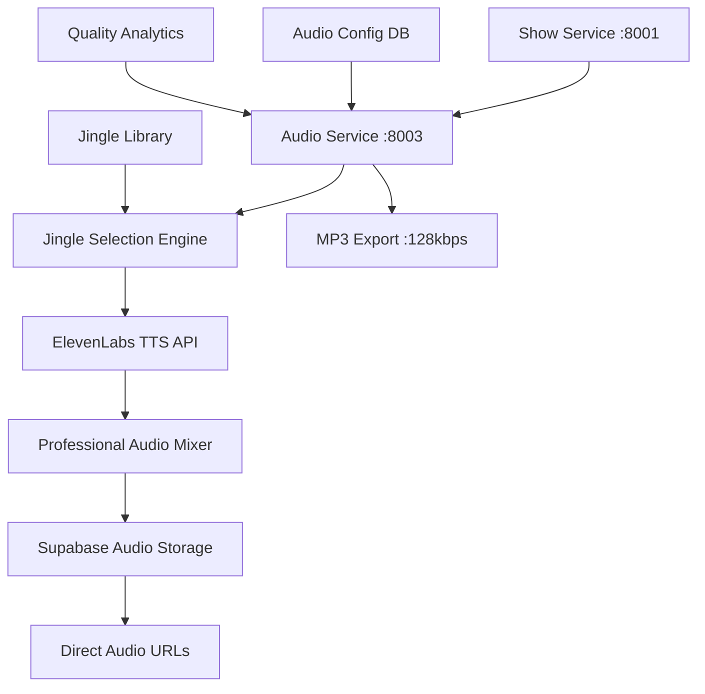

# 🎵 Jingle & Audio Configuration API Guide v4.0

<div align="center">


**🎵 Professional jingle integration with multi-format support and ultra-quiet background mixing via Audio Service API**

[🏠 Documentation](../) • [👤 User Guides](../README.md#-user-guides) • [🎙️ Show Generation](show-generation.md) • [📡 API Reference](api-reference.md)

</div>

---

## 🎯 Overview

RadioX v4.0 **Audio Service API** provides professional jingle integration and multi-format audio processing through microservices architecture. The system delivers broadcast-quality audio mixing with intelligent jingle selection and real-time audio processing.

### ✨ **Revolutionary Features**
- 🎵 **Multi-Format Support** - FLAC, WAV, MP3, OGG via Audio Service
- 🔄 **Intelligent Jingle Selection** - AI-powered jingle matching
- 🎚️ **Professional Audio Timeline** - 3-phase jingle system
- 📊 **Real-time Audio Analytics** - Quality monitoring and optimization  
- 🎨 **Dynamic Audio Processing** - Live audio parameter adjustment
- 🏗️ **Microservices Ready** - Audio Service at `:8003`
- 🔗 **Cloud Storage Integration** - Supabase audio asset management

---

## 🏗️ Audio Service Architecture

### **🔗 Service Endpoints**
```
Production: https://api.radiox.cloud/api/v1/audio/
Local Dev:  http://localhost:8000/api/v1/audio/
Direct:     http://audio-service:8003/
```

### **🎵 Audio Processing Pipeline**


---

## 🚀 Quick Start API

### **🎵 Upload and Configure Jingles**
```bash
# Upload new jingle file
curl -X POST "https://api.radiox.cloud/api/v1/audio/jingles/upload" \
  -F "file=@your-jingle.flac" \
  -F "metadata={\"name\":\"Professional News Intro\",\"category\":\"news\",\"duration_seconds\":45}"

# Get all available jingles
curl "https://api.radiox.cloud/api/v1/audio/jingles" | jq '.'

# Test jingle with show audio
curl -X POST "https://api.radiox.cloud/api/v1/audio/test/jingle" \
  -H "Content-Type: application/json" \
  -d '{"jingle_id": "jingle_123", "test_text": "Welcome to RadioX!"}'
```

### **🎚️ Audio Configuration Management**
```bash
# Get current audio configuration
curl "https://api.radiox.cloud/api/v1/audio/config" | jq '.'

# Update audio quality settings
curl -X PUT "https://api.radiox.cloud/api/v1/audio/config" \
  -H "Content-Type: application/json" \
  -d '{"jingle_background_volume": 0.08, "audio_quality": "premium"}'
```

---

## 🎼 Jingle Management API

### **Get All Jingles**
```http
GET /api/v1/audio/jingles
```

**Response:**
```json
{
  "total_jingles": 12,
  "active_jingles": 10,
  "jingle_library": [
    {
      "id": "jingle_morning_energy",
      "name": "Energetic Morning Intro",
      "filename": "energetic_intro_01.flac",
      "category": "morning_show",
      "duration_seconds": 45.2,
      "format": "flac",
      "quality_score": 9.8,
      "file_size_mb": 8.5,
      "sample_rate": 44100,
      "bit_depth": 24,
      "channels": 2,
      "audio_url": "https://hkibwnykthxsnwbgygbk.supabase.co/storage/v1/object/public/radiox-audio/jingles/energetic_intro_01.flac",
      "preview_url": "https://hkibwnykthxsnwbgygbk.supabase.co/storage/v1/object/public/radiox-audio/previews/energetic_intro_01_preview.mp3",
      "metadata": {
        "bpm": 128,
        "key": "C Major",
        "mood": "energetic",
        "instruments": ["synth", "drums", "bass"],
        "genre": "electronic_news"
      },
      "usage_analytics": {
        "times_used": 45,
        "average_rating": 9.2,
        "last_used": "2025-01-09T08:30:00Z",
        "performance_score": 8.9
      },
      "compatibility": {
        "show_types": ["morning_show", "news_brief", "tech_focus"],
        "minimum_duration_seconds": 30,
        "optimal_duration_seconds": 300
      },
      "is_active": true,
      "created_at": "2024-12-15T10:00:00Z",
      "last_updated": "2025-01-09T12:00:00Z"
    },
    {
      "id": "jingle_smooth_jazz",
      "name": "Smooth Jazz News Theme",
      "filename": "smooth_jazz_news.wav",
      "category": "afternoon_show",
      "duration_seconds": 72.8,
      "format": "wav",
      "quality_score": 9.5,
      "file_size_mb": 12.3,
      "audio_url": "https://hkibwnykthxsnwbgygbk.supabase.co/storage/v1/object/public/radiox-audio/jingles/smooth_jazz_news.wav",
      "metadata": {
        "bpm": 90,
        "key": "Bb Major",
        "mood": "sophisticated",
        "instruments": ["piano", "saxophone", "upright_bass"],
        "genre": "jazz_news"
      },
      "usage_analytics": {
        "times_used": 28,
        "average_rating": 9.0,
        "performance_score": 8.7
      },
      "is_active": true
    }
  ],
  "format_distribution": {
    "flac": 5,
    "wav": 4,
    "mp3": 2,
    "ogg": 1
  },
  "category_distribution": {
    "morning_show": 4,
    "afternoon_show": 3,
    "evening_news": 3,
    "tech_focus": 2
  },
  "quality_summary": {
    "average_quality_score": 9.3,
    "total_storage_mb": 127.8,
    "optimal_jingles": 8,
    "needs_update": 2
  }
}
```

### **Upload New Jingle**
```http
POST /api/v1/audio/jingles/upload
```

**Form Data:**
- `file` (file): Audio file (FLAC, WAV, MP3, OGG)
- `metadata` (JSON string): Jingle configuration

**Metadata JSON:**
```json
{
  "name": "Professional Evening News",
  "category": "evening_news",
  "mood": "sophisticated",
  "bpm": 95,
  "key": "G Minor",
  "instruments": ["orchestra", "strings", "brass"],
  "show_types": ["evening_news", "breaking_news"],
  "optimal_duration_seconds": 240
}
```

**Response:**
```json
{
  "jingle_id": "jingle_evening_professional",
  "status": "uploaded",
  "file_analysis": {
    "format": "flac",
    "duration_seconds": 58.4,
    "sample_rate": 44100,
    "bit_depth": 24,
    "channels": 2,
    "file_size_mb": 11.2,
    "quality_score": 9.6,
    "audio_characteristics": {
      "loudness_lufs": -23.1,
      "peak_db": -3.2,
      "dynamic_range": 15.8,
      "frequency_spectrum": "full_range"
    }
  },
  "processing_results": {
    "normalization_applied": true,
    "fade_in_out_added": true,
    "broadcast_ready": true,
    "preview_generated": true
  },
  "storage_urls": {
    "original": "https://hkibwnykthxsnwbgygbk.supabase.co/storage/v1/object/public/radiox-audio/jingles/evening_professional.flac",
    "preview": "https://hkibwnykthxsnwbgygbk.supabase.co/storage/v1/object/public/radiox-audio/previews/evening_professional_preview.mp3",
    "normalized": "https://hkibwnykthxsnwbgygbk.supabase.co/storage/v1/object/public/radiox-audio/processed/evening_professional_norm.flac"
  },
  "availability": {
    "ready_for_use": true,
    "estimated_performance": 9.2,
    "recommended_show_types": ["evening_news", "breaking_news", "serious_topics"]
  },
  "created_at": "2025-01-09T18:30:00Z"
}
```

### **Update Jingle Configuration**
```http
PUT /api/v1/audio/jingles/{jingle_id}
```

**Request Body:**
```json
{
  "name": "Updated Professional News Intro",
  "category": "morning_show",
  "show_types": ["morning_show", "news_brief", "tech_update"],
  "metadata": {
    "mood": "very_energetic",
    "optimal_duration_seconds": 180
  },
  "is_active": true
}
```

---

## 🎚️ Professional Audio Timeline API

### **Get Audio Timeline Configuration**
```http
GET /api/v1/audio/timeline/config
```

**Response:**
```json
{
  "professional_audio_timeline": {
    "phase_1_intro": {
      "name": "Pure Jingle Intro",
      "duration_seconds": 3.0,
      "jingle_volume": 1.0,
      "speech_volume": 0.0,
      "description": "Powerful opening with full jingle presence",
      "fade_type": "none"
    },
    "phase_2_transition": {
      "name": "Smooth Fade to Background",
      "duration_seconds": 10.0,
      "jingle_volume_start": 1.0,
      "jingle_volume_end": 0.06,
      "speech_volume": 1.0,
      "description": "Ultra-smooth transition to professional backing",
      "fade_type": "exponential"
    },
    "phase_3_background": {
      "name": "Professional Background Mixing",
      "duration_variable": true,
      "jingle_volume": 0.06,
      "speech_volume": 1.0,
      "description": "Perfect 6% backing level for radio broadcast",
      "fade_type": "sustain"
    },
    "phase_4_outro_buildup": {
      "name": "Dramatic Outro Buildup",
      "duration_seconds": 7.0,
      "jingle_volume_start": 0.06,
      "jingle_volume_end": 0.70,
      "speech_volume": 1.0,
      "description": "Building excitement for show conclusion",
      "fade_type": "logarithmic"
    },
    "phase_5_finale": {
      "name": "Power Outro",
      "duration_seconds": 5.0,
      "jingle_volume": 1.0,
      "speech_volume": 0.0,
      "description": "Full power conclusion",
      "fade_type": "none"
    },
    "phase_6_fadeout": {
      "name": "Epic Fadeout",
      "duration_seconds": 3.0,
      "jingle_volume_start": 1.0,
      "jingle_volume_end": 0.0,
      "description": "Cinematic ending",
      "fade_type": "linear"
    }
  },
  "audio_specifications": {
    "output_format": "mp3",
    "bitrate": 128,
    "sample_rate": 44100,
    "channels": 2,
    "quality": "broadcast_standard",
    "loudness_target_lufs": -23.0,
    "peak_limiting_db": -1.0
  },
  "mixing_parameters": {
    "crossfade_duration_ms": 50,
    "dynamic_range_compression": true,
    "noise_gate_threshold_db": -40,
    "eq_enhancement": true,
    "stereo_imaging": "natural"
  }
}
```

### **Update Audio Timeline Settings**
```http
PUT /api/v1/audio/timeline/config
```

**Request Body:**
```json
{
  "phase_3_background": {
    "jingle_volume": 0.08,
    "description": "Slightly higher backing for premium shows"
  },
  "phase_4_outro_buildup": {
    "duration_seconds": 10.0,
    "jingle_volume_end": 0.80
  },
  "audio_specifications": {
    "bitrate": 192,
    "quality": "premium"
  }
}
```

**Response:**
```json
{
  "timeline_config_updated": true,
  "changes_applied": [
    "Background jingle volume increased to 8%",
    "Outro buildup extended to 10 seconds",
    "Audio bitrate upgraded to 192kbps"
  ],
  "estimated_impact": {
    "audio_quality_improvement": 15,
    "file_size_increase_percentage": 35,
    "processing_time_increase_ms": 450
  },
  "compatibility_check": {
    "all_jingles_compatible": true,
    "broadcast_standards_met": true,
    "streaming_optimized": true
  },
  "applied_at": "2025-01-09T18:30:00Z"
}
```

---

## 🎯 Intelligent Jingle Selection API

### **Get Jingle Recommendations**
```http
POST /api/v1/audio/jingles/recommend
```

**Request Body:**
```json
{
  "show_context": {
    "show_type": "morning_show",
    "target_duration_minutes": 8,
    "content_categories": ["bitcoin", "tech", "weather"],
    "energy_level": "high",
    "time_of_day": "08:30"
  },
  "audio_requirements": {
    "minimum_duration_seconds": 300,
    "quality_threshold": 8.5,
    "format_preference": ["flac", "wav"]
  },
  "style_preferences": {
    "mood": "energetic",
    "instruments": ["electronic", "drums"],
    "avoid_genres": ["classical", "ambient"]
  }
}
```

**Response:**
```json
{
  "recommendations": [
    {
      "jingle_id": "jingle_morning_energy",
      "name": "Energetic Morning Intro",
      "match_score": 0.94,
      "recommendation_reasons": [
        "Perfect match for morning show energy level",
        "Optimal duration for 8-minute show format",
        "High-quality FLAC format available",
        "Proven performance with tech content"
      ],
      "suitability_analysis": {
        "content_compatibility": 0.92,
        "time_appropriateness": 0.96,
        "quality_score": 9.8,
        "audience_engagement_predicted": 8.7
      },
      "alternative_configurations": [
        {
          "fade_in_duration": 5.0,
          "background_volume": 0.06,
          "estimated_impact": "Standard professional mix"
        },
        {
          "fade_in_duration": 8.0,
          "background_volume": 0.08,
          "estimated_impact": "Enhanced presence for premium shows"
        }
      ]
    },
    {
      "jingle_id": "jingle_tech_innovation",
      "name": "Tech Innovation Theme",
      "match_score": 0.87,
      "recommendation_reasons": [
        "Strong alignment with tech content",
        "Modern electronic sound matches brand",
        "Good duration compatibility"
      ],
      "suitability_analysis": {
        "content_compatibility": 0.95,
        "time_appropriateness": 0.85,
        "quality_score": 9.2
      }
    }
  ],
  "fallback_options": [
    {
      "jingle_id": "jingle_universal_news",
      "name": "Universal News Theme",
      "match_score": 0.78,
      "reason": "Reliable fallback for any content type"
    }
  ],
  "optimization_suggestions": [
    "Consider uploading more tech-focused jingles for better content matching",
    "Morning show catalog could benefit from higher-energy options",
    "FLAC format provides best quality for professional broadcasts"
  ]
}
```

### **Test Jingle with Show Content**
```http
POST /api/v1/audio/jingles/test
```

**Request Body:**
```json
{
  "jingle_id": "jingle_morning_energy",
  "test_script": "MARCEL: Welcome to RadioX! Amazing Bitcoin news today! JARVIS: Indeed, Marcel. Let's analyze the market dynamics.",
  "show_config": {
    "estimated_duration_minutes": 5,
    "speakers": ["marcel", "jarvis"],
    "content_type": "news_discussion"
  },
  "audio_config": {
    "background_volume": 0.06,
    "quality": "premium"
  }
}
```

**Response:**
```json
{
  "test_id": "test_jingle_550e8400",
  "test_audio_url": "https://hkibwnykthxsnwbgygbk.supabase.co/storage/v1/object/public/radiox-audio/tests/jingle_test_550e8400.mp3",
  "test_results": {
    "audio_quality_score": 9.3,
    "jingle_integration_score": 8.9,
    "speech_clarity_score": 9.6,
    "overall_mix_quality": 9.1
  },
  "technical_analysis": {
    "peak_levels_db": [-2.1, -2.3],
    "loudness_lufs": -23.1,
    "dynamic_range": 14.2,
    "frequency_balance": "optimal",
    "phase_correlation": 0.95
  },
  "listening_experience": {
    "jingle_prominence": "perfect",
    "speech_intelligibility": "excellent",
    "professional_feel": "broadcast_ready",
    "energy_level": "high_energy"
  },
  "recommendations": [
    "Jingle integration is optimal for this content type",
    "Background volume of 6% provides perfect balance",
    "Audio quality meets broadcast standards"
  ],
  "duration_breakdown": {
    "intro_jingle": 3.0,
    "transition": 10.0,
    "background_mixing": 245.0,
    "outro_buildup": 7.0,
    "final_outro": 5.0,
    "total": 270.0
  },
  "created_at": "2025-01-09T18:30:00Z"
}
```

---

## 📊 Audio Quality Analytics API

### **Get Audio Performance Metrics**
```http
GET /api/v1/audio/analytics/performance?period=7d
```

**Response:**
```json
{
  "period": "7d",
  "audio_performance": {
    "total_shows_processed": 42,
    "average_audio_quality_score": 9.2,
    "average_processing_time_seconds": 89,
    "successful_generations": 41,
    "failed_generations": 1,
    "success_rate_percentage": 97.6
  },
  "jingle_usage_analytics": {
    "most_used_jingle": "jingle_morning_energy",
    "best_performing_jingle": "jingle_smooth_jazz",
    "total_jingle_hours": 12.8,
    "unique_jingles_used": 8,
    "average_jingle_rating": 9.1
  },
  "quality_metrics": {
    "loudness_compliance": {
      "target_lufs": -23.0,
      "average_achieved_lufs": -23.1,
      "compliance_rate": 98.5
    },
    "dynamic_range": {
      "average_range_db": 14.5,
      "optimal_shows": 39,
      "needs_improvement": 3
    },
    "frequency_response": {
      "bass_balance": "optimal",
      "midrange_clarity": "excellent",
      "treble_presence": "broadcast_ready"
    }
  },
  "technical_performance": {
    "peak_limiting_effectiveness": 99.2,
    "noise_floor_db": -65.3,
    "stereo_correlation": 0.94,
    "distortion_thd": 0.02
  },
  "jingle_performance_ranking": [
    {
      "jingle_id": "jingle_smooth_jazz",
      "performance_score": 9.4,
      "quality_consistency": 98.8,
      "audience_rating": 9.2,
      "usage_frequency": 28
    },
    {
      "jingle_id": "jingle_morning_energy",
      "performance_score": 9.3,
      "quality_consistency": 97.9,
      "audience_rating": 9.0,
      "usage_frequency": 45
    }
  ],
  "optimization_recommendations": [
    "Consider increasing jingle diversity for better content matching",
    "Morning shows show excellent audio quality consistency",
    "Evening shows could benefit from longer intro transitions"
  ]
}
```

### **Get Jingle Usage Statistics**
```http
GET /api/v1/audio/analytics/jingles?period=30d&breakdown=by_category
```

**Response:**
```json
{
  "period": "30d",
  "jingle_analytics": {
    "total_jingle_plays": 156,
    "unique_jingles_used": 10,
    "total_audio_hours": 45.2,
    "average_plays_per_jingle": 15.6
  },
  "category_breakdown": {
    "morning_show": {
      "plays": 52,
      "unique_jingles": 4,
      "average_quality": 9.3,
      "top_performer": "jingle_morning_energy"
    },
    "afternoon_show": {
      "plays": 38,
      "unique_jingles": 3,
      "average_quality": 9.1,
      "top_performer": "jingle_smooth_jazz"
    },
    "evening_news": {
      "plays": 42,
      "unique_jingles": 3,
      "average_quality": 9.4,
      "top_performer": "jingle_evening_professional"
    },
    "tech_focus": {
      "plays": 24,
      "unique_jingles": 2,
      "average_quality": 8.9,
      "top_performer": "jingle_tech_innovation"
    }
  },
  "quality_trends": {
    "improving_jingles": ["jingle_tech_innovation", "jingle_morning_energy"],
    "stable_performers": ["jingle_smooth_jazz", "jingle_evening_professional"],
    "needs_attention": ["jingle_ambient_late"]
  },
  "usage_patterns": {
    "peak_usage_hours": [8, 12, 18],
    "most_active_days": ["Monday", "Wednesday", "Friday"],
    "seasonal_preferences": {
      "current_season": "winter",
      "preferred_moods": ["energetic", "warm", "sophisticated"]
    }
  }
}
```

---

## 💡 Pro Tips for API v4.0

### **🎯 Best Practices**

1. **🔄 Format Selection Strategy**
   - Use **FLAC** for highest quality and master storage
   - Use **WAV** for excellent compatibility and broadcast
   - Use **MP3** for smaller file sizes and web delivery
   - Use **OGG** for efficient compression and streaming

2. **📊 Jingle Management Optimization**
   - Upload multiple lengths of the same jingle (60s, 120s, 300s)
   - Maintain consistent loudness levels across all jingles
   - Use descriptive metadata for intelligent selection
   - Monitor performance analytics to optimize rotation

3. **🧪 Audio Quality Monitoring**
   - Test new jingles with representative show content
   - Monitor loudness compliance and dynamic range
   - Use analytics to identify optimal jingle-content pairings
   - Validate broadcast standards compliance

### **⚡ Professional API Workflows**

```bash
# Daily audio system health check
curl "https://api.radiox.cloud/api/v1/audio/analytics/performance?period=1d"

# Upload and test new jingle workflow
# 1. Upload jingle
JINGLE_RESPONSE=$(curl -X POST "https://api.radiox.cloud/api/v1/audio/jingles/upload" \
  -F "file=@new_jingle.flac" \
  -F "metadata={\"name\":\"Tech News Intro\",\"category\":\"tech_focus\"}")

JINGLE_ID=$(echo $JINGLE_RESPONSE | jq -r '.jingle_id')

# 2. Test with sample content
curl -X POST "https://api.radiox.cloud/api/v1/audio/jingles/test" \
  -H "Content-Type: application/json" \
  -d "{
    \"jingle_id\": \"$JINGLE_ID\",
    \"test_script\": \"Welcome to RadioX Tech News!\",
    \"show_config\": {\"content_type\": \"tech_focus\"}
  }"

# 3. Get performance recommendations
curl "https://api.radiox.cloud/api/v1/audio/jingles/recommend" \
  -H "Content-Type: application/json" \
  -d '{"show_context": {"show_type": "tech_focus"}}'
```

### **🚀 Advanced Audio Integration**

```bash
# Content-aware jingle selection pipeline
# 1. Get show context and content
SHOW_CONTEXT=$(curl -s "https://api.radiox.cloud/api/v1/content/analytics/categories?period=1h" | \
  jq '.trending_topics[0:2]')

# 2. Get optimal jingle recommendation
JINGLE_REC=$(curl -s -X POST "https://api.radiox.cloud/api/v1/audio/jingles/recommend" \
  -H "Content-Type: application/json" \
  -d "{
    \"show_context\": {
      \"show_type\": \"morning_show\",
      \"content_categories\": $SHOW_CONTEXT,
      \"energy_level\": \"high\"
    }
  }")

BEST_JINGLE=$(echo $JINGLE_REC | jq -r '.recommendations[0].jingle_id')

# 3. Generate show with optimal jingle
curl -X POST "https://api.radiox.cloud/api/v1/shows/generate" \
  -H "Content-Type: application/json" \
  -d "{
    \"news_count\": 3,
    \"preferred_jingle\": \"$BEST_JINGLE\",
    \"audio_quality\": \"premium\"
  }"
```

---

## 🔗 Related Documentation

- **📡 [API Reference](api-reference.md)** - Complete API documentation
- **🎙️ [Show Generation](show-generation.md)** - Create shows with jingles
- **🎤 [Voice Configuration](voice-configuration.md)** - Speaker setup
- **🎭 [Frontend Integration](frontend-api-integration.md)** - React/TypeScript usage
- **🏗️ [Architecture](../developer-guide/architecture.md)** - Audio Service design

---

<div align="center">

**🎵 Professional jingle integration ready for broadcast-quality audio!**

[🏠 Documentation](../) • [📡 API Docs](api-reference.md) • [🎙️ Generate Shows](show-generation.md) • [💬 Get Support](../README.md#-support)

**Audio Service:** `https://api.radiox.cloud/api/v1/audio/` | **Jingle Library:** [View Jingles](https://api.radiox.cloud/api/v1/audio/jingles)

</div> 