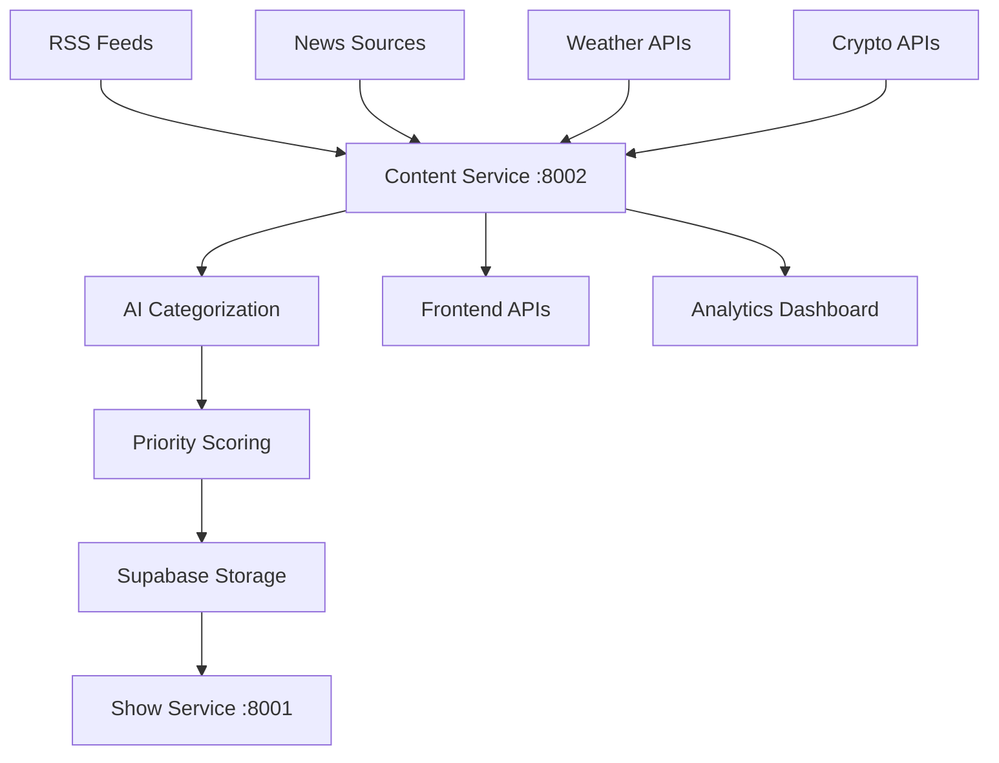

# 📰 RSS Content Service API Guide v4.0

<div align="center">


**📊 Complete guide to RSS feeds, news content, and real-time analytics via Content Service API**

[🏠 Documentation](../) • [👥 User Guides](../README.md#-user-guides) • [🎙️ Show Generation](show-generation.md) • [📡 API Reference](api-reference.md)

</div>

---

## 🎯 Overview

RadioX v4.0 **Content Service API** provides real-time access to RSS feeds, news articles, and content analytics through a modern microservices architecture. The system delivers live filtering, intelligent categorization, and comprehensive content management.

### ✨ **Revolutionary Features**
- 📊 **Real-time Content API** - Live feed and article access via REST
- 🏷️ **Intelligent Categorization** - AI-powered content classification
- 🔄 **Smart Filtering** - Advanced query parameters and search
- 🔗 **Direct Integration** - Native article and RSS feed URLs
- 📱 **API-First Design** - Built for modern frontend frameworks
- 🎨 **Rich Metadata** - Complete article analytics and metrics
- 🏗️ **Microservices Ready** - Content Service at `:8002`

---

## 🏗️ Content Service Architecture

### **🔗 Service Endpoints**
```
Production: https://api.radiox.cloud/api/v1/content/
Local Dev:  http://localhost:8000/api/v1/content/
Direct:     http://content-service:8002/
```

### **📰 Content Pipeline**


---

## 🚀 Quick Start API

### **📰 Get Latest News Articles**
```bash
# Get latest news (default: 10 articles)
curl "https://api.radiox.cloud/api/v1/content/news" | jq '.'

# Get news by category
curl "https://api.radiox.cloud/api/v1/content/news?category=bitcoin&limit=5" | jq '.'

# Get news for specific channel
curl "https://api.radiox.cloud/api/v1/content/news?channel=zurich&max_age_hours=6" | jq '.'
```

### **📡 RSS Feed Management**
```bash
# Get all configured RSS feeds
curl "https://api.radiox.cloud/api/v1/content/rss/feeds" | jq '.'

# Get feed statistics
curl "https://api.radiox.cloud/api/v1/content/rss/stats" | jq '.'

# Get articles from specific source
curl "https://api.radiox.cloud/api/v1/content/news?source=nzz" | jq '.'
```

---

## 📊 Content Analytics API

### **Get Real-time Statistics**
```http
GET /api/v1/content/analytics/stats
```

**Response:**
```json
{
  "realtime_stats": {
    "total_feeds": 30,
    "active_feeds": 28,
    "total_articles": 1247,
    "articles_last_24h": 156,
    "active_sources": 12,
    "categories": 15,
    "last_update": "2025-01-09T18:28:45Z"
  },
  "category_distribution": {
    "news": 324,
    "wirtschaft": 289,
    "tech": 198,
    "bitcoin": 145,
    "schweiz": 132,
    "zurich": 89,
    "international": 76,
    "weather": 45,
    "crypto": 42,
    "science": 28,
    "lifestyle": 18,
    "sports": 15
  },
  "source_performance": {
    "most_active": "20min",
    "highest_quality": "nzz",
    "most_reliable": "srf",
    "fastest_updates": "tagesanzeiger"
  },
  "content_quality": {
    "average_priority": 7.8,
    "articles_with_images": 78.5,
    "articles_with_summaries": 92.3,
    "content_freshness_hours": 3.2
  }
}
```

### **Get Category Analytics**
```http
GET /api/v1/content/analytics/categories?period=7d
```

**Response:**
```json
{
  "period": "7d",
  "category_analytics": {
    "bitcoin": {
      "total_articles": 45,
      "trending_score": 9.2,
      "average_priority": 8.5,
      "top_sources": ["cointelegraph", "nzz", "cash"],
      "peak_activity_hours": [9, 14, 18],
      "sentiment_analysis": {
        "positive": 62,
        "neutral": 28,
        "negative": 10
      },
      "growth_trend": "+15.3%"
    },
    "tech": {
      "total_articles": 38,
      "trending_score": 7.8,
      "average_priority": 7.2,
      "top_sources": ["heise", "techcrunch", "theverge"],
      "peak_activity_hours": [10, 15, 20],
      "sentiment_analysis": {
        "positive": 55,
        "neutral": 35,
        "negative": 10
      },
      "growth_trend": "+8.7%"
    }
  },
  "trending_topics": [
    "Bitcoin ETF approval",
    "AI regulation Switzerland", 
    "Zurich tech startups",
    "Crypto taxation changes"
  ],
  "content_recommendations": [
    "Increase Bitcoin coverage during peak hours",
    "Focus on Swiss tech innovation stories",
    "Weather content performs well in mornings"
  ]
}
```

---

## 📰 News Content API

### **Advanced News Query**
```http
GET /api/v1/content/news?category=tech&priority_min=7&limit=10&include_summary=true
```

**Query Parameters:**
- `category` (string): Filter by category (`tech`, `bitcoin`, `news`, etc.)
- `source` (string): Filter by news source (`nzz`, `srf`, `heise`, etc.)
- `priority_min` (integer): Minimum priority level (1-10)
- `priority_max` (integer): Maximum priority level (1-10)
- `max_age_hours` (integer): Maximum article age in hours
- `limit` (integer): Number of articles to return (default: 10, max: 100)
- `offset` (integer): Skip articles for pagination (default: 0)
- `include_summary` (boolean): Include AI-generated summaries
- `include_sentiment` (boolean): Include sentiment analysis
- `language` (string): Language preference (`en`, `de`)
- `channel` (string): Regional focus (`zurich`, `basel`, `bern`)

**Response:**
```json
{
  "articles": [
    {
      "id": "art_550e8400",
      "title": "Bitcoin erreicht neues Allzeithoch von $100,000",
      "summary": "Bitcoin durchbricht historische Marke nach institutioneller Akzeptanz...",
      "content_preview": "Die Kryptowährung Bitcoin hat heute zum ersten Mal...",
      "source": "nzz.ch",
      "category": "bitcoin",
      "priority": 10,
      "weight": 3.0,
      "published_at": "2025-01-09T16:30:00Z",
      "age_hours": 2.5,
      "url": "https://nzz.ch/finanzen/bitcoin-100000-allzeithoch",
      "rss_feed_url": "https://nzz.ch/feeds/rss.xml",
      "image_url": "https://img.nzz.ch/bitcoin-chart.jpg",
      "metadata": {
        "word_count": 850,
        "reading_time_minutes": 3,
        "has_video": false,
        "has_images": true,
        "author": "Swiss Finance Team"
      },
      "ai_analysis": {
        "sentiment": "positive",
        "confidence": 0.89,
        "key_topics": ["bitcoin", "cryptocurrency", "finance", "switzerland"],
        "emotional_tone": "excited",
        "relevance_score": 9.5
      },
      "engagement_metrics": {
        "social_shares": 245,
        "comments": 67,
        "click_through_rate": 8.9
      }
    }
  ],
  "pagination": {
    "total_articles": 1247,
    "current_page": 1,
    "total_pages": 125,
    "has_next": true,
    "has_previous": false
  },
  "query_info": {
    "filters_applied": ["category:tech", "priority_min:7"],
    "processing_time_ms": 45,
    "cache_hit": true,
    "last_updated": "2025-01-09T18:28:45Z"
  }
}
```

### **Search News Content**
```http
GET /api/v1/content/news/search?q=Bitcoin+Zurich&limit=5
```

**Query Parameters:**
- `q` (string): Search query (title and content)
- `category` (string): Filter by category
- `date_from` (ISO date): Start date filter
- `date_to` (ISO date): End date filter
- `sort` (string): Sort order (`relevance`, `date`, `priority`)

**Response:**
```json
{
  "search_results": [
    {
      "id": "art_search_123",
      "title": "Zurich Bitcoin ATM network expands",
      "relevance_score": 0.94,
      "highlight_snippets": [
        "...Bitcoin ATMs in <mark>Zurich</mark> have increased by 40%...",
        "...new <mark>Bitcoin</mark> adoption in Swiss financial capital..."
      ],
      "category": "bitcoin",
      "source": "cash.ch",
      "published_at": "2025-01-09T14:20:00Z"
    }
  ],
  "search_metadata": {
    "query": "Bitcoin Zurich",
    "total_results": 23,
    "search_time_ms": 67,
    "suggested_queries": ["Bitcoin Switzerland", "Crypto Zurich", "Swiss Bitcoin regulation"]
  }
}
```

---

## 📡 RSS Feed Management API

### **Get All RSS Feeds**
```http
GET /api/v1/content/rss/feeds
```

**Response:**
```json
{
  "total_feeds": 30,
  "active_feeds": 28,
  "rss_feeds": [
    {
      "id": "feed_nzz",
      "source": "nzz",
      "name": "Neue Zürcher Zeitung",
      "url": "https://nzz.ch/feeds/rss.xml",
      "priority": 10,
      "weight": 3.0,
      "language": "de",
      "region": "switzerland",
      "categories": ["news", "wirtschaft", "schweiz", "zurich", "international"],
      "update_frequency_minutes": 15,
      "last_updated": "2025-01-09T18:25:00Z",
      "last_successful_fetch": "2025-01-09T18:25:00Z",
      "articles_last_24h": 28,
      "average_articles_per_day": 32,
      "health_status": "healthy",
      "performance_metrics": {
        "uptime_percentage": 99.8,
        "average_response_time_ms": 234,
        "articles_quality_score": 9.1,
        "content_uniqueness": 0.94
      },
      "is_active": true,
      "created_at": "2024-12-01T10:00:00Z"
    },
    {
      "id": "feed_srf",
      "source": "srf",
      "name": "Schweizer Radio und Fernsehen",
      "url": "https://srf.ch/news/rss.xml",
      "priority": 9,
      "weight": 2.0,
      "language": "de",
      "region": "switzerland",
      "categories": ["news", "schweiz", "international", "weather"],
      "update_frequency_minutes": 20,
      "last_updated": "2025-01-09T18:20:00Z",
      "articles_last_24h": 22,
      "health_status": "healthy",
      "performance_metrics": {
        "uptime_percentage": 99.5,
        "average_response_time_ms": 189,
        "articles_quality_score": 8.8
      },
      "is_active": true
    }
  ],
  "feed_categories": {
    "news": 18,
    "wirtschaft": 12,
    "tech": 8,
    "bitcoin": 4,
    "weather": 3,
    "sports": 2
  },
  "performance_summary": {
    "total_articles_24h": 456,
    "average_fetch_time_ms": 267,
    "success_rate_percentage": 98.9,
    "content_diversity_score": 0.87
  }
}
```

### **Add New RSS Feed**
```http
POST /api/v1/content/rss/feeds
```

**Request Body:**
```json
{
  "source": "swissinfo",
  "name": "SWI swissinfo.ch",
  "url": "https://swissinfo.ch/rss",
  "priority": 8,
  "weight": 2.5,
  "language": "en",
  "region": "switzerland",
  "categories": ["international", "switzerland", "news"],
  "update_frequency_minutes": 30,
  "is_active": true
}
```

**Response:**
```json
{
  "feed_id": "feed_swissinfo",
  "status": "created",
  "validation_results": {
    "url_accessible": true,
    "rss_format_valid": true,
    "initial_articles_found": 15,
    "estimated_daily_volume": 25
  },
  "test_fetch_results": {
    "response_time_ms": 156,
    "content_quality_score": 8.2,
    "categories_detected": ["international", "switzerland"],
    "language_detected": "en"
  },
  "next_fetch_scheduled": "2025-01-09T19:00:00Z",
  "created_at": "2025-01-09T18:30:00Z"
}
```

### **Update RSS Feed Configuration**
```http
PUT /api/v1/content/rss/feeds/{feed_id}
```

**Request Body:**
```json
{
  "priority": 9,
  "update_frequency_minutes": 20,
  "categories": ["news", "switzerland", "international", "weather"],
  "is_active": true
}
```

---

## 🔍 Advanced Content Filtering API

### **Multi-Category Filter**
```http
GET /api/v1/content/news/filter
```

**Request Body:**
```json
{
  "categories": ["bitcoin", "tech"],
  "sources": ["nzz", "heise", "cointelegraph"],
  "priority_range": {
    "min": 7,
    "max": 10
  },
  "time_range": {
    "hours": 12
  },
  "content_requirements": {
    "has_image": true,
    "min_word_count": 200,
    "sentiment": ["positive", "neutral"]
  },
  "limit": 20,
  "sort_by": "priority",
  "include_analytics": true
}
```

**Response:**
```json
{
  "filtered_articles": [
    {
      "id": "art_filtered_123",
      "title": "Swiss Tech Innovation in Bitcoin Mining",
      "category": "tech",
      "source": "heise",
      "priority": 9,
      "sentiment": "positive",
      "word_count": 650,
      "has_image": true,
      "relevance_score": 0.92
    }
  ],
  "filter_results": {
    "total_matches": 67,
    "filtered_count": 20,
    "filter_efficiency": 0.76,
    "categories_found": {
      "bitcoin": 12,
      "tech": 8
    },
    "sources_found": {
      "nzz": 8,
      "heise": 7,
      "cointelegraph": 5
    }
  },
  "recommendations": [
    "Consider including 'crypto' category for broader coverage",
    "Priority range 6-10 would include 23 more relevant articles"
  ]
}
```

### **Smart Content Recommendations**
```http
GET /api/v1/content/recommendations?context=morning_show&duration_minutes=5
```

**Response:**
```json
{
  "recommended_content": {
    "primary_news": [
      {
        "article_id": "art_rec_001",
        "title": "Bitcoin reaches new heights",
        "reason": "High engagement, trending topic, matches morning energy",
        "estimated_read_time": 45,
        "priority": 10
      }
    ],
    "supporting_content": [
      {
        "article_id": "art_rec_002", 
        "title": "Zurich weather outlook",
        "reason": "Morning show standard, local relevance",
        "estimated_read_time": 20,
        "priority": 6
      }
    ],
    "filler_content": [
      {
        "article_id": "art_rec_003",
        "title": "Swiss tech startup funding",
        "reason": "Good conversation starter, moderate priority",
        "estimated_read_time": 30,
        "priority": 7
      }
    ]
  },
  "content_balance": {
    "total_estimated_time_seconds": 285,
    "target_duration_seconds": 300,
    "utilization_percentage": 95,
    "content_mix": {
      "breaking_news": 40,
      "weather": 20,
      "business": 25,
      "tech": 15
    }
  },
  "alternative_options": [
    "Add crypto analysis for +30 seconds",
    "Include sports brief for broader appeal",
    "Add international news for variety"
  ]
}
```

---

## 📊 Real-time Content Dashboard API

### **Generate Live Dashboard Data**
```http
GET /api/v1/content/dashboard/live
```

**Response:**
```json
{
  "dashboard_data": {
    "live_stats": {
      "articles_per_hour": 23,
      "trending_categories": ["bitcoin", "tech", "weather"],
      "peak_activity_sources": ["20min", "nzz", "srf"],
      "content_velocity": "high",
      "system_health": "optimal"
    },
    "category_heatmap": {
      "bitcoin": {
        "activity": "very_high",
        "articles_last_hour": 8,
        "trend": "rising",
        "sentiment": "positive"
      },
      "tech": {
        "activity": "high", 
        "articles_last_hour": 5,
        "trend": "stable",
        "sentiment": "neutral"
      }
    },
    "source_performance": [
      {
        "source": "nzz",
        "articles_24h": 28,
        "quality_score": 9.1,
        "response_time_ms": 234,
        "status": "excellent"
      }
    ],
    "content_quality_metrics": {
      "average_word_count": 487,
      "articles_with_images": 78.5,
      "sentiment_distribution": {
        "positive": 55,
        "neutral": 35,
        "negative": 10
      },
      "content_freshness_score": 8.9
    }
  },
  "dashboard_url": "https://hkibwnykthxsnwbgygbk.supabase.co/storage/v1/object/public/radiox-dashboards/content_live.html",
  "auto_refresh_interval": 30,
  "last_updated": "2025-01-09T18:30:00Z"
}
```

### **Export Dashboard**
```http
POST /api/v1/content/dashboard/export
```

**Request Body:**
```json
{
  "format": "html",
  "include_charts": true,
  "time_range": "24h",
  "categories": ["all"],
  "embed_analytics": true
}
```

**Response:**
```json
{
  "export_id": "export_550e8400",
  "dashboard_url": "https://hkibwnykthxsnwbgygbk.supabase.co/storage/v1/object/public/radiox-exports/dashboard_550e8400.html",
  "format": "html",
  "file_size_kb": 245,
  "generation_time_seconds": 3.2,
  "features_included": [
    "Real-time statistics cards",
    "Category filter functionality",
    "Source performance tables",
    "Interactive charts",
    "Mobile responsive design"
  ],
  "expires_at": "2025-01-16T18:30:00Z",
  "created_at": "2025-01-09T18:30:00Z"
}
```

---

## 💡 Pro Tips for API v4.0

### **🎯 Best Practices**

1. **🔄 Efficient Content Fetching**
   - Use pagination with `limit` and `offset` for large datasets
   - Cache frequently accessed content with appropriate TTL
   - Use category and source filters to reduce response size
   - Monitor API rate limits and implement backoff strategies

2. **📊 Smart Analytics Integration**
   - Poll analytics endpoints every 5-10 minutes for dashboards
   - Use webhook notifications for real-time updates
   - Combine multiple metrics for comprehensive insights
   - Store trending topics for historical analysis

3. **🧪 Content Quality Optimization**
   - Monitor content quality scores and adjust feed priorities
   - Use sentiment analysis for balanced content mix
   - Track engagement metrics to optimize content selection
   - Implement content recommendation algorithms

### **⚡ Professional API Workflows**

```bash
# Daily content health check
curl "https://api.radiox.cloud/api/v1/content/analytics/stats" | jq '.realtime_stats'

# Morning show content preparation
curl "https://api.radiox.cloud/api/v1/content/recommendations?context=morning_show&duration_minutes=8"

# Real-time trending analysis
curl "https://api.radiox.cloud/api/v1/content/analytics/categories?period=1d" | jq '.trending_topics'

# Content quality monitoring
curl "https://api.radiox.cloud/api/v1/content/rss/feeds" | jq '.performance_summary'
```

### **🚀 Advanced Integration Patterns**

```bash
# Content-aware show generation pipeline
# 1. Get trending content for show context
TRENDING=$(curl -s "https://api.radiox.cloud/api/v1/content/analytics/categories?period=6h" | \
  jq -r '.trending_topics[0:3] | join(",")')

# 2. Get recommended articles for show length
CONTENT=$(curl -s "https://api.radiox.cloud/api/v1/content/recommendations?context=evening_show&duration_minutes=6")

# 3. Generate show with content context
SHOW=$(curl -s -X POST "https://api.radiox.cloud/api/v1/shows/generate" \
  -H "Content-Type: application/json" \
  -d "{
    \"news_count\": 3,
    \"trending_topics\": \"$TRENDING\",
    \"content_context\": \"evening_news\"
  }")

# 4. Monitor content performance
SESSION_ID=$(echo $SHOW | jq -r '.session_id')
curl "https://api.radiox.cloud/api/v1/analytics/shows/$SESSION_ID" | jq '.metadata.content_sources'
```

---

## 🔗 Related Documentation

- **📡 [API Reference](api-reference.md)** - Complete API documentation
- **🎙️ [Show Generation](show-generation.md)** - Create shows with content
- **🎭 [Frontend Integration](frontend-api-integration.md)** - React/TypeScript usage
- **🏗️ [Architecture](../developer-guide/architecture.md)** - Content Service design
- **🚀 [Production Deployment](../deployment/production.md)** - Infrastructure setup

---

<div align="center">

**📰 Real-time content management ready for modern radio production!**

[🏠 Documentation](../) • [📡 API Docs](api-reference.md) • [🎙️ Generate Shows](show-generation.md) • [💬 Get Support](../README.md#-support)

**Content Service:** `https://api.radiox.cloud/api/v1/content/` | **Live Stats:** [View Dashboard](https://api.radiox.cloud/api/v1/content/dashboard/live)

</div> 