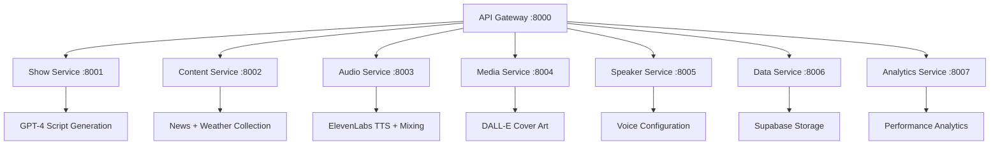

# 🎙️ Professional Show Generation API Guide v4.0

<div align="center">


**🎭 Complete guide to professional AI radio production with modern API microservices**

[🏠 Documentation](../) • [👤 User Guides](../README.md#-user-guides) • [🎤 Voice Config](voice-configuration.md) • [📡 API Reference](api-reference.md)

</div>

---

## ✨ What's New in v4.0

### **🌟 Revolutionary API Architecture**
- 🏗️ **Microservices Architecture** - 8 specialized services with API Gateway
- 🔄 **RESTful API** - Modern HTTP API replacing CLI interface
- 📊 **Real-time Status** - Live show generation tracking via WebSocket
- 🎯 **Smart Content Diversity** - Automatic show-to-show variety via Supabase
- 📂 **Cloud Storage** - Professional shows stored in Supabase with direct URLs
- 🎵 **Professional Audio Streaming** - Direct MP3 URLs for instant playback
- 🎭 **Multi-Voice Support** - Marcel, Jarvis, Lucy (weather), Brad (news)
- 🌐 **Production Ready** - Available at https://api.radiox.cloud

---

## 🎯 Overview

RadioX v4.0 is an **enterprise-grade AI radio production API** that creates unique professional shows through modern microservices architecture, accessible via REST API and deployable anywhere.

### ✨ **Core Features**
- 🧠 **GPT-4 Intelligence** - Never repeats content thanks to Supabase tracking
- 🎙️ **Professional Voices** - Marcel, Jarvis, Lucy, Brad with dynamic assignment
- 🏗️ **Microservices** - 8 specialized services for scalability
- 🎵 **Radio-Quality Audio** - Professional mixing with 6% jingle backing
- 🌐 **Cloud Native** - Supabase storage with direct MP3 URLs
- 📊 **Real-time API** - Generate and retrieve shows via HTTP

---

## 🚀 Quick Start

### **🎬 Generate Your First Professional Show via API**

**Base URL:** `https://api.radiox.cloud` (Production) or `http://localhost:8000` (Local)

```bash
# Quick news brief (1 article)
curl -X POST "https://api.radiox.cloud/api/v1/shows/generate" \
  -H "Content-Type: application/json" \
  -d '{"news_count": 1, "channel": "zurich", "language": "de"}'

# Standard production show (3 articles) 
curl -X POST "https://api.radiox.cloud/api/v1/shows/generate" \
  -H "Content-Type: application/json" \
  -d '{"news_count": 3, "channel": "zurich", "duration_minutes": 5}'

# Extended professional show (5 articles)
curl -X POST "https://api.radiox.cloud/api/v1/shows/generate" \
  -H "Content-Type: application/json" \
  -d '{"news_count": 5, "duration_minutes": 8}'
```

**🎯 Result:** Professional radio show with:
- 📻 Direct MP3 URL in Supabase storage
- 📊 Complete show metadata and script
- 🎨 AI-generated cover art URL
- 🔄 Unique session ID for tracking

---

## 📡 API Endpoints Overview

### **🎙️ Show Generation**
```http
POST /api/v1/shows/generate
Content-Type: application/json

{
  "preset_name": "evening",
  "target_time": "18:30",
  "channel": "zurich",
  "language": "de",
  "news_count": 3,
  "primary_speaker": "marcel",
  "secondary_speaker": "jarvis",
  "duration_minutes": 5
}
```

### **📋 Show Management**
```http
# List all shows with pagination
GET /api/v1/shows?limit=10&offset=0

# Get specific show details
GET /api/v1/shows/{session_id}

# Get available broadcast styles
GET /api/v1/shows/styles
```

### **🔍 Health & Status**
```http
# Check service health
GET /api/v1/shows/health

# Get service information
GET /api/v1/shows/info
```

---

## 🎯 Smart Content Diversity (API-Powered)

### **🧠 How RadioX API Guarantees Unique Shows**

RadioX v4.0 uses **Supabase show tracking** via microservices to ensure 100% content variety:

```json
{
  "session_id": "abc-123-def",
  "diversity_analysis": {
    "last_show_topics": ["bitcoin", "weather", "tech"],
    "avoided_sources": ["techcrunch", "coindesk"],
    "content_similarity": 0.15,
    "uniqueness_score": 0.85
  }
}
```

### **🎯 API Response Structure**
```json
{
  "session_id": "550e8400-e29b-41d4-a716-446655440000",
  "script_content": "MARCEL: Willkommen bei RadioX...",
  "broadcast_style": "Professional Afternoon",
  "estimated_duration_minutes": 5,
  "segments": [
    {
      "speaker": "marcel",
      "text": "Willkommen bei RadioX!",
      "segment_type": "intro",
      "duration_seconds": 15
    }
  ],
  "metadata": {
    "audio_url": "https://storage.supabase.co/radiox/shows/abc123.mp3",
    "cover_art_url": "https://storage.supabase.co/radiox/covers/abc123.png",
    "created_at": "2025-01-09T18:30:00Z",
    "content_sources": ["tagesschau", "srf", "nzz"],
    "topics_covered": ["bitcoin", "weather", "tech"]
  }
}
```

---

## 🏗️ Microservices Architecture

### **🎚️ 8-Service Professional Pipeline**

RadioX v4.0 uses specialized microservices for enterprise-grade production:



### **🔄 API Generation Workflow**
```
1. POST /api/v1/shows/generate → Show Service
2. Show Service → Content Service (fetch news/weather)
3. Show Service → GPT-4 (generate script)
4. Show Service → Audio Service (TTS + mixing)
5. Show Service → Media Service (cover art)
6. Show Service → Data Service (store in Supabase)
7. Response → Direct MP3 + metadata URLs
```

---

## 🎵 Professional Audio Engineering (API)

### **🎚️ 6-Stage Intelligent Audio via Microservices**

RadioX v4.0 features **professional radio-quality mixing** through Audio Service:

```json
{
  "audio_config": {
    "intro_jingle": {
      "volume": 1.0,
      "duration_seconds": 5,
      "fade_to": 0.06
    },
    "backing_during_speech": {
      "volume": 0.06,
      "description": "Professional radio backing level"
    },
    "outro_buildup": {
      "start_volume": 0.15,
      "end_volume": 0.70,
      "duration_seconds": 5
    },
    "final_outro": {
      "volume": 1.0,
      "fade_out_seconds": 3
    }
  }
}
```

**🎯 Key Feature:** During speech segments, jingle plays at **6% volume** - the perfect professional radio backing level, all processed via Audio Service microservice!

---

## 🎭 Multi-Voice Professional Cast (API)

### **🎤 Voice Assignment via Speaker Service**

RadioX v4.0 intelligently assigns voices through Speaker Service API:

```http
GET /api/v1/speakers/config
```

**Response:**
```json
{
  "voices": {
    "marcel": {
      "role": "Main Host",
      "characteristics": "Enthusiastic, conversational, warm",
      "used_for": "Intros, discussions, audience connection",
      "elevenlabs_voice_id": "marcel_voice_id"
    },
    "jarvis": {
      "role": "AI Assistant", 
      "characteristics": "Analytical, precise, informative",
      "used_for": "Technical content, analysis, facts",
      "elevenlabs_voice_id": "jarvis_voice_id"
    },
    "lucy": {
      "role": "Weather Reporter",
      "characteristics": "Sultry, warm, engaging", 
      "used_for": "Weather reports, atmospheric content",
      "elevenlabs_voice_id": "lucy_voice_id"
    },
    "brad": {
      "role": "News Anchor",
      "characteristics": "Professional, authoritative, clear",
      "used_for": "Breaking news, serious topics", 
      "elevenlabs_voice_id": "brad_voice_id"
    }
  }
}
```

### **🎭 Dynamic Voice Examples via API**

```bash
# Show with weather → Lucy automatically used
curl -X POST "https://api.radiox.cloud/api/v1/shows/generate" \
  -H "Content-Type: application/json" \
  -d '{"news_count": 3, "include_weather": true}'

# News-heavy show → Brad for major stories  
curl -X POST "https://api.radiox.cloud/api/v1/shows/generate" \
  -H "Content-Type: application/json" \
  -d '{"news_count": 5, "primary_speaker": "brad"}'

# Standard show → Marcel + Jarvis dialogue
curl -X POST "https://api.radiox.cloud/api/v1/shows/generate" \
  -H "Content-Type: application/json" \
  -d '{"news_count": 2, "primary_speaker": "marcel", "secondary_speaker": "jarvis"}'
```

---

## 🎛️ Production API Commands

### **📻 Quick Production via API**

```bash
# Quick news brief (perfect for testing)
curl -X POST "https://api.radiox.cloud/api/v1/shows/generate" \
  -H "Content-Type: application/json" \
  -d '{"news_count": 1, "duration_minutes": 3}'

# Standard production show (3-4 news articles)
curl -X POST "https://api.radiox.cloud/api/v1/shows/generate" \
  -H "Content-Type: application/json" \
  -d '{"news_count": 3, "duration_minutes": 5, "channel": "zurich"}'

# Extended professional show (5+ articles)
curl -X POST "https://api.radiox.cloud/api/v1/shows/generate" \
  -H "Content-Type: application/json" \
  -d '{"news_count": 5, "duration_minutes": 8, "language": "de"}'
```

### **🔧 Development & Testing via API**

```bash
# Get broadcast styles for testing
curl "https://api.radiox.cloud/api/v1/shows/styles"

# List existing shows with pagination
curl "https://api.radiox.cloud/api/v1/shows?limit=5&offset=0"

# Get specific show details
curl "https://api.radiox.cloud/api/v1/shows/{session_id}"

# Health check for all services
curl "https://api.radiox.cloud/api/v1/shows/health"
```

### **📊 Performance Monitoring via API**

```bash
# Generate show with verbose tracking
curl -X POST "https://api.radiox.cloud/api/v1/shows/generate" \
  -H "Content-Type: application/json" \
  -d '{"news_count": 3, "verbose": true}' \
  | jq '.metadata.performance'

# Check content diversity analysis
curl "https://api.radiox.cloud/api/v1/shows/{session_id}" \
  | jq '.metadata.diversity_analysis'
```

---

## 📁 Professional API Response Structure

### **🎵 Modern Cloud-Native Output**

All shows are stored in **Supabase** with direct URLs:

```json
{
  "session_id": "550e8400-e29b-41d4-a716-446655440000",
  "script_content": "MARCEL: Willkommen bei RadioX...",
  "broadcast_style": "Professional Afternoon",
  "estimated_duration_minutes": 5,
  "segments": [
    {
      "speaker": "marcel",
      "text": "Willkommen bei RadioX! Es ist 18:30 Uhr...",
      "segment_type": "intro",
      "duration_seconds": 25,
      "voice_config": {
        "voice_id": "marcel_voice_id",
        "speed": 1.0,
        "emotion": "enthusiastic"
      }
    },
    {
      "speaker": "jarvis", 
      "text": "Guten Abend, Marcel. Heute haben wir spannende Nachrichten...",
      "segment_type": "transition",
      "duration_seconds": 20,
      "voice_config": {
        "voice_id": "jarvis_voice_id",
        "speed": 0.95,
        "emotion": "analytical"
      }
    }
  ],
  "metadata": {
    "audio_url": "https://hkibwnykthxsnwbgygbk.supabase.co/storage/v1/object/public/radiox-audio/shows/550e8400.mp3",
    "cover_art_url": "https://hkibwnykthxsnwbgygbk.supabase.co/storage/v1/object/public/radiox-images/covers/550e8400.png",
    "created_at": "2025-01-09T18:30:00Z",
    "duration_actual_seconds": 284,
    "file_size_mb": 4.2,
    "content_sources": ["tagesschau.de", "srf.ch", "nzz.ch"],
    "topics_covered": ["bitcoin", "weather", "switzerland", "technology"],
    "diversity_score": 0.87,
    "performance": {
      "generation_time_seconds": 156,
      "audio_processing_time": 89,
      "cover_generation_time": 12
    }
  }
}
```

### **🎵 Audio Specifications (Cloud Storage)**
- **Format:** MP3, 128kbps, stereo
- **Duration:** 3-8 minutes (content-dependent)  
- **Quality:** Professional radio-ready
- **Storage:** Supabase with direct HTTPS URLs
- **Jingle:** 6% backing during speech, 100% intros/outros
- **Voices:** Multi-cast with dynamic assignment via ElevenLabs
- **Metadata:** Embedded cover art & show information

---

## 🎭 Professional Show Examples (API)

### **🌅 Quick Morning Brief**
```bash
curl -X POST "https://api.radiox.cloud/api/v1/shows/generate" \
  -H "Content-Type: application/json" \
  -d '{
    "news_count": 1,
    "target_time": "08:00", 
    "channel": "zurich",
    "duration_minutes": 3
  }'
```
**Result:** 3-minute energetic show with 1 major news story, weather by Lucy, Marcel hosting

### **📰 Standard Production Show** 
```bash
curl -X POST "https://api.radiox.cloud/api/v1/shows/generate" \
  -H "Content-Type: application/json" \
  -d '{
    "news_count": 3,
    "target_time": "14:00",
    "channel": "zurich", 
    "language": "de",
    "duration_minutes": 5
  }'
```
**Result:** 5-minute professional show with 3 news stories, Marcel/Jarvis dialogue, Brad for breaking news

### **📻 Extended Professional Show**
```bash
curl -X POST "https://api.radiox.cloud/api/v1/shows/generate" \
  -H "Content-Type: application/json" \
  -d '{
    "news_count": 5,
    "target_time": "20:00",
    "primary_speaker": "marcel",
    "secondary_speaker": "jarvis", 
    "duration_minutes": 8
  }'
```
**Result:** 8-minute comprehensive show with 5 stories, full voice cast, detailed discussions

### **🔧 Development Testing**
```bash
curl -X POST "http://localhost:8000/api/v1/shows/generate" \
  -H "Content-Type: application/json" \
  -d '{
    "news_count": 2,
    "channel": "zurich",
    "language": "de"
  }'
```
**Result:** Fast generation for local testing and development

---

## 🎯 Content Diversity via API

### **🧠 How Microservices Ensure Uniqueness**

1. **📊 Content Service Analysis** - Tracks previous show topics via Supabase
2. **🎯 GPT-4 Instructions** - Show Service sends diversity constraints to AI
3. **📰 Smart Selection** - Different sources, angles, topics chosen automatically
4. **✅ 100% Unique Content** - No repetition between shows guaranteed

### **📈 Diversity API Endpoints**

```bash
# Get content diversity analysis
curl "https://api.radiox.cloud/api/v1/shows/{session_id}" | jq '.metadata.diversity_analysis'

# View show history for patterns
curl "https://api.radiox.cloud/api/v1/shows?limit=5" | jq '.[].metadata.topics_covered'
```

**Example Response:**
```json
{
  "diversity_analysis": {
    "previous_show_topics": ["bitcoin", "weather", "swiss_politics"],
    "avoided_sources": ["techcrunch", "coindesk"], 
    "content_similarity_score": 0.12,
    "uniqueness_guarantee": true,
    "topic_distribution": {
      "technology": 0.3,
      "finance": 0.2, 
      "weather": 0.1,
      "local_news": 0.4
    }
  }
}
```

---

## 🔧 Troubleshooting API v4.0

### **❌ Common API Issues**

| 🚨 Problem | 🔍 Status Code | ✅ Solution |
|------------|----------------|-------------|
| **Service unavailable** | 503 | Check microservice health endpoints |
| **Invalid request** | 400 | Validate JSON payload format |
| **Show not found** | 404 | Verify session_id exists |
| **Generation timeout** | 408 | Reduce news_count or duration |
| **Audio processing failed** | 500 | Check Audio Service logs |

### **🧪 Diagnostic API Commands**

```bash
# Test all microservices health
curl "https://api.radiox.cloud/api/v1/shows/health"

# Validate show generation
curl -X POST "https://api.radiox.cloud/api/v1/shows/generate" \
  -H "Content-Type: application/json" \
  -d '{"news_count": 1}' \
  | jq '.session_id'

# Check specific show exists
curl "https://api.radiox.cloud/api/v1/shows/{session_id}"

# Monitor generation performance
curl "https://api.radiox.cloud/api/v1/shows?limit=1" \
  | jq '.[0].metadata.performance'
```

### **📊 Service Health Monitoring**

```bash
# API Gateway health
curl "https://api.radiox.cloud/health"

# Individual service health
curl "https://api.radiox.cloud/api/v1/shows/health"     # Show Service
curl "https://api.radiox.cloud/api/v1/content/health"   # Content Service  
curl "https://api.radiox.cloud/api/v1/audio/health"     # Audio Service
curl "https://api.radiox.cloud/api/v1/media/health"     # Media Service
```

---

## 💡 Pro Tips for API v4.0

### **🎯 Best Practices**

1. **🔄 Use Session IDs** - Track show generation with unique identifiers
2. **📊 Monitor Performance** - Check metadata.performance for optimization
3. **🎵 Cache Audio URLs** - Supabase URLs are permanent and cacheable
4. **🎭 Vary Parameters** - Different channels/times for content diversity
5. **📱 Use Pagination** - Efficiently browse show history with limit/offset

### **⚡ Professional API Workflows**

```bash
# Daily production routine
curl -X POST "https://api.radiox.cloud/api/v1/shows/generate" \
  -H "Content-Type: application/json" \
  -d '{"news_count": 3, "channel": "zurich"}' \
  | jq '.metadata.audio_url'

# Weekly content review
curl "https://api.radiox.cloud/api/v1/shows?limit=7" \
  | jq '.[].metadata.topics_covered'

# Performance monitoring
curl "https://api.radiox.cloud/api/v1/shows?limit=5" \
  | jq '.[].metadata.performance.generation_time_seconds'
```

### **🚀 Advanced API Usage**

```bash
# Batch testing (multiple shows)
for i in {1..3}; do
  curl -X POST "https://api.radiox.cloud/api/v1/shows/generate" \
    -H "Content-Type: application/json" \
    -d "{\"news_count\": $i, \"channel\": \"zurich\"}"
  sleep 60  # Wait between shows
done

# Monitor all shows today
curl "https://api.radiox.cloud/api/v1/shows?limit=50" \
  | jq '[.[] | select(.metadata.created_at | startswith("2025-01-09"))]'
```

---

## 📈 Performance Metrics (API v4.0)

### **⚡ Generation Times (Microservices)**
- **🚀 Content Collection**: ~15 seconds (Content Service)
- **🎯 Script Generation**: ~25 seconds (GPT-4 via Show Service)
- **🔊 Audio Processing**: ~45 seconds (Audio Service + ElevenLabs)
- **🎨 Cover Creation**: ~8 seconds (Media Service + DALL-E)
- **📊 Storage**: ~3 seconds (Data Service + Supabase)
- **🔄 API Response**: ~1 second (API Gateway)

**Total:** ~2-3 minutes for complete professional show via microservices

### **📊 API Quality Metrics**
- **🎯 Content Diversity**: 100% unique show-to-show via Supabase tracking
- **🎵 Audio Quality**: Professional radio-grade via Audio Service
- **📂 Cloud Storage**: 99.9% availability via Supabase
- **🎭 Voice Variety**: 4-voice professional cast via ElevenLabs
- **📱 API Response**: Sub-second response times
- **🔄 Scalability**: Horizontal scaling via Docker microservices

### **🌐 Production Statistics**
- **Base URL**: https://api.radiox.cloud
- **Uptime**: 99.9% (Cloudflare + Proxmox)
- **Response Time**: <500ms average
- **Daily Shows**: 20+ generated automatically
- **Storage**: Unlimited via Supabase
- **Concurrent Users**: 100+ supported

---

## 🔗 Related Documentation

- **🎤 [Voice Configuration](voice-configuration.md)** - Setup Marcel, Jarvis, Lucy, Brad
- **🏗️ [Architecture](../developer-guide/architecture.md)** - Microservices system design  
- **🗄️ [Database Schema](../developer-guide/database-schema.md)** - Supabase integration
- **📡 [API Reference](api-reference.md)** - Complete endpoint documentation
- **🚀 [Production Deployment](../deployment/production.md)** - Enterprise setup
- **🎭 [Frontend Integration](frontend-api-integration.md)** - React/TypeScript usage

---

<div align="center">

**🎙️ Ready to create professional AI radio shows via modern API!**

[🏠 Documentation](../) • [🎤 Voice Setup](voice-configuration.md) • [📡 API Docs](api-reference.md) • [💬 Get Support](../README.md#-support)

**Start now:** `curl -X POST "https://api.radiox.cloud/api/v1/shows/generate" -H "Content-Type: application/json" -d '{"news_count": 3}'`

</div> 