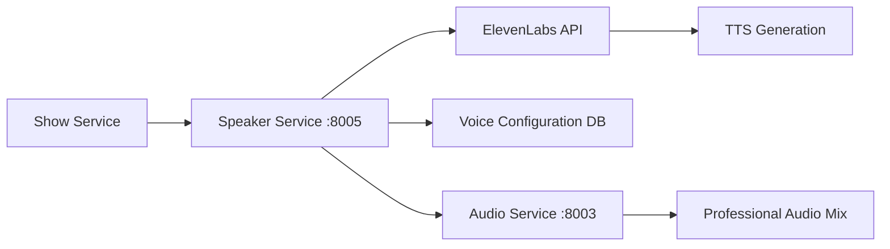

# 🎤 Voice Configuration API Guide v4.0

<div align="center">


**🔊 Complete guide to configuring voices and audio via RadioX Speaker Service API**

[🏠 Documentation](../) • [👤 User Guides](../README.md#-user-guides) • [🎙️ Show Generation](show-generation.md) • [📡 API Reference](api-reference.md)

</div>

---

## 🎯 Overview

RadioX v4.0 uses **Speaker Service API** with **ElevenLabs V3 TTS** for professional-quality voice generation. The microservices architecture provides four distinct AI personalities accessible via REST endpoints.

### ✨ **Key Features**
- 🎭 **4-Voice Professional Cast** - Marcel, Jarvis, Lucy & Brad
- 🔊 **ElevenLabs V3 API** - Latest TTS with emotional tags
- 🌍 **Multi-language Support** - English (primary) & German
- 🎨 **Auto-Embedding** - Cover art automatically embedded in MP3
- 🏗️ **Microservices Ready** - Speaker Service API at `:8005`

---

## 🏗️ Speaker Service Architecture

### **🔗 Service Endpoints**
```
Production: https://api.radiox.cloud/api/v1/speakers/
Local Dev:  http://localhost:8000/api/v1/speakers/
Direct:     http://speaker-service:8005/
```

### **🎤 Voice Management Pipeline**


---

## 🎭 Professional Voice Cast API

### **Get All Voice Configurations**
```http
GET /api/v1/speakers/config
```

**Response:**
```json
{
  "voices": {
    "marcel": {
      "role": "Main Host",
      "characteristics": "Enthusiastic, conversational, warm",
      "used_for": "Intros, discussions, audience connection",
      "elevenlabs_voice_id": "21m00Tcm4TlvDq8ikWAM",
      "language": "en",
      "voice_settings": {
        "stability": 0.75,
        "similarity_boost": 0.85,
        "style": 0.65,
        "use_speaker_boost": true
      },
      "is_active": true,
      "created_at": "2025-01-09T12:00:00Z"
    },
    "jarvis": {
      "role": "AI Assistant",
      "characteristics": "Analytical, precise, informative",
      "used_for": "Technical content, analysis, facts",
      "elevenlabs_voice_id": "EXAVITQu4vr4xnSDxMaL",
      "language": "en",
      "voice_settings": {
        "stability": 0.80,
        "similarity_boost": 0.85,
        "style": 0.60,
        "use_speaker_boost": true
      },
      "is_active": true,
      "created_at": "2025-01-09T12:00:00Z"
    },
    "lucy": {
      "role": "Weather Reporter",
      "characteristics": "Sultry, warm, engaging",
      "used_for": "Weather reports, atmospheric content",
      "elevenlabs_voice_id": "lucy_voice_id_v3",
      "language": "en",
      "voice_settings": {
        "stability": 0.70,
        "similarity_boost": 0.90,
        "style": 0.75,
        "use_speaker_boost": true
      },
      "is_active": true,
      "created_at": "2025-01-09T12:00:00Z"
    },
    "brad": {
      "role": "News Anchor",
      "characteristics": "Professional, authoritative, clear",
      "used_for": "Breaking news, serious topics",
      "elevenlabs_voice_id": "brad_voice_id_v3",
      "language": "en",
      "voice_settings": {
        "stability": 0.85,
        "similarity_boost": 0.80,
        "style": 0.55,
        "use_speaker_boost": true
      },
      "is_active": true,
      "created_at": "2025-01-09T12:00:00Z"
    }
  },
  "total_voices": 4,
  "default_primary": "marcel",
  "default_secondary": "jarvis"
}
```

**cURL Example:**
```bash
curl "https://api.radiox.cloud/api/v1/speakers/config" | jq '.'
```

---

## 🔧 Voice Configuration Management

### **Update Voice Settings**
```http
PUT /api/v1/speakers/{speaker_name}/config
```

**Request Body:**
```json
{
  "voice_settings": {
    "stability": 0.80,
    "similarity_boost": 0.90,
    "style": 0.70,
    "use_speaker_boost": true
  },
  "characteristics": "Updated personality description",
  "elevenlabs_voice_id": "new_voice_id_v3"
}
```

**Response:**
```json
{
  "speaker_name": "marcel",
  "updated_settings": {
    "stability": 0.80,
    "similarity_boost": 0.90,
    "style": 0.70,
    "use_speaker_boost": true
  },
  "previous_settings": {
    "stability": 0.75,
    "similarity_boost": 0.85,
    "style": 0.65,
    "use_speaker_boost": true
  },
  "updated_at": "2025-01-09T18:30:00Z",
  "status": "updated"
}
```

**cURL Example:**
```bash
curl -X PUT "https://api.radiox.cloud/api/v1/speakers/marcel/config" \
  -H "Content-Type: application/json" \
  -d '{
    "voice_settings": {
      "stability": 0.80,
      "similarity_boost": 0.90,
      "style": 0.70
    }
  }'
```

---

## 🧪 Voice Testing API

### **Test Specific Voice**
```http
POST /api/v1/speakers/test
```

**Request Body:**
```json
{
  "speaker_name": "marcel",
  "text": "Hello, this is a voice test for RadioX! How do I sound?",
  "voice_settings": {
    "stability": 0.75,
    "similarity_boost": 0.85,
    "style": 0.65,
    "use_speaker_boost": true
  },
  "emotional_tags": ["excited"],
  "language": "en"
}
```

**Response:**
```json
{
  "test_id": "test_550e8400",
  "audio_url": "https://hkibwnykthxsnwbgygbk.supabase.co/storage/v1/object/public/radiox-audio/tests/marcel_test_550e8400.mp3",
  "speaker_used": "marcel",
  "voice_id_used": "21m00Tcm4TlvDq8ikWAM",
  "settings_applied": {
    "stability": 0.75,
    "similarity_boost": 0.85,
    "style": 0.65,
    "use_speaker_boost": true
  },
  "audio_specs": {
    "duration_seconds": 4.2,
    "file_size_kb": 67,
    "format": "mp3",
    "sample_rate": 44100
  },
  "processing_metrics": {
    "generation_time_ms": 1850,
    "elevenlabs_latency_ms": 1234,
    "upload_time_ms": 340
  },
  "created_at": "2025-01-09T18:30:00Z"
}
```

### **Batch Voice Testing**
```http
POST /api/v1/speakers/test/batch
```

Test all voices with the same text for comparison.

**Request Body:**
```json
{
  "text": "Welcome to RadioX, your AI radio station!",
  "speakers": ["marcel", "jarvis", "lucy", "brad"],
  "emotional_tags": ["excited"],
  "language": "en"
}
```

**Response:**
```json
{
  "batch_test_id": "batch_550e8400",
  "total_tests": 4,
  "test_results": [
    {
      "speaker_name": "marcel",
      "audio_url": "https://...marcel_batch_550e8400.mp3",
      "duration_seconds": 3.8,
      "generation_time_ms": 1650
    },
    {
      "speaker_name": "jarvis",
      "audio_url": "https://...jarvis_batch_550e8400.mp3", 
      "duration_seconds": 4.1,
      "generation_time_ms": 1720
    }
  ],
  "comparison_url": "https://hkibwnykthxsnwbgygbk.supabase.co/storage/v1/object/public/radiox-audio/comparisons/batch_550e8400.html",
  "created_at": "2025-01-09T18:30:00Z"
}
```

**cURL Examples:**
```bash
# Test single voice
curl -X POST "https://api.radiox.cloud/api/v1/speakers/test" \
  -H "Content-Type: application/json" \
  -d '{
    "speaker_name": "marcel",
    "text": "Hello RadioX listeners!",
    "emotional_tags": ["excited"]
  }'

# Batch test all voices
curl -X POST "https://api.radiox.cloud/api/v1/speakers/test/batch" \
  -H "Content-Type: application/json" \
  -d '{
    "text": "Welcome to RadioX!",
    "speakers": ["marcel", "jarvis", "lucy", "brad"]
  }'
```

---

## 🎭 ElevenLabs V3 Emotional Tags

### **Available Emotional Tags**
```http
GET /api/v1/speakers/emotions
```

**Response:**
```json
{
  "emotional_tags": {
    "excited": {
      "description": "High energy, enthusiasm",
      "best_for": "Breaking news, Bitcoin gains, introductions",
      "compatible_speakers": ["marcel", "lucy"],
      "intensity": "high"
    },
    "sarcastic": {
      "description": "Dry humor, wit",
      "best_for": "Jarvis responses, irony, commentary",
      "compatible_speakers": ["jarvis", "brad"],
      "intensity": "medium"
    },
    "whispers": {
      "description": "Intimate, secretive",
      "best_for": "Confidential info, asides, transitions",
      "compatible_speakers": ["lucy", "marcel"],
      "intensity": "low"
    },
    "laughs": {
      "description": "Natural laughter",
      "best_for": "Funny moments, reactions, lighthearted content",
      "compatible_speakers": ["marcel", "lucy"],
      "intensity": "medium"
    },
    "curious": {
      "description": "Questioning, interested",
      "best_for": "Exploring topics, interviews, analysis",
      "compatible_speakers": ["jarvis", "marcel"],
      "intensity": "medium"
    },
    "impressed": {
      "description": "Amazed, surprised",
      "best_for": "Remarkable news, unexpected developments",
      "compatible_speakers": ["marcel", "brad"],
      "intensity": "high"
    },
    "authoritative": {
      "description": "Professional, commanding",
      "best_for": "Breaking news, serious topics, announcements",
      "compatible_speakers": ["brad", "jarvis"],
      "intensity": "high"
    },
    "warm": {
      "description": "Friendly, welcoming",
      "best_for": "Weather reports, audience connection, outros",
      "compatible_speakers": ["lucy", "marcel"],
      "intensity": "medium"
    }
  },
  "usage_examples": {
    "marcel": "[excited] Amazing Bitcoin news today! [laughs] I can't believe it!",
    "jarvis": "[sarcastic] Obviously predictable, Marcel. [curious] But let's analyze this further.",
    "lucy": "[warm] Good evening, everyone. [whispers] Tonight's weather is [whispers] quite spectacular.
    "brad": "[authoritative] Breaking news from Zurich. [impressed] This changes everything.
```

### **Script Format with Emotional Tags**
```
MARCEL: [excited] Welcome to RadioX! Amazing Bitcoin news today!
JARVIS: [sarcastic] Obviously predictable, Marcel.
MARCEL: [laughs] You're such a party pooper! [laughs harder]
JARVIS: [whispers] Between you and me, this is actually impressive.
LUCY: [warm] Good evening, everyone. The weather tonight is [whispers] quite spectacular.
BRAD: [authoritative] Breaking news from Zurich. [impressed] This changes everything.
```

---

## 🌍 Multi-Language Configuration

### **Get Language Support**
```http
GET /api/v1/speakers/languages
```

**Response:**
```json
{
  "supported_languages": {
    "en": {
      "name": "English",
      "status": "primary",
      "voices_available": 4,
      "emotional_tags_supported": 8,
      "quality": "v3_optimized"
    },
    "de": {
      "name": "German", 
      "status": "secondary",
      "voices_available": 2,
      "emotional_tags_supported": 6,
      "quality": "v3_standard"
    }
  },
  "voice_language_mapping": {
    "marcel_en": "21m00Tcm4TlvDq8ikWAM",
    "jarvis_en": "EXAVITQu4vr4xnSDxMaL",
    "marcel_de": "custom_marcel_de_id",
    "jarvis_de": "custom_jarvis_de_id"
  },
  "default_fallback": "en"
}
```

### **Configure German Voices**
```http
PUT /api/v1/speakers/languages/de
```

**Request Body:**
```json
{
  "voice_mappings": {
    "marcel": "your_german_marcel_voice_id",
    "jarvis": "your_german_jarvis_voice_id"
  },
  "voice_settings": {
    "stability": 0.80,
    "similarity_boost": 0.85,
    "style": 0.60
  },
  "enabled": true
}
```

**cURL Example:**
```bash
curl -X PUT "https://api.radiox.cloud/api/v1/speakers/languages/de" \
  -H "Content-Type: application/json" \
  -d '{
    "voice_mappings": {
      "marcel": "german_marcel_voice_id",
      "jarvis": "german_jarvis_voice_id"
    },
    "enabled": true
  }'
```

---

## 🔊 Audio Quality Management

### **Get Audio Configuration**
```http
GET /api/v1/speakers/audio/config
```

**Response:**
```json
{
  "audio_specs": {
    "format": "mp3",
    "bitrate": 128,
    "sample_rate": 44100,
    "channels": 2,
    "quality": "radio_broadcast"
  },
  "voice_processing": {
    "normalization": true,
    "noise_reduction": true,
    "dynamic_range_compression": true,
    "professional_eq": true
  },
  "elevenlabs_settings": {
    "model": "eleven_multilingual_v2",
    "output_format": "mp3_44100_128",
    "optimize_streaming_latency": 2,
    "voice_settings": {
      "stability": 0.75,
      "similarity_boost": 0.85,
      "style": 0.65,
      "use_speaker_boost": true
    }
  },
  "jingle_integration": {
    "intro_volume": 1.0,
    "background_volume": 0.06,
    "outro_volume": 1.0,
    "fade_duration_seconds": 3,
    "mixing_quality": "professional"
  }
}
```

### **Update Audio Quality Settings**
```http
PUT /api/v1/speakers/audio/config
```

**Request Body:**
```json
{
  "audio_specs": {
    "bitrate": 192,
    "quality": "high_fidelity"
  },
  "voice_processing": {
    "noise_reduction": true,
    "professional_eq": true
  },
  "elevenlabs_settings": {
    "model": "eleven_multilingual_v2",
    "optimize_streaming_latency": 1
  }
}
```

---

## 🔧 Custom Voice Setup via API

### **Add New Voice**
```http
POST /api/v1/speakers/voices
```

**Request Body:**
```json
{
  "speaker_name": "sarah",
  "voice_name": "Sarah",
  "role": "Tech News Anchor",
  "characteristics": "Professional, tech-savvy, engaging",
  "used_for": "Technology news, startup coverage, innovation topics",
  "elevenlabs_voice_id": "your_custom_voice_id",
  "language": "en",
  "voice_settings": {
    "stability": 0.78,
    "similarity_boost": 0.88,
    "style": 0.62,
    "use_speaker_boost": true
  },
  "emotional_tags_compatible": ["excited", "curious", "impressed", "authoritative"],
  "is_active": true
}
```

**Response:**
```json
{
  "speaker_name": "sarah",
  "status": "created",
  "voice_id": "your_custom_voice_id",
  "test_audio_url": "https://hkibwnykthxsnwbgygbk.supabase.co/storage/v1/object/public/radiox-audio/tests/sarah_welcome.mp3",
  "created_at": "2025-01-09T18:30:00Z",
  "available_immediately": true
}
```

### **List All ElevenLabs Voices**
```http
GET /api/v1/speakers/elevenlabs/voices
```

Get all available voices from your ElevenLabs account for configuration.

**Response:**
```json
{
  "total_voices": 28,
  "available_voices": [
    {
      "voice_id": "21m00Tcm4TlvDq8ikWAM",
      "name": "Rachel",
      "category": "premade",
      "language": "en",
      "description": "Young American female",
      "labels": ["american", "female", "young"],
      "preview_url": "https://api.elevenlabs.io/v1/voices/21m00Tcm4TlvDq8ikWAM"
    },
    {
      "voice_id": "EXAVITQu4vr4xnSDxMaL", 
      "name": "Bella",
      "category": "premade",
      "language": "en",
      "description": "Young American female",
      "labels": ["american", "female", "young", "soft"],
      "preview_url": "https://api.elevenlabs.io/v1/voices/EXAVITQu4vr4xnSDxMaL"
    }
  ],
  "custom_voices": [
    {
      "voice_id": "custom_marcel_clone",
      "name": "Marcel Clone",
      "category": "cloned",
      "language": "en",
      "description": "Custom cloned voice",
      "created_by": "user"
    }
  ]
}
```

**cURL Examples:**
```bash
# Add new voice
curl -X POST "https://api.radiox.cloud/api/v1/speakers/voices" \
  -H "Content-Type: application/json" \
  -d '{
    "speaker_name": "sarah",
    "role": "Tech Anchor",
    "elevenlabs_voice_id": "your_voice_id",
    "voice_settings": {
      "stability": 0.75,
      "similarity_boost": 0.85
    }
  }'

# List ElevenLabs voices
curl "https://api.radiox.cloud/api/v1/speakers/elevenlabs/voices" | jq '.available_voices'
```

---

## 📊 Speaker Analytics & Performance

### **Get Speaker Usage Analytics**
```http
GET /api/v1/speakers/analytics?period=7d&speaker=marcel
```

**Response:**
```json
{
  "period": "7d",
  "speaker_analytics": {
    "marcel": {
      "total_usage_seconds": 1847,
      "shows_featured": 23,
      "average_generation_time_ms": 1650,
      "quality_score": 9.2,
      "emotional_tags_used": {
        "excited": 45,
        "laughs": 32,
        "impressed": 18,
        "curious": 12
      },
      "performance_trend": "improving",
      "cost_usd": 12.45
    }
  },
  "comparative_metrics": {
    "fastest_speaker": "brad",
    "highest_quality": "lucy",
    "most_used": "marcel",
    "most_versatile": "jarvis"
  },
  "recommendations": [
    "Marcel's excitement works well for Bitcoin news",
    "Consider using Brad for more serious topics",
    "Lucy's warm tone perfect for weather segments"
  ]
}
```

### **Get Voice Quality Metrics**
```http
GET /api/v1/speakers/quality/metrics
```

**Response:**
```json
{
  "quality_metrics": {
    "overall_score": 9.1,
    "clarity_score": 9.4,
    "naturalness_score": 8.9,
    "emotional_expression": 9.0,
    "consistency_score": 9.3
  },
  "speaker_quality_breakdown": {
    "marcel": {
      "clarity": 9.5,
      "naturalness": 9.2,
      "emotional_range": 9.8,
      "consistency": 9.1
    },
    "jarvis": {
      "clarity": 9.6,
      "naturalness": 8.9,
      "emotional_range": 8.5,
      "consistency": 9.4
    }
  },
  "improvement_suggestions": [
    "Optimize stability for jarvis to improve naturalness",
    "Marcel's emotional range is excellent, maintain current settings"
  ]
}
```

---

## 🔧 Troubleshooting via API

### **Diagnose Voice Issues**
```http
POST /api/v1/speakers/diagnose
```

**Request Body:**
```json
{
  "speaker_name": "marcel",
  "issue_type": "audio_quality",
  "description": "Voice sounds robotic",
  "sample_text": "This is a test to diagnose the issue"
}
```

**Response:**
```json
{
  "diagnosis_id": "diag_550e8400",
  "issue_identified": "stability_too_high",
  "current_settings": {
    "stability": 0.95,
    "similarity_boost": 0.85,
    "style": 0.65
  },
  "recommended_settings": {
    "stability": 0.75,
    "similarity_boost": 0.85,
    "style": 0.70
  },
  "test_audio_urls": {
    "current": "https://...current_settings.mp3",
    "recommended": "https://...recommended_settings.mp3"
  },
  "auto_apply": false,
  "confidence_score": 0.87,
  "diagnosis_timestamp": "2025-01-09T18:30:00Z"
}
```

### **Health Check Speaker Service**
```http
GET /api/v1/speakers/health
```

**Response:**
```json
{
  "service_status": "healthy",
  "elevenlabs_api": {
    "status": "connected",
    "latency_ms": 234,
    "quota_remaining": 850000,
    "last_check": "2025-01-09T18:29:45Z"
  },
  "database_connection": {
    "status": "healthy",
    "response_time_ms": 12,
    "last_query": "2025-01-09T18:29:50Z"
  },
  "active_voices": 4,
  "cache_status": "optimal",
  "uptime_seconds": 86400,
  "memory_usage_mb": 245,
  "cpu_usage_percent": 15.2
}
```

**Common Diagnostic Commands:**
```bash
# Diagnose voice quality
curl -X POST "https://api.radiox.cloud/api/v1/speakers/diagnose" \
  -H "Content-Type: application/json" \
  -d '{
    "speaker_name": "marcel",
    "issue_type": "audio_quality",
    "sample_text": "Test voice quality"
  }'

# Check service health
curl "https://api.radiox.cloud/api/v1/speakers/health" | jq '.service_status'

# Test all voices quickly
curl -X POST "https://api.radiox.cloud/api/v1/speakers/test/batch" \
  -H "Content-Type: application/json" \
  -d '{"text": "Quick health check", "speakers": ["marcel", "jarvis"]}'
```

---

## 💡 Pro Tips for API v4.0

### **🎯 Best Practices**

1. **🔄 Use Emotional Tags Strategically**
   - `[excited]` for Marcel with Bitcoin news
   - `[sarcastic]` for Jarvis responses
   - `[warm]` for Lucy weather reports
   - `[authoritative]` for Brad breaking news

2. **📊 Monitor Performance**
   - Check analytics weekly with `/analytics` endpoint
   - Use quality metrics to optimize settings
   - Monitor ElevenLabs quota usage

3. **🧪 Test Before Production**
   - Always test new voices with `/test` endpoint
   - Use batch testing for voice comparisons
   - Validate emotional tags compatibility

4. **🔧 Optimize Settings**
   - Start with default settings and adjust gradually
   - Use diagnosis endpoint for troubleshooting
   - Monitor generation times and quality scores

### **⚡ Professional API Workflows**

```bash
# Daily voice quality check
curl "https://api.radiox.cloud/api/v1/speakers/health"

# Weekly performance review
curl "https://api.radiox.cloud/api/v1/speakers/analytics?period=7d"

# Test new emotional tags
curl -X POST "https://api.radiox.cloud/api/v1/speakers/test" \
  -H "Content-Type: application/json" \
  -d '{
    "speaker_name": "marcel",
    "text": "[excited] Amazing news today! [laughs] Incredible!",
    "emotional_tags": ["excited", "laughs"]
  }'

# Compare all voices for new content type
curl -X POST "https://api.radiox.cloud/api/v1/speakers/test/batch" \
  -H "Content-Type: application/json" \
  -d '{
    "text": "Breaking: Bitcoin reaches new all-time high!",
    "speakers": ["marcel", "jarvis", "lucy", "brad"],
    "emotional_tags": ["excited", "impressed"]
  }'
```

### **🚀 Advanced Integration**

```bash
# Integration with show generation
SPEAKER_CONFIG=$(curl -s "https://api.radiox.cloud/api/v1/speakers/config")
SHOW_RESPONSE=$(curl -s -X POST "https://api.radiox.cloud/api/v1/shows/generate" \
  -H "Content-Type: application/json" \
  -d "{\"primary_speaker\": \"marcel\", \"secondary_speaker\": \"jarvis\"}")

# Voice quality optimization pipeline
curl -X POST "https://api.radiox.cloud/api/v1/speakers/test" \
  -H "Content-Type: application/json" \
  -d '{"speaker_name": "marcel", "text": "Quality test"}' | \
jq '.audio_url' | \
xargs curl -o test_audio.mp3

# Monitor and alert on quality degradation
QUALITY=$(curl -s "https://api.radiox.cloud/api/v1/speakers/quality/metrics" | \
  jq '.quality_metrics.overall_score')
if (( $(echo "$QUALITY < 8.5" | bc -l) )); then
  echo "Voice quality alert: $QUALITY"
fi
```

---

## 🔗 Related Documentation

- **🎙️ [Show Generation Guide](show-generation.md)** - Use voices in radio shows
- **📡 [API Reference](api-reference.md)** - Complete API documentation
- **🎭 [Frontend Integration](frontend-api-integration.md)** - React/TypeScript usage
- **🏗️ [Architecture](../developer-guide/architecture.md)** - Speaker Service design
- **🚀 [Production Deployment](../deployment/production.md)** - Infrastructure setup

---

<div align="center">

**🎤 Your professional AI voices are ready for broadcast!**

[🏠 Documentation](../) • [🎙️ Generate Shows](show-generation.md) • [📡 API Docs](api-reference.md) • [💬 Get Support](../README.md#-support)

**Speaker Service:** `https://api.radiox.cloud/api/v1/speakers/` | **Status:** [Health Check](https://api.radiox.cloud/api/v1/speakers/health)

</div> 